# Summary of Innovation and Technical Guide for "Distributed Computation Strategy for the Training and Inference of Protein and Molecular Structure Prediction Models"

## Overview

**Context Parallelism (CP)** is a general-purpose distributed computing framework for scaling quadratic tensor operations—pair-representation updates, triangle attention, and multi-head attention with pairwise bias—across multiple GPUs using PyTorch DTensor. CP shards O(N²) tensors along the batch and both sequence dimensions over a 2D or 3D device mesh and coordinates computation through ring communication with double buffering, achieving linear scaling in rank count while preserving numerical equivalence to serial execution.

The framework is **application-agnostic**: the ring communication primitives, tiled softmax merging, and DTensor sharding strategies apply wherever quadratic pair or attention tensors appear. This guide validates and demonstrates CP on the **Boltz protein structure prediction model**, which serves as a representative testbed because its core modules contain all the quadratic patterns that CP targets: pair representations of shape `(B, N, N, D)`, triangle attention, triangle multiplication, pair-weighted averaging, outer product mean, and attention with pair bias.

For each module this guide describes the serial reference (the ground-truth implementation in Boltz), the CP distributed algorithm with ring communication, CUDA acceleration kernels (CUEQ, TRIFAST, FlexAttention), and space/time complexity. The final section presents the Efficient Window Batching and Distributed Gather techniques that complement ring-based CP with window-local parallelism.

The guide opens with two infrastructure sections: **Data Feature Sharding** (Section 1) describes how serial feature tensors are partitioned into DTensors across the device mesh, forming the universal input contract for all downstream modules; **Distributed Manager and Communication** (Section 2) covers the centralized resource manager and the communication primitives that every module uses to overlap collective transfers with local computation. Sections 3–9 then detail the individual distributed module implementations.

## Table of Contents

- [DTensor Context Parallelism Technical Guide](#dtensor-context-parallelism-technical-guide)
  - [Overview](#overview)
  - [Table of Contents](#table-of-contents)
  - [1. Data Feature Sharding](#1-data-feature-sharding)
    - [Overview and Problem Statement](#overview-and-problem-statement)
    - [Key Innovations](#key-innovations)
    - [Placement Strategy](#placement-strategy)
    - [Atom Feature Scatter](#atom-feature-scatter)
    - [Token and MSA Feature Distribution](#token-and-msa-feature-distribution)
    - [Window Batching Post-Processing](#window-batching-post-processing)
    - [Collation](#collation)
    - [Inference DataModule](#inference-datamodule)
    - [Training DataModule](#training-datamodule)
    - [Testing Utilities](#testing-utilities)
    - [Infrastructure Role](#infrastructure-role)
    - [Source Files](#source-files)
  - [2. Distributed Manager and Communication](#2-distributed-manager-and-communication)
    - [Overview and Problem Statement](#overview-and-problem-statement-1)
    - [Key Innovations](#key-innovations-1)
    - [DistributedManager](#distributedmanager)
    - [Communication Primitives](#communication-primitives)
    - [Double-Buffered Overlap Pattern](#double-buffered-overlap-pattern)
    - [Communication Wiring in boltz2.py](#communication-wiring-in-boltz2py)
    - [Infrastructure Role](#infrastructure-role-1)
    - [Source Files](#source-files-1)
  - [3. Triangle Attention](#3-triangle-attention)
    - [Overview and Problem Statement](#overview-and-problem-statement-2)
    - [Key Innovations](#key-innovations-2)
      - [Forward Pass](#forward-pass)
      - [Backward Pass](#backward-pass)
    - [Executive Summary: From Serial Bottlenecks to Distributed Efficiency](#executive-summary-from-serial-bottlenecks-to-distributed-efficiency)
    - [Serial Reference Implementation](#serial-reference-implementation)
    - [DTensor CP Implementation](#dtensor-cp-implementation)
      - [Forward Pass](#forward-pass-1)
      - [Backward Pass](#backward-pass-1)
    - [CUDA Acceleration Kernels](#cuda-acceleration-kernels)
    - [Space and Time Complexity](#space-and-time-complexity)
    - [Source Files and Tests](#source-files-and-tests)
  - [4. Triangle Multiplication](#4-triangle-multiplication)
    - [Overview and Problem Statement](#overview-and-problem-statement-3)
    - [Key Innovations](#key-innovations-3)
      - [Forward Pass](#forward-pass-2)
      - [Backward Pass](#backward-pass-2)
    - [Executive Summary: From Serial Bottlenecks to Distributed Efficiency](#executive-summary-from-serial-bottlenecks-to-distributed-efficiency-1)
    - [Serial Reference Implementation](#serial-reference-implementation-1)
    - [DTensor CP Implementation](#dtensor-cp-implementation-1)
      - [Forward Pass](#forward-pass-3)
      - [Backward Pass](#backward-pass-3)
    - [CUDA Acceleration Kernels](#cuda-acceleration-kernels-1)
    - [Space and Time Complexity](#space-and-time-complexity-1)
    - [Source Files and Tests](#source-files-and-tests-1)
  - [5. Pair Weighted Averaging](#5-pair-weighted-averaging)
    - [Overview and Problem Statement](#overview-and-problem-statement-4)
    - [Key Innovations](#key-innovations-4)
      - [Forward Pass](#forward-pass-4)
      - [Backward Pass](#backward-pass-4)
    - [Executive Summary: From Serial Bottlenecks to Distributed Efficiency](#executive-summary-from-serial-bottlenecks-to-distributed-efficiency-2)
    - [Serial Reference Implementation](#serial-reference-implementation-2)
    - [DTensor CP Implementation](#dtensor-cp-implementation-2)
      - [Forward Pass](#forward-pass-5)
      - [Backward Pass](#backward-pass-5)
    - [CUDA Acceleration Kernels](#cuda-acceleration-kernels-2)
    - [Space and Time Complexity](#space-and-time-complexity-2)
    - [Source Files and Tests](#source-files-and-tests-2)
  - [6. Outer Product Mean](#6-outer-product-mean)
    - [Overview and Problem Statement](#overview-and-problem-statement-5)
    - [Key Innovations](#key-innovations-5)
      - [Forward Pass](#forward-pass-6)
      - [Backward Pass](#backward-pass-6)
    - [Executive Summary: From Serial Bottlenecks to Distributed Efficiency](#executive-summary-from-serial-bottlenecks-to-distributed-efficiency-3)
    - [Serial Reference Implementation](#serial-reference-implementation-3)
    - [DTensor CP Implementation](#dtensor-cp-implementation-3)
      - [Forward Pass](#forward-pass-7)
      - [Backward Pass](#backward-pass-7)
    - [CUDA Acceleration Kernels](#cuda-acceleration-kernels-3)
    - [Space and Time Complexity](#space-and-time-complexity-3)
    - [Source Files and Tests](#source-files-and-tests-3)
  - [7. Attention Pair Bias (Ring)](#7-attention-pair-bias-ring)
    - [Overview and Problem Statement](#overview-and-problem-statement-6)
    - [Key Innovations](#key-innovations-6)
      - [Forward Pass](#forward-pass-8)
      - [Backward Pass](#backward-pass-8)
    - [Executive Summary: From Serial Bottlenecks to Distributed Efficiency](#executive-summary-from-serial-bottlenecks-to-distributed-efficiency-4)
    - [Serial Reference Implementation](#serial-reference-implementation-4)
    - [DTensor CP Implementation](#dtensor-cp-implementation-4)
      - [Forward Pass](#forward-pass-9)
      - [Backward Pass](#backward-pass-9)
    - [CUDA Acceleration Kernels](#cuda-acceleration-kernels-4)
    - [Space and Time Complexity](#space-and-time-complexity-4)
    - [Source Files and Tests](#source-files-and-tests-4)
  - [8. Attention Pair Bias (Shardwise)](#8-attention-pair-bias-shardwise)
    - [Overview and Problem Statement](#overview-and-problem-statement-7)
    - [Key Innovations](#key-innovations-7)
      - [Forward Pass](#forward-pass-10)
      - [Backward Pass](#backward-pass-10)
    - [Executive Summary: From Serial Bottlenecks to Distributed Efficiency](#executive-summary-from-serial-bottlenecks-to-distributed-efficiency-5)
    - [Serial Reference Implementation](#serial-reference-implementation-5)
    - [DTensor CP Implementation](#dtensor-cp-implementation-5)
      - [Forward Pass](#forward-pass-11)
      - [Backward Pass](#backward-pass-11)
    - [CUDA Acceleration Kernels](#cuda-acceleration-kernels-5)
    - [Space and Time Complexity](#space-and-time-complexity-5)
    - [Source Files and Tests](#source-files-and-tests-5)
  - [9. Window Batching and Distributed Gather](#9-window-batching-and-distributed-gather)
    - [Overview](#overview-1)
      - [The Problem: Quadratic Attention in Atom Transformers](#the-problem-quadratic-attention-in-atom-transformers)
      - [This Document](#this-document)
      - [Key Innovations](#key-innovations-8)
    - [Executive Summary: From Serial Bottlenecks to Distributed Efficiency](#executive-summary-from-serial-bottlenecks-to-distributed-efficiency-6)
      - [The Challenge: Single-Device Implementation Limitations](#the-challenge-single-device-implementation-limitations)
        - [1. Indexing Matrix Approach for Window Batching](#1-indexing-matrix-approach-for-window-batching)
        - [2. Matrix Multiplication / Einsum for Token-to-Atom Mapping](#2-matrix-multiplication--einsum-for-token-to-atom-mapping)
        - [3. Distribution Requires a Suite of Coordinated Primitives](#3-distribution-requires-a-suite-of-coordinated-primitives)
      - [The Solution: Distributed-First Design with Mathematical Insights](#the-solution-distributed-first-design-with-mathematical-insights)
        - [1. Toeplitz-Based Sliding Window (Sections 1-3)](#1-toeplitz-based-sliding-window-sections-1-3)
        - [2. Translational Symmetry for Distribution (Sections 4-5)](#2-translational-symmetry-for-distribution-sections-4-5)
        - [3. Index-Based Gather with Interval Communication (Sections 6-9)](#3-index-based-gather-with-interval-communication-sections-6-9)
        - [4. Index-Based Scatter-Reduce with Interval Communication](#4-index-based-scatter-reduce-with-interval-communication)
    - [Implementation: `GatherSlidingWindows`](#implementation-gatherslidingwindows)
      - [1. The Indexing Matrix Approach](#1-the-indexing-matrix-approach)
        - [Problem Statement](#problem-statement)
        - [Hyperparameters (from `structure.yaml`)](#hyperparameters-from-structureyaml)
        - [1.1 `get_indexing_matrix(K, W, H, device)`](#11-get_indexing_matrixk-w-h-device)
        - [1.2 `single_to_keys(single, indexing_matrix, W, H)`](#12-single_to_keyssingle-indexing_matrix-w-h)
      - [2. The Efficient Alternative: `efficient_toeplitz_matmul_unfold()`](#2-the-efficient-alternative-efficient_toeplitz_matmul_unfold)
        - [Mathematical Foundation: Toeplitz Structure](#mathematical-foundation-toeplitz-structure)
        - [The Implementation](#the-implementation)
        - [Example Walkthrough: K=3, offsets=\[-3, -1, 1\]](#example-walkthrough-k3-offsets-3--1-1)
        - [Equivalence](#equivalence)
        - [Why This is More Efficient](#why-this-is-more-efficient)
        - [The Offset Formula](#the-offset-formula)
        - [Design Intuition](#design-intuition)
        - [Mathematical Properties](#mathematical-properties)
      - [Key Insights](#key-insights)
      - [Usage Examples](#usage-examples)
      - [Distributed Implementation](#distributed-implementation)
        - [Overview](#overview-2)
        - [Data Ownership Strategy](#data-ownership-strategy)
        - [Detailed Example: K=12, n\_ranks=3](#detailed-example-k12-n_ranks3)
        - [Usage](#usage)
        - [Translational Symmetry: Why Local Computation Works](#translational-symmetry-why-local-computation-works)
        - [Key Properties](#key-properties)
        - [Space and Time Complexity](#space-and-time-complexity-6)
        - [Backward Pass](#backward-pass-12)
        - [Implementation Details](#implementation-details)
    - [Distributed Unmasking and Reshaping](#distributed-unmasking-and-reshaping)
      - [Problem](#problem)
      - [Algorithm: Global Pack-Left](#algorithm-global-pack-left)
      - [Backward Pass](#backward-pass-13)
      - [Space and Time Complexity](#space-and-time-complexity-7)
    - [Gather Operations: Token-to-Atom Representation Mapping](#gather-operations-token-to-atom-representation-mapping)
      - [Motivation](#motivation)
      - [Serial Implementation: Matrix Multiplication and Einsum](#serial-implementation-matrix-multiplication-and-einsum)
        - [1D Gather: Token Single → Atom Single](#1d-gather-token-single--atom-single)
        - [2D Outer Gather: Token Pair → Atom Pair](#2d-outer-gather-token-pair--atom-pair)
      - [Limitations of Serial Implementation](#limitations-of-serial-implementation)
    - [Distributed 1D Gather: `distributed_gather`](#distributed-1d-gather-distributed_gather)
      - [Problem Statement](#problem-statement-1)
      - [Algorithm](#algorithm-2)
      - [Key Innovation: Interval-Based Communication](#key-innovation-interval-based-communication)
      - [Backward Pass](#backward-pass-14)
      - [Space and Time Complexity](#space-and-time-complexity-8)
      - [Implementation](#implementation)
    - [Distributed 2D Outer Gather: `distributed_outer_gather`](#distributed-2d-outer-gather-distributed_outer_gather)
      - [Problem Statement](#problem-statement-2)
      - [Why "Outer" Gather?](#why-outer-gather)
      - [2D Sharding Challenge](#2d-sharding-challenge)
      - [Algorithm](#algorithm-3)
      - [Mesh Flexibility](#mesh-flexibility)
      - [Co-Sharding/Co-Replicating Requirements](#co-shardingco-replicating-requirements)
      - [Backward Pass](#backward-pass-15)
      - [Space and Time Complexity](#space-and-time-complexity-9)
      - [Implementation](#implementation-1)
    - [Distributed Scatter-Reduce: `distributed_scatter_reduce`](#distributed-scatter-reduce-distributed_scatter_reduce)
      - [Problem Statement](#problem-statement-3)
      - [Algorithm](#algorithm-4)
      - [Key Innovation: Interval-Based Scatter Communication](#key-innovation-interval-based-scatter-communication)
      - [Backward Pass](#backward-pass-16)
      - [Space and Time Complexity](#space-and-time-complexity-10)
      - [Implementation](#implementation-2)
    - [Advantages of Distributed Operations](#advantages-of-distributed-operations)
      - [1. Memory Efficiency](#1-memory-efficiency)
      - [2. Computation Scaling](#2-computation-scaling)
      - [3. Communication Efficiency](#3-communication-efficiency)
      - [4. Overlap with Computation](#4-overlap-with-computation)
      - [5. Scatter-Reduce Shares the Same Advantages](#5-scatter-reduce-shares-the-same-advantages)
    - [Implementation Details](#implementation-details-1)
      - [Source Files](#source-files-2)
      - [Utility Functions](#utility-functions)
      - [Testing](#testing)
  - [10. Confidence Model](#10-confidence-model)
    - [Overview and Problem Statement](#overview-and-problem-statement-8)
    - [Key Innovations](#key-innovations-9)
    - [Serial Reference Implementation](#serial-reference-implementation-6)
    - [DTensor CP Implementation Overview](#dtensor-cp-implementation-overview)
    - [pLDDT Loss: plddt\_loss](#plddt-loss-plddt_loss)
      - [Overview and Problem Statement](#overview-and-problem-statement-9)
      - [Key Innovations](#key-innovations-10)
      - [Serial Reference Implementation](#serial-reference-implementation-7)
      - [DTensor CP Implementation](#dtensor-cp-implementation-6)
        - [Forward Pass](#forward-pass-12)
        - [Backward Pass](#backward-pass-17)
      - [Fused Triton Kernel: cdist\_lddt](#fused-triton-kernel-cdist_lddt)
      - [Space and Time Complexity](#space-and-time-complexity-11)
      - [Source Files and Tests](#source-files-and-tests-6)
    - [PDE Loss: pde\_loss](#pde-loss-pde_loss)
      - [Overview and Problem Statement](#overview-and-problem-statement-10)
      - [Key Innovations](#key-innovations-11)
      - [Serial Reference Implementation](#serial-reference-implementation-8)
      - [DTensor CP Implementation](#dtensor-cp-implementation-7)
        - [Forward Pass](#forward-pass-13)
        - [Backward Pass](#backward-pass-18)
      - [Fused Triton Kernel: cdist\_pde](#fused-triton-kernel-cdist_pde)
      - [Space and Time Complexity](#space-and-time-complexity-12)
      - [Source Files and Tests](#source-files-and-tests-7)
  - [11. Smooth LDDT Loss](#11-smooth-lddt-loss)
    - [Overview and Problem Statement](#overview-and-problem-statement-11)
    - [Key Innovations](#key-innovations-12)
    - [Serial Reference Implementation](#serial-reference-implementation-9)
    - [DTensor CP Implementation](#dtensor-cp-implementation-8)
      - [Composable Path: smooth\_lddt\_loss](#composable-path-smooth_lddt_loss)
      - [Fused Triton Path: smooth\_lddt\_loss\_triton](#fused-triton-path-smooth_lddt_loss_triton)
    - [Fused Triton Kernel: smooth\_lddt\_loss\_fwd\_kernel / smooth\_lddt\_loss\_bwd\_kernel](#fused-triton-kernel-smooth_lddt_loss_fwd_kernel--smooth_lddt_loss_bwd_kernel)
      - [Problem Statement](#problem-statement-4)
      - [Algorithm (Forward)](#algorithm-forward)
      - [Algorithm (Backward)](#algorithm-backward)
      - [Forward Data Flow](#forward-data-flow)
      - [Backward Data Flow](#backward-data-flow)
      - [Space and Time Complexity](#space-and-time-complexity-13)
    - [Source Files and Tests](#source-files-and-tests-8)

---

## 1. Data Feature Sharding

### Overview and Problem Statement

The serial Boltz featurizer pipeline (`src/boltz/data/`) produces full-length tensors on a single process—atom coordinates, residue properties, pair masks, MSA alignments, and other molecular features all reside in monolithic tensors in a single address space. There is no distributed data partitioning in the serial codebase; every tensor is materialized in full on the one process that runs the pipeline. This section describes the data feature sharding layer that bridges serial featurization and distributed computation—a capability that exists only in the Context Parallelism implementation.

Context Parallelism requires O(N^2) pair tensors and O(N) single tensors to be partitioned across a 2D square device mesh of P = P_0 x P_1 ranks so that each rank holds only its local shard, with correct DTensor placement metadata for every downstream `autograd.Function` module. The tensors fall into three categories with distinct sharding semantics:

- **1D single representations** (token single, atom single): sharded along the sequence axis across mesh rows, replicated across mesh columns.
- **2D pair representations** (token pair, atom pair, MSA): sharded along both sequence axes, one per mesh dimension, so each rank holds a (N/P_0) x (N/P_1) block.
- **Mapping matrices** (`atom_to_token`, `token_to_rep_atom`): structurally diagonal—only the block at mesh coordinate (i, i) carries meaningful content, because atoms belonging to token-row-i map exclusively to tokens within token-column-i.

The data feature sharding layer pads tensors to mesh-divisible lengths, scatters atom features via point-to-point communication, distributes token and MSA features via `distribute_tensor`, and wraps every shard as a DTensor with explicit placement metadata. The resulting DTensor features are the universal input contract consumed by every distributed model module in Sections 3–9.

### Key Innovations

- **Placement-driven 2D sharding:** Three placement categories—`(Shard(0), Replicate())`, `(Shard(0), Shard(1))`, `(Shard(1), Replicate())`—map tensor semantics to device ownership on the 2D CP mesh. Mapping matrices (`atom_to_token`, `token_to_rep_atom`) use a structurally diagonal block pattern where only the `(i, i)` block carries non-zero content, because atoms assigned to token-row-i map exclusively to tokens within that same row's range.
- **Source-rank scatter with metadata broadcast:** Only CP rank 0 (mesh coordinate `(0, 0)`) holds the full feature dict; metadata (feature names, dtypes, shapes) is broadcast via `broadcast_object_list` so all ranks know tensor layouts before receiving shards via `torch.distributed.scatter`.
- **Two-path distribution:** Atom features use point-to-point scatter (variable-length atom-to-token mapping prevents regular partitioning); token and MSA features use the lighter-weight `distribute_tensor` path (regular shapes align directly with mesh dimensions).
- **Explicit DTensor metadata:** Every local shard is wrapped via `DTensor.from_local` with explicit global `shape`, `stride` (from `update_exhaustive_strides`), and `placements`—avoiding implicit metadata all-gathers that could deadlock with heterogeneous shard sizes.

### Placement Strategy

Each feature tensor is assigned one of three placement types on the 2D CP mesh. The placement dictionaries are defined in `src/boltz/distributed/data/module/placements.py`:

| Placement                 | Mesh axes                      | Typical features                                                                                                                                                                              |
| ------------------------- | ------------------------------ | --------------------------------------------------------------------------------------------------------------------------------------------------------------------------------------------- |
| `(Shard(0), Replicate())` | Row-sharded, column-replicated | 1D atom features (`ref_pos`, `atom_pad_mask`, `ref_charge`, ...), 1D token features (`token_index`, `residue_index`, `asym_id`, ...), mapping matrices (`atom_to_token`, `token_to_rep_atom`) |
| `(Shard(0), Shard(1))`    | Both axes sharded              | 2D pair and MSA features (`pair_mask`, `token_bonds`, `disto_target`, `msa`, `contact_conditioning`, `token_pair_pad_mask`, ...)                                                              |
| `(Shard(1), Replicate())` | Column-sharded, row-replicated | Ensemble-aware features with a leading ensemble dimension (`coords` of shape `(E, A, 3)`, `frames_idx`, `frame_resolved_mask`)                                                                |

Three concrete dictionaries extend a common base:

- **`BASE_FEATURE_PLACEMENTS_V2`** — shared atom, token, and MSA placements.
- **`TRAINING_FEATURE_PLACEMENTS_V2`** — adds `temp_feature` and `ph_feature`.
- **`INFERENCE_FEATURE_PLACEMENTS_V2`** — adds `affinity_token_mask`.

The following diagrams illustrate device ownership for each tensor category on a 2x2 CP mesh. Each rectangle represents the full global tensor; labels inside each block indicate which device(s) own that shard.

```text
Legend:
  D[i, j]  = device at mesh coordinate (row i, column j)
  D[i, :]  = all devices in row i hold identical (replicated) copies
  A label inside a block means that device owns that data shard.

(a) Token single repr               (b) Token pair repr
    Placement: (Shard(0),                Placement: (Shard(0),
                Replicate())                          Shard(1))

              N_token                           N_token
         +--------------+               +--------+--------+
         |              |               |        |        |
         |   D[0, :]    |               | D[0,0] | D[0,1] |
N_token  +--------------+      N_token  +--------+--------+
         |              |               |        |        |
         |   D[1, :]    |               | D[1,0] | D[1,1] |
         +--------------+               +--------+--------+


(c) MSA repr                         (d) Atom single repr
    Placement: (Shard(0),                Placement: (Shard(0),
                Shard(1))                             Replicate())

              N_token                            N_atom
         +--------+--------+               +--------------+
         |        |        |               |              |
         | D[0,0] | D[0,1] |               |   D[0, :]    |
N_seq    +--------+--------+      N_atom   +--------------+
         |        |        |               |              |
         | D[1,0] | D[1,1] |               |   D[1, :]    |
         +--------+--------+               +--------------+


(e) Atom pair repr                   (f) atom_to_token one-hot mapping
    Placement: (Shard(0),                Placement: (Shard(0),
                Shard(1))                             Replicate())

              N_atom                            N_token
         +--------+--------+          +----------+----------+
         |        |        |          |          |  unused  |
         | D[0,0] | D[0,1] |          |  D[0,:]  |  zeros   |
N_atom   +--------+--------+   N_atom +----------+----------+
         |        |        |          |  unused  |          |
         | D[1,0] | D[1,1] |          |  zeros   |  D[1,:]  |
         +--------+--------+          +----------+----------+

    In diagram (f), the atom_to_token mapping matrix has a diagonal
    block structure: atoms in row-partition i map only to tokens in
    column-partition i. Off-diagonal blocks contain only zeros.
```

The placement type determines how each feature is scattered or distributed during data loading, how `CollateDTensor` adds the batch dimension, and how downstream `autograd.Function` implementations partition computation across ranks.

### Atom Feature Scatter

The core atom-level distribution is performed by `pad_and_scatter_atom_features_dtensor` in `src/boltz/distributed/data/feature/featurizer.py`. The function implements a source-rank scatter pattern:

1. **Source rank only.** CP rank 0 (mesh coordinate `(0, 0)`) holds the full feature dict from the serial featurizer; all other ranks pass `features=None`.
2. **Token-based sharding.** Tokens are partitioned into `n_rows × n_cols` contiguous ranges on the square mesh. Each token range maps to an atom range via `atom_counts_per_token`, so atom-level features follow token partition boundaries.
3. **Metadata broadcast.** Feature names, dtypes, and shapes are broadcast from the source rank via `broadcast_object_list`, ensuring every rank knows the tensor layout before receiving data.
4. **Scatter.** For each feature, the source rank builds a `scatter_list` of per-rank shards and calls `torch.distributed.scatter`; non-source ranks receive their shard into a pre-allocated buffer.
5. **DTensor wrapping.** Each rank constructs a DTensor from its local shard via `DTensor.from_local` with explicit global `shape`, `stride` (computed by `update_exhaustive_strides`), and `placements`—avoiding any implicit metadata all-gather.

Feature categories require specialized handling:

- **1D atom features** (`ref_pos`, `atom_pad_mask`, `ref_charge`, etc.): padded to `max_atoms_per_shard` per rank and duplicated across the column (j) axis for `(Shard(0), Replicate())` placement.
- **2D pair features** (`pair_mask`): rank `(i, j)` receives the block `[atom_start_i:atom_end_i, atom_start_j:atom_end_j]`, giving full `(Shard(0), Shard(1))` 2D sharding.
- **2D diagonal features** (`atom_to_token`, `token_to_rep_atom`): only the diagonal block `(i, i)` carries meaningful content; column ranks receive a copy of the diagonal block for their row.
- **`frames_idx`**: atom indices are remapped from unpadded to padded coordinates via `remap_atom_indices_unpadded_to_padded`, accounting for per-shard padding offsets.
- **`r_set_to_rep_atom`**: assignment follows the token partition, computed via `r_set_to_rep_atom @ atom_to_token` on the source rank before scattering.

### Token and MSA Feature Distribution

Token-level and MSA features use a lighter-weight distribution path via `distribute_features` in `src/boltz/distributed/data/utils.py`:

1. `broadcast_feature_tensors_metadata` broadcasts an `OrderedDict` of `(dtype, shape)` tuples from the source rank, guaranteeing all ranks iterate features in identical order—critical for collective synchronization.
2. For each feature, the source rank provides the full tensor while other ranks allocate an empty tensor from the broadcast metadata.
3. `torch.distributed.distribute_tensor` shards or replicates the tensor according to the feature's placement entry.

This path is simpler than atom scatter because token and MSA tensors have regular shapes that align directly with the mesh dimensions, without the variable-length atom-to-token mapping that atom features require.

### Window Batching Post-Processing

After atom features are scattered, `pack_atom_features` in the featurizer applies window batching post-processing via `distributed_pack_and_pad`:

- Per-shard trailing padding from the scatter step is removed and atoms are repacked to a length of `W × size_cp`, where `W` is the window size for the AtomTransformer's sequence-local attention.
- The `atom_to_token` matrix is converted to global token indices (`atom_to_token_ids_global`) before packing, because the one-hot matrix representation cannot survive the pack-and-pad reshape. After packing, the one-hot matrix is reconstructed from the global indices.

### Collation

`CollateDTensor` in `src/boltz/distributed/data/utils.py` serves as the collate function for DataLoaders under CP, batching a list of single-sample DTensor dicts into a multi-sample batch:

1. **Batch dimension.** A new leading dimension is added with `Shard(0)` placement for data-parallel (DP) batching. All original CP placements shift by +1 to account for the new axis—for example, `(Shard(0), Replicate())` becomes `(Shard(0), Shard(1), Replicate())`.
2. **Shape synchronization.** The maximum local shape is all-reduced across DP ranks; each rank pads its local shards to match, ensuring uniform DTensor global shapes across the batch.
3. **Index remapping.** Atom-index features (`frames_idx`) are remapped via `remap_atom_indices_repad` when per-sample atom padding differs across DP ranks after shape synchronization.

### Inference DataModule

The inference data pipeline is implemented by `PredictionDatasetCPWithDTensorV2` and `Boltz2InferenceDataModuleDTensor` in `src/boltz/distributed/data/module/inferencev2.py`:

- **Single-rank loading.** Only the rank at mesh coordinate `(0, 0)` runs the serial pipeline: `load_input` → `tokenizer.tokenize` → `featurizer.process`. All other CP ranks skip I/O entirely.
- **Divisibility padding.** Before distribution, `max_tokens` and `max_seqs` are rounded up to multiples of `n_shards_axis_0`; `max_atoms` is rounded to `lcm(W, n_shards_axis_0)` to satisfy both window batching and sharding constraints.
- **Two-path distribution.** Atom features route through `pad_and_scatter_atom_features_dtensor`; token and MSA features route through `distribute_features`.
- **Device transfer.** `transfer_batch_to_device` moves DTensors to GPU by extracting the local shard (`to_local()`), transferring to the target device (`.to(device)`), and rewrapping with `DTensor.from_local` using the original placements—avoiding DTensor-level device transfer that could trigger unwanted collectives.

The inference DataModule is consumed by `src/boltz/distributed/predict.py`, which creates the `DistributedManager`, builds a CPU device mesh for Gloo-backend scatter collectives, and passes the DataModule to Lightning's `Trainer.predict`.

### Training DataModule

The training data pipeline—`_BaseDatasetCPWithDTensorV2`, `TrainingDatasetCPWithDTensorV2`, and `Boltz2TrainingDataModule` in `src/boltz/distributed/data/module/trainingv2.py`—mirrors the inference pipeline with training-specific additions:

- **Serial dataset wrapping.** `Boltz2TrainingDataModule` wraps the serial `Boltz2TrainingDataModuleSerial`, constructing CP-aware train and validation datasets from the underlying serial datasets.
- **Same scatter/distribute pattern.** `_distribute_features` in the base class follows the same two-path atom/token distribution as inference, including divisibility padding and metadata broadcast.
- **Validation filtering.** `ValidationDatasetCPWithDTensorV2` iterates samples until one passes the `val_skip_sample_threshold_*` criteria before distributing, ensuring all CP ranks agree on whether to use a sample.

The training DataModule is consumed by `src/boltz/distributed/train.py` via `_create_distributed_data_module`.

### Testing Utilities

`src/boltz/testing/utils.py` provides reusable helpers for creating and distributing test features:

| Function                   | Purpose                                                                                |
| -------------------------- | -------------------------------------------------------------------------------------- |
| `get_features`             | Creates random features with optional `shard_dims`, padding to mesh-compatible sizes   |
| `get_features_shardable`   | Produces features via `BoltzFeaturizer.process` with optional sharding                 |
| `get_feature_placements`   | Returns placement dicts (3-tuple for full mesh, 2-tuple for CP submesh)                |
| `distribute_atom_features` | End-to-end helper: scatter atoms, collate across DP ranks, merge multiplicity features |
| `pad_to_length`            | Pads a DTensor's local shard along a dimension to a target global length               |
| `homogenize_shard_shapes`  | Pads local shards so all ranks have identical local shapes                             |

### Infrastructure Role

The data feature sharding layer forms one of the two infrastructure foundations for the entire CP framework. All distributed model modules in Sections 3–9—trunk encoders, Pairformer layers, diffusion structure modules, and loss functions—receive their inputs as DTensors created by this pipeline. The placement metadata attached at creation time determines how each downstream `autograd.Function` partitions computation and schedules ring or transpose communication. Without correctly sharded and padded DTensor inputs, no distributed module can operate.

### Source Files

| File                                                     | Role                                                                          |
| -------------------------------------------------------- | ----------------------------------------------------------------------------- |
| `src/boltz/distributed/data/feature/featurizer.py`       | `pad_and_scatter_atom_features_dtensor`, `pack_atom_features`                 |
| `src/boltz/distributed/data/feature/featurizer_utils.py` | Index remapping utilities, `ATOM_INDEX_FEATURES`                              |
| `src/boltz/distributed/data/utils.py`                    | `distribute_features`, `broadcast_feature_tensors_metadata`, `CollateDTensor` |
| `src/boltz/distributed/data/module/placements.py`        | `BASE_FEATURE_PLACEMENTS_V2`, training/inference placement dicts              |
| `src/boltz/distributed/data/module/inferencev2.py`       | Inference dataset and DataModule                                              |
| `src/boltz/distributed/data/module/trainingv2.py`        | Training dataset and DataModule                                               |
| `src/boltz/distributed/predict.py`                       | Inference entry point                                                         |
| `src/boltz/distributed/train.py`                         | Training entry point                                                          |
| `src/boltz/testing/utils.py`                             | Test helpers for feature creation and distribution                            |

## 2. Distributed Manager and Communication

### Overview and Problem Statement

The serial Boltz model runs as a single process with no distributed resource management or inter-rank communication. All tensor operations execute on one device, and no device mesh, process groups, or communication handles exist. There is no serial counterpart to this section.

Context Parallelism requires every distributed module to share a consistent view of the device mesh topology (which ranks form the 2D CP grid, which form the DP group), process groups for collectives, rank-to-coordinate mappings for point-to-point transfers, and communication handles that can overlap collective transfers with local computation. Without a centralized resource manager, each module would need to independently discover and construct these distributed primitives, leading to inconsistent state and duplicated initialization logic. The `DistributedManager` and communication primitives described in this section solve this problem—together with the data feature sharding layer (Section 1), they form the two infrastructure foundations for all DTensor model modules in Sections 3–9.

### Key Innovations

- **Borg-pattern singleton:** `DistributedManager` provides a single source of truth for all distributed state—device mesh, process groups, rank mappings, and layout maps. Every component (data loaders, model modules, loss functions, checkpointing) accesses the same shared state through any instance, eliminating redundant initialization and guaranteeing consistency.
- **Hierarchical process group topology:** A parent mesh with named dimensions `(dp, cp)` coexists with a subgroup mesh `(dp, cp_axis_0, cp_axis_1)` that decomposes the flat CP group into row and column sub-groups. Named process groups (`world`, `dp`, `cp`, `cp_axis_0`, `cp_axis_1`) allow modules to select the correct group for each collective without hard-coding rank arithmetic.
- **`LayoutMap` for coordinate-to-rank mapping:** All communication handles use `LayoutMap` objects to translate 2D mesh coordinates to global ranks, enabling ring shifts, transposes, and point-to-point transfers without per-module rank computation.
- **Typed communication handle hierarchy:** `One2OneComm` provides async P2P send/recv with parity-based ordering to prevent NCCL deadlocks. `TransposeComm` specializes P2P for matrix transpose on a 2D grid (rank `(i, j)` exchanges with rank `(j, i)`). `Ring2DComm` manages row-wise and column-wise ring shifts with separate forward/backward handles. Specialized variants (`Ring2DCommTriAttn`, `AttentionPairBiasComm`) add module-specific handle sets for triangle attention and attention pair bias.
- **Double-buffered communication-computation overlap:** All ring-based modules use a canonical pattern: `enqueue_to_dispatch` launches non-blocking P2P operations and returns immediately, allowing the subsequent local `compute` call to execute on the GPU while the next data block transfers in the background. `wait_until_finished` synchronizes before the newly arrived block is consumed. This pattern is the building block that every ring-based module in Sections 3–9 composes into its specific distributed algorithm.
- **Parity-based send/recv ordering:** When two ranks exchange data simultaneously, the parity of rank indices determines which rank sends first and which receives first, preventing circular-wait deadlocks in NCCL.

### DistributedManager

`DistributedManager` in `src/boltz/distributed/manager.py` is a Borg-pattern singleton that owns all distributed state. Every component—data loaders, model modules, loss functions, checkpointing—accesses the same shared state through any instance.

**Key attributes:**

| Attribute                          | Type                      | Purpose                                                       |
| ---------------------------------- | ------------------------- | ------------------------------------------------------------- |
| `rank`, `world_size`, `local_rank` | `int`                     | Process identity                                              |
| `device`                           | `torch.device`            | Local device (e.g. `cuda:0`)                                  |
| `device_mesh`                      | `DeviceMesh`              | Parent mesh with named dimensions `(dp, cp)`                  |
| `device_mesh_subgroups`            | `DeviceMesh`              | Subgroup mesh with dimensions `(dp, cp_axis_0, cp_axis_1)`    |
| `group`                            | `dict[str, ProcessGroup]` | Process groups: `world`, `dp`, `cp`, `cp_axis_0`, `cp_axis_1` |
| `layout_subgroups`                 | `dict[str, LayoutMap]`    | `LayoutMap` for CP coordinate-to-rank mapping                 |

**Initialization flow:**

```text
DistributedManager.initialize()
  → _setup()
    → torch.distributed.init_process_group()
    → create group["world"]
  → create_grid_group(OrderedDict([("dp", size_dp), ("cp", (size_cp_axis, size_cp_axis))]))
    → _create_device_mesh_and_groups() for parent mesh (dp × cp)
    → _create_device_mesh_and_groups() for subgroup mesh (dp × cp_axis_0 × cp_axis_1)
    → populate group, group_rank, group_ranks, subgroups, layout_subgroups
```

Both `src/boltz/distributed/predict.py` and `src/boltz/distributed/train.py` call `DistributedManager.initialize()` at startup, then `create_grid_group()` with a grid specification that defines the DP and CP dimensions. The resulting `dist_manager` instance is passed to the model constructor and data modules.

### Communication Primitives

`src/boltz/distributed/comm.py` provides the communication handles used throughout the model. Each handle wraps `torch.distributed` point-to-point operations with an async dispatch/wait API:

**`One2OneComm`** — the base class for point-to-point send/recv between two ranks. Key methods:

- `enqueue_to_dispatch(to_send, to_recv)` — queues P2P ops and dispatches them via `batch_isend_irecv`.
- `wait_until_finished()` — blocks until all dispatched ops complete.
- Parity-based send/recv ordering prevents NCCL deadlocks when two ranks exchange simultaneously.

**`TransposeComm(One2OneComm)`** — specializes P2P for matrix transpose on a 2D grid: rank `(i, j)` exchanges data with rank `(j, i)`. Used for outer sum redistribution, distogram loss, relative position encoding, and confidence module.

**`Ring2DComm`** — manages row-wise and column-wise ring shifts on the 2D grid, with separate handles for forward and backward passes:

- `comm_row` / `comm_col` — per-step ring shifts (left along rows, up along columns).
- `comm_2d_trans` — 2D transpose for initial redistribution.
- Used by Triangle Multiplication (Section 4) and Outer Product Mean (Section 6).

**`Ring2DCommTriAttn`** — specialized ring handles for Triangle Attention (Section 3):

- Two-stage bias redistribution (`comm_bias_init0`, `comm_bias_init1`, `comm_bias`).
- K/V/mask ring rotation (`comm_k`, `comm_v`, `comm_mask`).
- Separate backward-pass ring handles (`comm_dk`, `comm_dv`, `comm_dbias`).

**`AttentionPairBiasComm`** — ring attention handles for the structure module's Attention Pair Bias (Section 7):

- Transpose handles for initial K/V/mask redistribution.
- Per-step ring shift for K, V, and pair bias Z.

Individual communication patterns and their mathematical derivations are detailed in the respective module sections (Sections 3–9).

### Double-Buffered Overlap Pattern

All ring-based modules use a canonical double-buffered pattern to overlap communication with computation:

```python
buffer = [block_0, empty_block]
i_ready, i_recv = 0, 1

for step in range(n_steps):
    # Launch async transfer of NEXT block
    comm.enqueue_to_dispatch(buffer[i_ready], buffer[i_recv])

    # Compute on CURRENT block (overlaps with transfer)
    result += compute(buffer[i_ready])

    # Wait for transfer to complete
    comm.wait_until_finished()

    # Swap buffers
    i_ready, i_recv = i_recv, i_ready
```

The `enqueue_to_dispatch` call launches non-blocking P2P operations and returns immediately, allowing the subsequent `compute` call to execute on the GPU while the next data block transfers in the background. `wait_until_finished` synchronizes before the newly arrived block is consumed in the next iteration.

### Communication Wiring in boltz2.py

The top-level distributed model class `Boltz2` in `src/boltz/distributed/model/models/boltz2.py` creates all communication handles at initialization and passes them to submodules:

1. **`TransposeComm`** — created from `group["cp"]` and `layout_subgroups["cp"]`. Shared by modules that need matrix transpose (outer sum, redistribute). Deep-copied for distogram, relative position encoder, and confidence module to maintain independent communication state.
2. **`AttentionPairBiasComm`** — created from CP subgroups for the diffusion structure module's ring attention.
3. **Ring comm handles** — submodules (Triangle Attention, Triangle Multiplication, Outer Product Mean, Pair Weighted Averaging) create their own `Ring2DComm` or `Ring2DCommTriAttn` internally from the process groups and layout maps provided by the `DistributedManager`.
4. **Control-flow broadcast** — random scalars that determine execution paths (recycling steps, sampling steps) are broadcast over `cp_group` to ensure all ranks execute identical code branches, preventing collective deadlocks from divergent control flow.

### Infrastructure Role

The `DistributedManager` and communication handles form the second infrastructure foundation for the CP framework, complementing the data feature sharding layer (Section 1). Every distributed model module in Sections 3–9 receives its device mesh, process groups, and comm handles from this infrastructure. The ring and transpose patterns described here are the building blocks that module-level `autograd.Function` implementations compose to implement their specific distributed algorithms.

### Source Files

| File                                           | Role                                                                                       |
| ---------------------------------------------- | ------------------------------------------------------------------------------------------ |
| `src/boltz/distributed/manager.py`             | `DistributedManager` singleton, device mesh and process group creation                     |
| `src/boltz/distributed/comm.py`                | `One2OneComm`, `TransposeComm`, `Ring2DComm`, `Ring2DCommTriAttn`, `AttentionPairBiasComm` |
| `src/boltz/distributed/model/models/boltz2.py` | Top-level model: comm handle creation and wiring to submodules                             |
| `src/boltz/distributed/predict.py`             | Inference entry point: `DistributedManager` initialization                                 |
| `src/boltz/distributed/train.py`               | Training entry point: `DistributedManager` initialization                                  |

## 3. Triangle Attention

### Overview and Problem Statement

Triangle Attention performs multi-head attention over the rows (Starting Node) or columns (Ending Node) of a pair representation tensor. The core operation is:

```
Q, K, V = proj_q(x), proj_k(x), proj_v(x)      # from pair repr x
tri_bias = proj_bias(x)
attn_scores = (Q @ K^T) / sqrt(c_hidden) + tri_bias + mask_bias
attn_weights = softmax(attn_scores, dim=-1)
output = attn_weights @ V
```

Input and output shapes are `(B, I, J, C_in)`. The full attention matrix is O(I×J) per head, so distributing over a 2D grid is necessary for large pair lengths.

Training the model requires computing gradients of the loss with respect to every input and weight via backpropagation. The distributed backward pass must propagate gradients through the same ring communication topology as the forward pass — rotating gradient buffers for K, V, and triangle bias in reverse while accumulating local query gradients — and restore gradient ownership to match the original data layout, all while maintaining numerical equivalence to serial autograd.

### Key Innovations

#### Forward Pass

- **Memory**: Per-rank pair shards O(I/P × J/P × D) replace full O(I × J × D) attention activations; Q stays local while K, V, bias, and mask rotate.
- **Computation**: Ring-based partial attention with numerically stable tiled softmax merge; CUEQ/TRIFAST kernels for triangle-specific fused attention on local chunks.
- **Distribution**: Two-stage triangle bias redistribution (diagonal flattening then ring alignment) so bias semantics match serial; Starting/Ending node variants via axis_cp and transpose.
- **Communication**: O(P) ring steps with O(B × I/P × J/P × D) volume per step; double buffering overlaps compute with next-step K/V/bias/mask transfer.

#### Backward Pass

- **Memory**: Gradient buffers for dK, dV, dtriangle_bias are double-buffered and rotated through the ring; dQ accumulates locally with no communication, keeping per-rank memory at O(I/P × J/P × D).
- **Computation**: CUEQ/TRIFAST backward kernels compute per-block dQ, dK, dV, dtriangle_bias; REFERENCE path recomputes attention scores from saved LSE/amax for numerically stable softmax gradient.
- **Distribution**: Two-stage bias gradient restoration (comm_dbias_final0 then comm_dbias_final1) reverses the forward's diagonal flattening and ring alignment; KV gradient ownership restored via comm_dk_final. Weight gradients (dweight_q, dweight_k, dweight_v) are produced as `Partial(Sum)` DTensors for downstream all-reduce.
- **Communication**: O(P) ring steps with O(B × I/P × J/P × D) per step for dK, dV, dbias rotation; 3 final restoration comms (dbias_final0, dbias_final1, dk_final); dtype casting to match saved tensor precision prevents NCCL buffer mismatches.

### Executive Summary: From Serial Bottlenecks to Distributed Efficiency

Serial triangle attention materializes full O(I×J) attention scores per head and is memory- and compute-bound for large pair lengths. The distributed design keeps queries local and rotates keys, values, triangular bias, and mask along a 2D ring so each rank computes partial attention over a column (or row) chunk; partial log-sum-exp and attention outputs are merged across steps via tiled softmax, preserving numerical equivalence to the serial softmax. Fused CUDA kernels (CUEQ, TRIFAST) accelerate the local triangle-attention block; the ring communication pattern enables linear scaling in the number of context-parallel ranks while retaining correct triangular structure and masking.

### Serial Reference Implementation

**Source**: [src/boltz/model/layers/triangular_attention/attention.py](src/boltz/model/layers/triangular_attention/attention.py), [src/boltz/model/layers/triangular_attention/primitives.py](src/boltz/model/layers/triangular_attention/primitives.py)

| Tensor     | Shape                                          | Meaning                                  |
| ---------- | ---------------------------------------------- | ---------------------------------------- |
| `x`        | `(B, I, J, C_in)`                              | Pair representation                      |
| `mask`     | `(B, I, J)`                                    | Pair mask                                |
| `q, k, v`  | `(B, H, Q, C_hidden)` or `(B, H, K, C_hidden)` | After linear projection and head reshape |
| `tri_bias` | `(B, 1, H, I, J)`                              | From linear(x), permuted                 |
| Output     | `(B, I, J, C_in)`                              | Residual path shape                      |

**Serial flow (Starting Node: Q=rows I, K=columns J). Ending Node transposes input/output so attention runs along columns.**

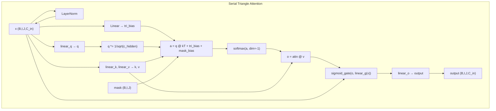
```mermaid
flowchart TD
    subgraph serial [Serial Triangle Attention]
        x["x (B,I,J,C_in)"]
        mask["mask (B,I,J)"]
        LN["LayerNorm"]
        linear_bias["Linear → tri_bias"]
        proj_q["linear_q → q"]
        proj_kv["linear_k, linear_v → k, v"]
        scale["q *= 1/sqrt(c_hidden)"]
        attn_scores["a = q @ kT + tri_bias + mask_bias"]
        softmax["softmax(a, dim=-1)"]
        out_attn["o = attn @ v"]
        gate["sigmoid_gate(o, linear_g(x))"]
        proj_o["linear_o → output"]
        x --> LN
        LN --> x
        x --> linear_bias
        x --> proj_q
        x --> proj_kv
        linear_bias --> attn_scores
        proj_q --> scale
        scale --> attn_scores
        proj_kv --> attn_scores
        mask --> attn_scores
        attn_scores --> softmax
        softmax --> out_attn
        proj_kv --> out_attn
        out_attn --> gate
        x --> gate
        gate --> proj_o
        proj_o --> output["output (B,I,J,C_in)"]
    end
```

**Tensor shape pipeline (Starting Node: Q indexed by rows I, K/V indexed by columns J):** The full I×J attention score matrix is materialized per head. Ending Node transposes input/output so attention runs along columns instead.

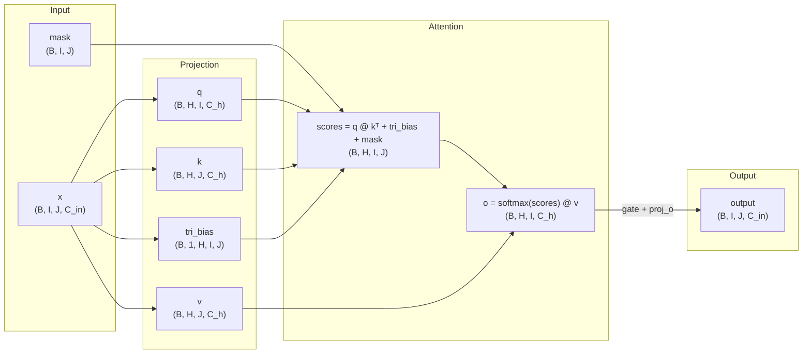
```mermaid
flowchart LR
    subgraph Input
        x["x<br/>(B, I, J, C_in)"]
        mask["mask<br/>(B, I, J)"]
    end
    subgraph Projection
        q["q<br/>(B, H, I, C_h)"]
        k["k<br/>(B, H, J, C_h)"]
        v["v<br/>(B, H, J, C_h)"]
        tb["tri_bias<br/>(B, 1, H, I, J)"]
    end
    subgraph Attention
        sc["scores = q @ kᵀ + tri_bias + mask<br/>(B, H, I, J)"]
        o["o = softmax(scores) @ v<br/>(B, H, I, C_h)"]
    end
    subgraph Output
        out["output<br/>(B, I, J, C_in)"]
    end
    x --> q & k & v & tb
    mask --> sc
    q & k & tb --> sc
    sc --> o
    v --> o
    o -- "gate + proj_o" --> out
```

- Q is indexed by I (rows), K/V by J (columns) — the attention score matrix is I×J per head.
- The triangle bias `tri_bias` is a full `(I, J)` additive bias derived from the pair representation via a linear projection.
- Total compute: O(B × H × I × J × C_h) for scores + O(B × H × I × J × C_h) for output = O(B × H × I × J² × C_h) total.
- Output restores the original pair shape `(B, I, J, C_in)` via gate and output projection.

**Backward pass**: The serial backward pass is handled entirely by the PyTorch autograd engine. Because all operations (linear projections, softmax, einsum, gating) are composed of standard differentiable PyTorch ops, `loss.backward()` automatically computes gradients through the attention score computation, softmax, weighted sum, and gating without custom backward logic.

### DTensor CP Implementation

**Source**: [src/boltz/distributed/model/layers/triangular_attention.py](src/boltz/distributed/model/layers/triangular_attention.py)

**Sharding**: Inputs and outputs use `(Shard(0), Shard(1), Shard(2))` on a 3D device mesh `[batch, cp0, cp1]` (pair dims 1 and 2 sharded).

**Communication**: `Ring2DCommTriAttn` ([src/boltz/distributed/comm.py](src/boltz/distributed/comm.py)). Two-stage triangle bias redistribution: (1) flatten diagonals onto rows/columns; (2) rotate for ring alignment. K, V, mask, and bias then rotate by one step each ring iteration; Q stays local. Partial attention outputs are merged with `tiled_softmax_attention_update`. Starting Node uses `axis_cp=1`; Ending Node uses `axis_cp=0` and transposes input/output.

#### Forward Pass

**Distributed forward flow:**

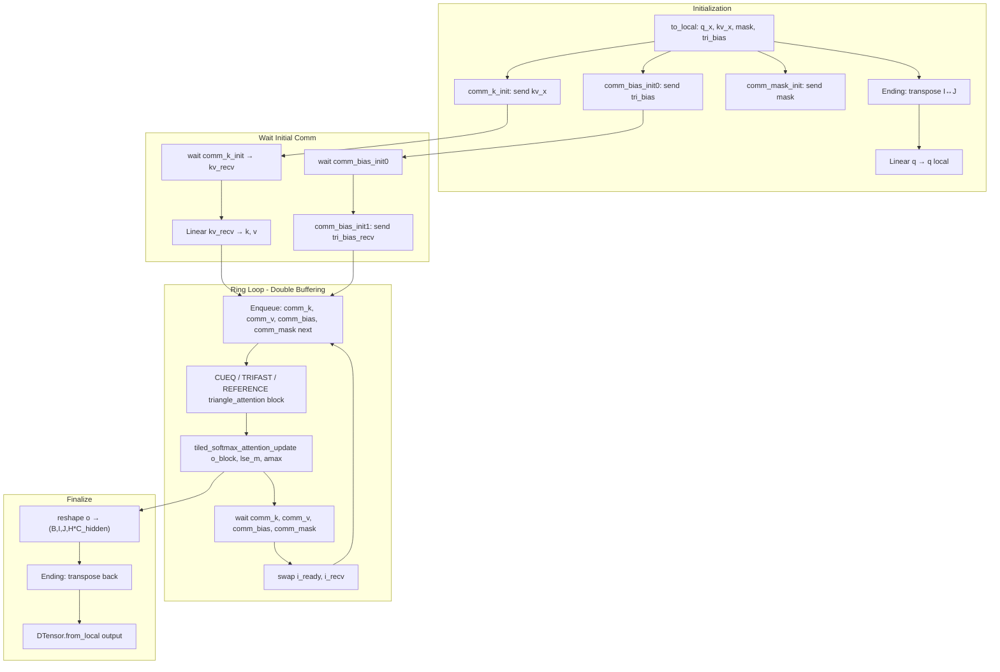
```mermaid
flowchart TD
    subgraph init [Initialization]
        to_local["to_local: q_x, kv_x, mask, tri_bias"]
        ending_t["Ending: transpose I↔J"]
        q_proj["Linear q → q local"]
        kv_send["comm_k_init: send kv_x"]
        mask_send["comm_mask_init: send mask"]
        bias0_send["comm_bias_init0: send tri_bias"]
    end
    subgraph wait_init [Wait Initial Comm]
        wait_kv["wait comm_k_init → kv_recv"]
        wait_bias0["wait comm_bias_init0"]
        k_proj["Linear kv_recv → k, v"]
        bias1_send["comm_bias_init1: send tri_bias_recv"]
    end
    subgraph ring_loop [Ring Loop - Double Buffering]
        launch_next["Enqueue: comm_k, comm_v, comm_bias, comm_mask next"]
        kernel["CUEQ / TRIFAST / REFERENCE triangle_attention block"]
        tiled["tiled_softmax_attention_update o_block, lse_m, amax"]
        wait_ring["wait comm_k, comm_v, comm_bias, comm_mask"]
        swap["swap i_ready, i_recv"]
    end
    subgraph final [Finalize]
        reshape_o["reshape o → (B,I,J,H*C_hidden)"]
        ending_t_back["Ending: transpose back"]
        from_local["DTensor.from_local output"]
    end
    to_local --> ending_t
    ending_t --> q_proj
    to_local --> kv_send
    to_local --> mask_send
    to_local --> bias0_send
    kv_send --> wait_kv
    bias0_send --> wait_bias0
    wait_kv --> k_proj
    wait_bias0 --> bias1_send
    k_proj --> launch_next
    bias1_send --> launch_next
    launch_next --> kernel
    kernel --> tiled
    tiled --> wait_ring
    wait_ring --> swap
    swap --> launch_next
    tiled --> reshape_o
    reshape_o --> ending_t_back
    ending_t_back --> from_local
```

[Triangle Attention forward algorithm interactive visualization](cp_tech_guide_interactive/triangle_attention.html)

**Tensor data flow across ranks (Starting Node, axis_cp=1, P×P grid, example P=3):** Each cell shows which original data shard each rank holds. Notation: `t(i,j)` = shard of tensor `t` originally at grid position (cp0=i, cp1=j). `q` = q_x (query source, stays local), `k` = kv_x (key/value source; K and V both derive from same kv_x), `m` = mask, `b` = triangle bias. Grid rows = cp0, columns = cp1.

```
Stage 0: Initial — identity layout

q:                     k:                     m:                     b:
q(0,0) q(0,1) q(0,2)   k(0,0) k(0,1) k(0,2)   m(0,0) m(0,1) m(0,2)   b(0,0) b(0,1) b(0,2)
q(1,0) q(1,1) q(1,2)   k(1,0) k(1,1) k(1,2)   m(1,0) m(1,1) m(1,2)   b(1,0) b(1,1) b(1,2)
q(2,0) q(2,1) q(2,2)   k(2,0) k(2,1) k(2,2)   m(2,0) m(2,1) m(2,2)   b(2,0) b(2,1) b(2,2)

      ↓ bias init0: col j up-shifts by j (only b changes)

Stage 1: After bias Stage 1

q:                     k:                     m:                     b:
q(0,0) q(0,1) q(0,2)   k(0,0) k(0,1) k(0,2)   m(0,0) m(0,1) m(0,2)   b(0,0) b(1,1) b(2,2)
q(1,0) q(1,1) q(1,2)   k(1,0) k(1,1) k(1,2)   m(1,0) m(1,1) m(1,2)   b(1,0) b(2,1) b(0,2)
q(2,0) q(2,1) q(2,2)   k(2,0) k(2,1) k(2,2)   m(2,0) m(2,1) m(2,2)   b(2,0) b(0,1) b(1,2)

      ↓ bias init1: row i right-shifts by i; k+m init: row i right-shifts by i along cp1

Stage 2: Ring-ready — q col = bias_i, k col = bias_j

q:                     k:                     m:                     b:
q(0,0) q(0,1) q(0,2)   k(0,0) k(0,1) k(0,2)   m(0,0) m(0,1) m(0,2)   b(0,0) b(1,1) b(2,2)
q(1,0) q(1,1) q(1,2)   k(1,2) k(1,0) k(1,1)   m(1,2) m(1,0) m(1,1)   b(0,2) b(1,0) b(2,1)
q(2,0) q(2,1) q(2,2)   k(2,1) k(2,2) k(2,0)   m(2,1) m(2,2) m(2,0)   b(0,1) b(1,2) b(2,0)

      ↓ Ring step 0: compute, then shift (k+m right-shift along cp1; b up-shift along cp0)

Stage 3: After first ring shift

q:                     k:                     m:                     b:
q(0,0) q(0,1) q(0,2)   k(0,2) k(0,0) k(0,1)   m(0,2) m(0,0) m(0,1)   b(0,2) b(1,0) b(2,1)
q(1,0) q(1,1) q(1,2)   k(1,1) k(1,2) k(1,0)   m(1,1) m(1,2) m(1,0)   b(0,1) b(1,2) b(2,0)
q(2,0) q(2,1) q(2,2)   k(2,0) k(2,1) k(2,2)   m(2,0) m(2,1) m(2,2)   b(0,0) b(1,1) b(2,2)

      ↓ Steps 1..P−1: repeat → full attention complete
```

- **q stays local**: each rank's q_x shard is never communicated. Q block index = cp1.
- **k + m shuffled**: `comm_k_init` / `comm_mask_init` right-shift kv_x and mask along cp1 by the rank's cp0 offset, aligning K/V/mask with the ring-start position.
- **b redistributed in 2 stages**: Stage 1 (`comm_bias_init0`) flattens lower diagonals onto rows (col j up-shifts by j); Stage 2 (`comm_bias_init1`) rotates within rows (row i right-shifts by i). Together they prepare bias for the ring without cross-rail traffic.
- **Ring invariant**: after init, `bias_i = Q block` and `bias_j = K block` at every rank. This invariant is preserved through all ring steps because k/m right-shift along cp1 (within each row) and b up-shifts along cp0 (within each column).
- After P steps every Q has paired with all K/V blocks — full attention computed.
- CUEQ/TRIFAST kernels compute the local triangle-attention block; `tiled_softmax_attention_update` merges partial results numerically stably.

#### Backward Pass

The backward pass runs the same ring topology as the forward but computes gradients instead of attention outputs. The forward tensors (K, V, bias, mask) are replayed through the ring while gradient buffers for dK, dV, and dtriangle_bias rotate alongside them. dQ accumulates locally — no communication needed since Q never left the owning rank.

**Saved tensors**: The forward pass saves q_x_local, kv_x_recv (after initial ring shuffle), weight_q/k/v, projected q, the final ring-position K^T/V/bias/mask buffers, attention output o, and numerical stability state (amax, lse_m).

**Backward algorithm:**

1. **Dtype alignment**: Cast the upstream gradient `do` to the saved tensor dtype to prevent NCCL buffer size mismatches under mixed precision.
2. **Ring loop** (P steps, same direction as forward):
   - Each step replays the forward's K^T, V, bias, mask from double buffers.
   - CUEQ/TRIFAST/REFERENCE backward kernels compute per-block gradients: `dq_block`, `dkT_block`, `dvT_block`, `dtriangle_bias_block`.
   - `dq` accumulates locally (no communication): `dq += dq_block`.
   - `dkT`, `dvT`, `dtriangle_bias` are received from the ring, accumulated with the current block, and sent onward via `comm_dk`, `comm_dv`, `comm_dbias`.
3. **Extra rotation step**: One additional buffer swap after the loop restores gradient ownership to the forward's initial layout.
4. **Weight gradients**: `dweight_q = einsum(dq_reshaped, q_x_local)`, `dweight_k = einsum(dk_reshaped, kv_x_recv)`, `dweight_v = einsum(dv_reshaped, kv_x_recv)`. These are wrapped as `Partial(Sum)` DTensors for downstream all-reduce.
5. **Input gradients**: `dq_x = einsum(dq_reshaped, weight_q)`, `dkv_x = einsum(dv_reshaped, weight_v) + einsum(dk_reshaped, weight_k)`.
6. **Bias gradient restoration** (two stages, reversing forward init):
   - `comm_dbias_final0`: reverses the forward's column up-shift (Stage 1).
   - `comm_dbias_final1`: reverses the forward's row right-shift (Stage 2).
7. **KV gradient restoration**: `comm_dk_final` sends `dkv_x` back to the original kv_x owner.
8. **Ending Node**: transposes all gradients back to `(B, I, J, C)` layout.

**Distributed backward flow:**

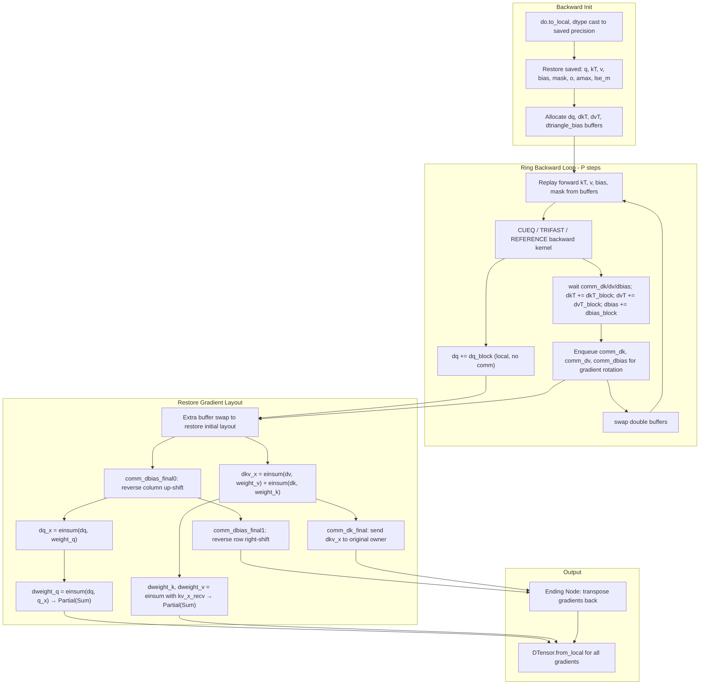
```mermaid
flowchart TD
    subgraph init [Backward Init]
        do_cast["do.to_local, dtype cast to saved precision"]
        restore["Restore saved: q, kT, v, bias, mask, o, amax, lse_m"]
        alloc["Allocate dq, dkT, dvT, dtriangle_bias buffers"]
    end
    subgraph ring_bwd [Ring Backward Loop - P steps]
        replay["Replay forward kT, v, bias, mask from buffers"]
        kernel_bwd["CUEQ / TRIFAST / REFERENCE backward kernel"]
        accum_dq["dq += dq_block (local, no comm)"]
        accum_dkv["wait comm_dk/dv/dbias; dkT += dkT_block; dvT += dvT_block; dbias += dbias_block"]
        send_grad["Enqueue comm_dk, comm_dv, comm_dbias for gradient rotation"]
        swap_bwd["swap double buffers"]
    end
    subgraph restore_layout [Restore Gradient Layout]
        extra_swap["Extra buffer swap to restore initial layout"]
        dbias_f0["comm_dbias_final0: reverse column up-shift"]
        dqx["dq_x = einsum(dq, weight_q)"]
        dwq["dweight_q = einsum(dq, q_x) → Partial(Sum)"]
        dbias_f1["comm_dbias_final1: reverse row right-shift"]
        dkvx["dkv_x = einsum(dv, weight_v) + einsum(dk, weight_k)"]
        dwkv["dweight_k, dweight_v = einsum with kv_x_recv → Partial(Sum)"]
        dk_final["comm_dk_final: send dkv_x to original owner"]
    end
    subgraph out_bwd [Output]
        ending_bwd["Ending Node: transpose gradients back"]
        from_local_bwd["DTensor.from_local for all gradients"]
    end
    do_cast --> restore --> alloc --> replay
    replay --> kernel_bwd --> accum_dq
    kernel_bwd --> accum_dkv --> send_grad --> swap_bwd --> replay
    accum_dq --> extra_swap
    send_grad --> extra_swap
    extra_swap --> dbias_f0 --> dqx --> dwq
    dbias_f0 --> dbias_f1
    extra_swap --> dkvx --> dwkv
    dkvx --> dk_final
    dbias_f1 --> ending_bwd
    dk_final --> ending_bwd
    dwq --> from_local_bwd
    dwkv --> from_local_bwd
    ending_bwd --> from_local_bwd
```

**Communication budget (backward):**

| Collective | Count | Volume per op |
| --- | --- | --- |
| Ring P2P (dkT, dvT, dbias) | P steps × 3 | O(B × I/P × J/P × D) each |
| comm_dbias_final0 | 1 | O(B × I/P × J/P × H) |
| comm_dbias_final1 | 1 | O(B × I/P × J/P × H) |
| comm_dk_final | 1 | O(B × I/P × J/P × C_in) |

[Triangle Attention backward algorithm interactive visualization](cp_tech_guide_interactive/triangle_attention_backward.html)

**Tensor data flow across ranks (Backward, axis_cp=1, P×P grid, example P=3):** Notation: `dq(i,j)`, `dk(i,j)`, `db(i,j)` = gradient for the original shard at grid position (i,j). During the ring, gradient buffers rotate alongside forward data buffers (dk/dv right-shift along cp1, db up-shift along cp0). dq accumulates locally with no communication. Grid rows = cp0, columns = cp1.

```
Stage 0: Ring completes + extra buffer swap — gradient ownership matches forward Stage 2

dq (local throughout):       dk:                        db:
dq(0,0) dq(0,1) dq(0,2)   dk(0,0) dk(0,1) dk(0,2)   db(0,0) db(1,1) db(2,2)
dq(1,0) dq(1,1) dq(1,2)   dk(1,2) dk(1,0) dk(1,1)   db(0,2) db(1,0) db(2,1)
dq(2,0) dq(2,1) dq(2,2)   dk(2,1) dk(2,2) dk(2,0)   db(0,1) db(1,2) db(2,0)

      ↓ comm_dbias_final0: row i left-shift by i (reverses forward bias init1)

Stage 1: After comm_dbias_final0

dk (unchanged):              db:
dk(0,0) dk(0,1) dk(0,2)   db(0,0) db(1,1) db(2,2)
dk(1,2) dk(1,0) dk(1,1)   db(1,0) db(2,1) db(0,2)
dk(2,1) dk(2,2) dk(2,0)   db(2,0) db(0,1) db(1,2)

      ↓ comm_dbias_final1: col j down-shift by j (reverses forward bias init0)
      ↓ comm_dk_final: row i left-shift by i (reverses forward k/m init)

Stage 2: Final — identity layout, all gradients restored to owners

dq:                        dk:                        db:
dq(0,0) dq(0,1) dq(0,2)   dk(0,0) dk(0,1) dk(0,2)   db(0,0) db(0,1) db(0,2)
dq(1,0) dq(1,1) dq(1,2)   dk(1,0) dk(1,1) dk(1,2)   db(1,0) db(1,1) db(1,2)
dq(2,0) dq(2,1) dq(2,2)   dk(2,0) dk(2,1) dk(2,2)   db(2,0) db(2,1) db(2,2)
```

- During the P-step ring, each gradient buffer (dk, dv, db) accumulates contributions from every rank that processed the corresponding data shard, then one extra rotation aligns ownership with the forward's Stage 2 layout.
- The two-stage bias restoration and kv restoration together invert the forward's three init communications, bringing all gradients back to the identity layout.

### CUDA Acceleration Kernels

| Backend                  | Forward                            | Backward                                          | Notes                                          |
| ------------------------ | ---------------------------------- | ------------------------------------------------- | ---------------------------------------------- |
| **CUEQ**                 | `cueq_triangle.triangle_attention` | `torch.ops.cuequivariance.triangle_attention_bwd` | Returns LSE and amax for tiled softmax         |
| **TRIFAST**              | `trifast_triangle_attention`       | `trifast_triangle_attention_bwd`                  | Requires mask; LSE only (no amax)              |
| **REFERENCE**            | PyTorch matmul + softmax           | PyTorch autograd                                  | Scale applied in Python                        |
| **CUEQ_FWD_TRIFAST_BWD** | CUEQ forward                       | TRIFAST backward                                  | FP32; tensors reshaped for TRIFAST in backward |

CUEQ expects `q` shape `[*, H, Q, C_hidden]`, `kT` `[*, H, K, C_hidden]`, `v` `[*, H, V, C_hidden]`, bias `[*, 1, H, I, J]`, mask `[*, I, 1, 1, J]` (bool). TRIFAST uses `[*, H, I, Q, C_hidden]` and `[*, H, I, J]` mask (True = invalid).

### Space and Time Complexity

| Aspect               | Serial            | Distributed (per rank)                    |
| -------------------- | ----------------- | ----------------------------------------- |
| Compute              | O(B × H × I × J² × D) | O(B × H × I/P × (J/P)² × D) per step; P steps |
| Memory (activations) | O(B × H × I × J × D)  | O(B × H × I/P × J/P × D)                      |
| Comm per step        | —                     | O(B × H × I/P × J/P × D) for k, v, bias, mask |
| Ring steps           | —                 | P (grid size along axis_cp)               |

*P denotes the size of each mesh dimension sharding a pair axis (i.e. √P\_total for a P\_total-GPU square mesh). For 2D-sharded pair modules P = √P\_total and the ring has √P\_total steps; total compute per rank equals serial / P\_total.*

### Source Files and Tests

- Implementation: [src/boltz/distributed/model/layers/triangular_attention.py](src/boltz/distributed/model/layers/triangular_attention.py)
- Tests: [tests/distributed/model/layers/test_dtensor_triangle_attention.py](tests/distributed/model/layers/test_dtensor_triangle_attention.py)

---

## 4. Triangle Multiplication

### Overview and Problem Statement

Triangle Multiplication aggregates over one index of the pair representation to update the other two. The operations are:

**Outgoing**: `o = einsum("bnkd,bmkd->bnmd", a, b)` — sum over shared index k (first position).

**Incoming**: `o = einsum("bknd,bkmd->bnmd", a, b)` — sum over shared index k (second position).

Input and output shapes are `(B, N, N, D)`. Serial complexity is O(B × N² × N × D) = O(B × N³ × D); distribution is needed to fit and parallelize over the pair dimensions.

Training requires computing gradients of the loss with respect to the pair representation and gate through the einsum contraction. The distributed backward pass performs two separate distributed BMMs — one for grad_a and one for grad_b — using the same ring communication pattern as the forward, then combines them with the chain-rule contributions from masking and gating to produce the final input and gate gradients.

### Key Innovations

#### Forward Pass

- **Memory**: Sharded operands O((N/P)² × D) per rank; one operand transposed across the 2D grid so ring shifts align with the contracted index.
- **Computation**: Ring BMM: row-wise shift of LHS and column-wise shift of RHS; each step accumulates a partial matmul; no global all-gather of the full pair tensor.
- **Distribution**: Outgoing vs incoming variants differ only by which operand is transposed (RHS vs LHS), reusing the same Ring2DComm primitive.
- **Communication**: O(P) ring steps with O(B × (N/P)² × D) volume per step; double buffering overlaps matmul with next-step send/receive.

#### Backward Pass

- **Memory**: No additional large buffers beyond the two distributed BMM outputs; saved tensors (a, b, mask, gate, masked-gated input) reuse forward activation memory.
- **Computation**: Two independent `_distributed_bmm` calls compute grad_a and grad_b with the same Cannon ring pattern; gate and mask gradients are elementwise chain-rule operations on local tensors.
- **Distribution**: Outgoing mode transposes LHS for grad_b; Incoming mode transposes RHS for grad_a — the complementary transpose of the forward. The same `Ring2DComm` instance is reused.
- **Communication**: 2 × (1 optional transpose + P ring steps) for the two BMMs; dtype cast of upstream gradient to match saved tensor precision prevents NCCL buffer mismatches.

### Executive Summary: From Serial Bottlenecks to Distributed Efficiency

Serial triangle multiplication performs a full einsum over the pair dimensions, incurring O(B × N³ × D) compute and O(N² × D) activation memory. The distributed algorithm transposes one operand across the 2D process grid and then runs a ring: LHS chunks shift along rows and RHS chunks along columns so that each rank repeatedly multiplies its current LHS block by the incoming RHS block and accumulates. After P steps the contraction is complete without ever materializing the full N×N operands on any rank. The same primitive supports both outgoing and incoming modes by choosing which operand is transposed, enabling scalable triangle multiplication for large pair representations.

### Serial Reference Implementation

**Source**: [src/boltz/model/layers/triangular_mult.py](src/boltz/model/layers/triangular_mult.py)

| Tensor | Shape            | Meaning                                    |
| ------ | ---------------- | ------------------------------------------ |
| `x`    | `(B, N, N, 2*D)` | Pair representation (split into a, b)      |
| `mask` | `(B, N, N)`      | Pair mask                                  |
| `a, b` | `(B, N, N, D)`   | From chunk(x, 2, dim=-1), masked and gated |
| Output | `(B, N, N, D)`   | After einsum and output projection         |

**Serial flow:**

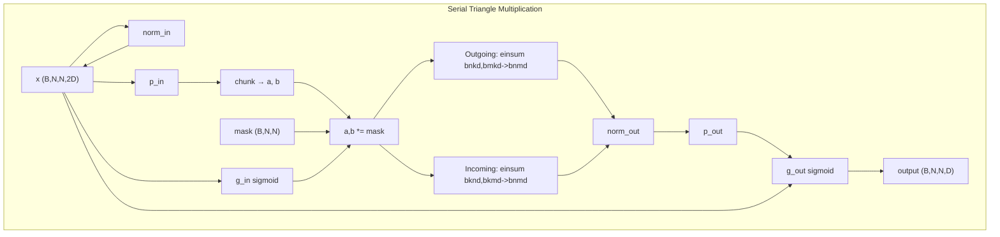
```mermaid
flowchart TD
    subgraph serial [Serial Triangle Multiplication]
        x["x (B,N,N,2D)"]
        mask["mask (B,N,N)"]
        norm["norm_in"]
        g_in["g_in sigmoid"]
        p_in["p_in"]
        chunk["chunk → a, b"]
        mask_apply["a,b *= mask"]
        einsum_out["Outgoing: einsum bnkd,bmkd->bnmd"]
        einsum_in["Incoming: einsum bknd,bkmd->bnmd"]
        norm_out["norm_out"]
        p_out["p_out"]
        g_out["g_out sigmoid"]
        x --> norm
        norm --> x
        x --> g_in
        x --> p_in
        p_in --> chunk
        chunk --> mask_apply
        mask --> mask_apply
        g_in --> mask_apply
        mask_apply --> einsum_out
        mask_apply --> einsum_in
        einsum_out --> norm_out
        einsum_in --> norm_out
        norm_out --> p_out
        p_out --> g_out
        x --> g_out
        g_out --> output["output (B,N,N,D)"]
    end
```

**Tensor shape pipeline:** Input x is split into a and b. The einsum contracts over one N dimension (the shared index k), producing O(N³) compute. Outgoing and Incoming differ in which axis is contracted.

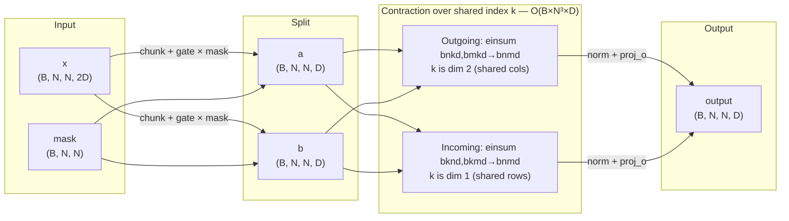
```mermaid
flowchart LR
    subgraph Input
        x["x<br/>(B, N, N, 2D)"]
        mask["mask<br/>(B, N, N)"]
    end
    subgraph Split
        a["a<br/>(B, N, N, D)"]
        b["b<br/>(B, N, N, D)"]
    end
    subgraph Einsum["Contraction over shared index k — O(B×N³×D)"]
        out_mode["Outgoing: einsum bnkd,bmkd→bnmd<br/>k is dim 2 (shared cols)"]
        in_mode["Incoming: einsum bknd,bkmd→bnmd<br/>k is dim 1 (shared rows)"]
    end
    subgraph Output
        out["output<br/>(B, N, N, D)"]
    end
    x -- "chunk + gate × mask" --> a & b
    mask --> a & b
    a & b --> out_mode & in_mode
    out_mode -- "norm + proj_o" --> out
    in_mode -- "norm + proj_o" --> out
```

- The einsum contracts over one of the two N dimensions (size N), producing O(B × N² × N × D) = O(B × N³ × D) compute.
- Outgoing sums over shared columns (k in position 2): `a[n,:,d] · b[m,:,d] → out[n,m,d]`.
- Incoming sums over shared rows (k in position 1): `a[:,n,d] · b[:,m,d] → out[n,m,d]`.
- Both modes produce the same output shape `(B, N, N, D)`.

**Backward pass**: The serial backward pass is handled entirely by the PyTorch autograd engine. Gradients flow through the einsum, masking, gating (sigmoid derivative), and chunking operations automatically via `loss.backward()` without custom backward logic.

### DTensor CP Implementation

**Source**: [src/boltz/distributed/model/layers/triangular_mult.py](src/boltz/distributed/model/layers/triangular_mult.py)

**Sharding**: `(Shard(0), Shard(1), Shard(2))` on a 2D process grid over the pair dimensions (batch and the two N dimensions).

**Communication**: `Ring2DComm`. One operand is transposed across the 2D grid (`comm_2d_trans`). Row ring: LHS chunks shift left (row init: row i shifts by i; then shift by 1). Column ring: RHS chunks shift up (col init: col j shifts by j; then shift by 1). Each step accumulates a partial matmul; after P steps the full result is assembled. Outgoing: transpose RHS. Incoming: transpose LHS.

#### Forward Pass

**Distributed forward flow:**

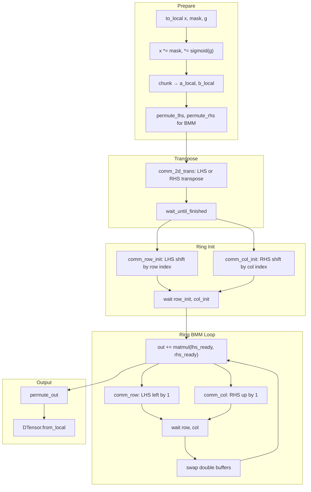
```mermaid
flowchart TD
    subgraph prep [Prepare]
        to_local["to_local x, mask, g"]
        mask_gate["x *= mask, *= sigmoid(g)"]
        chunk_ab["chunk → a_local, b_local"]
        permute["permute_lhs, permute_rhs for BMM"]
    end
    subgraph transpose [Transpose]
        xpose["comm_2d_trans: LHS or RHS transpose"]
        wait_xpose["wait_until_finished"]
    end
    subgraph ring_init [Ring Init]
        row_init["comm_row_init: LHS shift by row index"]
        col_init["comm_col_init: RHS shift by col index"]
        wait_init["wait row_init, col_init"]
    end
    subgraph ring_loop [Ring BMM Loop]
        matmul["out += matmul(lhs_ready, rhs_ready)"]
        row_shift["comm_row: LHS left by 1"]
        col_shift["comm_col: RHS up by 1"]
        wait_ring["wait row, col"]
        swap_buf["swap double buffers"]
    end
    subgraph out [Output]
        permute_out["permute_out"]
        from_local["DTensor.from_local"]
    end
    to_local --> mask_gate
    mask_gate --> chunk_ab
    chunk_ab --> permute
    permute --> xpose
    xpose --> wait_xpose
    wait_xpose --> row_init
    wait_xpose --> col_init
    row_init --> wait_init
    col_init --> wait_init
    wait_init --> matmul
    matmul --> row_shift
    matmul --> col_shift
    row_shift --> wait_ring
    col_shift --> wait_ring
    wait_ring --> swap_buf
    swap_buf --> matmul
    matmul --> permute_out
    permute_out --> from_local
```

[Triangle Multiplication forward algorithm interactive visualization](cp_tech_guide_interactive/triangle_multiplication.html)

**Tensor data flow across ranks (Outgoing mode, P×P grid, example P=3):** Each cell shows which original data shard each rank holds. Notation: `T(i,j)` = shard of tensor `T` originally at grid position (i,j). `L` = LHS, `R` = RHS. Outgoing mode transposes R; Incoming mode transposes L instead (rest is identical). Grid rows = cp0, columns = cp1.

```
Stage 0: Initial — rank(i,j) owns L(i,j) and R(i,j)

L:                     R:
L(0,0) L(0,1) L(0,2)   R(0,0) R(0,1) R(0,2)
L(1,0) L(1,1) L(1,2)   R(1,0) R(1,1) R(1,2)
L(2,0) L(2,1) L(2,2)   R(2,0) R(2,1) R(2,2)

      ↓ Transpose R: R(i,j) → position (j,i). L unchanged.

Stage 1: After R transpose

L:                     R:
L(0,0) L(0,1) L(0,2)   R(0,0) R(1,0) R(2,0)
L(1,0) L(1,1) L(1,2)   R(0,1) R(1,1) R(2,1)
L(2,0) L(2,1) L(2,2)   R(0,2) R(1,2) R(2,2)

      ↓ Cannon init shifts

Stage 2: Cannon-aligned — contracted index k matches at each rank

L:                     R:
L(0,0) L(0,1) L(0,2)   R(0,0) R(1,1) R(2,2)
L(1,1) L(1,2) L(1,0)   R(1,0) R(2,1) R(0,2)
L(2,2) L(2,0) L(2,1)   R(2,0) R(0,1) R(1,2)

      ↓ Step 0: matmul + shift (L left-shift in rows; R up-shift in cols)

Stage 3: After first ring shift

L:                     R:
L(0,1) L(0,2) L(0,0)   R(1,0) R(2,1) R(0,2)
L(1,2) L(1,0) L(1,1)   R(2,0) R(0,1) R(1,2)
L(2,0) L(2,1) L(2,2)   R(0,0) R(1,1) R(2,2)

      ↓ Steps 1..P−1: repeat → full contraction complete
```

- **Outgoing** transposes R; **Incoming** transposes L. The rest of the algorithm is identical.
- At each step the contracted index k aligns: e.g. in Stage 2, rank (0,1) has L(0,1) (k=1) and R(1,1) (k=1). After shift, rank (0,1) has L(0,2) (k=2) and R(2,1) (k=2).
- After P steps, every (LHS, RHS) pair that contributes to the output has been colocated and multiplied — no all-gather needed.

#### Backward Pass

The backward pass computes gradients for the two operands (a, b) of the einsum, then combines them via the chain rule through the gating and masking operations to produce dx and dg. Each operand gradient requires a distributed BMM with the same Cannon ring pattern as the forward.

**Saved tensors**: a_local, b_local (the two chunks from forward), mask_local, g_local (sigmoid of gate), and x_masked_gated_local (the full masked-and-gated input before chunking).

**Backward algorithm:**

1. **Dtype alignment**: Cast upstream gradient `d_loss_d_out` to the saved tensor dtype (e.g. bfloat16) to prevent NCCL buffer size mismatches.
2. **grad_a via `_distributed_bmm`**: Computes `d_loss_d_a = d_loss_d_out @ b` (Outgoing) or `b @ d_loss_d_out` (Incoming) using the Cannon ring — transpose, row/col init, P ring steps with partial matmul accumulation.
3. **grad_b via `_distributed_bmm`**: Computes `d_loss_d_b = d_loss_d_out @ a` (Outgoing, with LHS transpose) or `a @ d_loss_d_out` (Incoming) using the same ring.
4. **Concatenate**: `dab = cat([d_loss_d_a, d_loss_d_b], dim=-1)` to match the original chunked layout.
5. **Gate gradient**: `dg = dab * x_masked_gated * (1 - g)` — the sigmoid derivative `σ(g)(1 - σ(g))` combined with the input.
6. **Input gradient**: `dx = dab * mask * g` — chain rule through masking and gating.

**Distributed backward flow:**

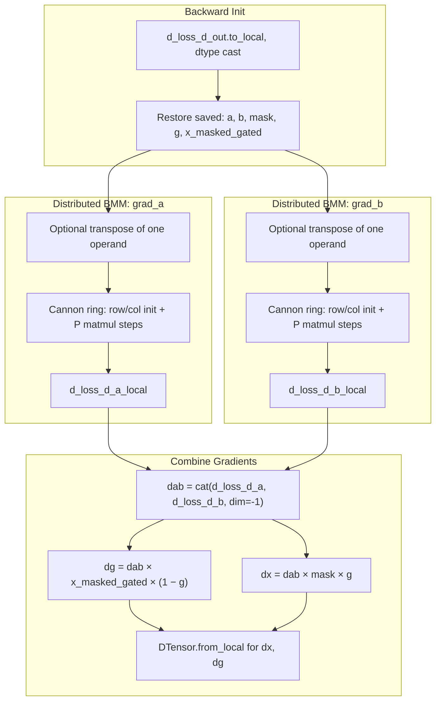
```mermaid
flowchart TD
    subgraph init_bwd [Backward Init]
        do_cast["d_loss_d_out.to_local, dtype cast"]
        restore_bwd["Restore saved: a, b, mask, g, x_masked_gated"]
    end
    subgraph bmm_da [Distributed BMM: grad_a]
        xpose_da["Optional transpose of one operand"]
        ring_da["Cannon ring: row/col init + P matmul steps"]
        result_da["d_loss_d_a_local"]
    end
    subgraph bmm_db [Distributed BMM: grad_b]
        xpose_db["Optional transpose of one operand"]
        ring_db["Cannon ring: row/col init + P matmul steps"]
        result_db["d_loss_d_b_local"]
    end
    subgraph combine [Combine Gradients]
        cat_dab["dab = cat(d_loss_d_a, d_loss_d_b, dim=-1)"]
        dg_comp["dg = dab × x_masked_gated × (1 − g)"]
        dx_comp["dx = dab × mask × g"]
        wrap_dtensor["DTensor.from_local for dx, dg"]
    end
    do_cast --> restore_bwd
    restore_bwd --> xpose_da --> ring_da --> result_da
    restore_bwd --> xpose_db --> ring_db --> result_db
    result_da --> cat_dab
    result_db --> cat_dab
    cat_dab --> dg_comp
    cat_dab --> dx_comp
    dg_comp --> wrap_dtensor
    dx_comp --> wrap_dtensor
```

**Communication budget (backward):**

| Collective | Count | Volume per op |
| --- | --- | --- |
| Transpose (comm_2d_trans) | 1 per BMM (if needed) | O(B × (N/P)² × D) |
| Row init + Col init | 2 per BMM | O(B × (N/P)² × D) |
| Ring P2P (row shift + col shift) | P−1 per BMM × 2 | O(B × (N/P)² × D) each |

[Triangle Multiplication backward algorithm interactive visualization](cp_tech_guide_interactive/triangle_multiplication_backward.html)

**Tensor data flow across ranks (Backward, Outgoing mode, P×P grid, example P=3):** Notation: `G(i,j)` = upstream gradient shard, `a(i,j)` and `b(i,j)` = saved operand shards from forward. Two independent Cannon BMMs compute grad_a and grad_b. Grid rows = cp0, columns = cp1.

```
grad_a BMM: G (LHS, no transpose), b (RHS) — same Cannon as forward

Stage 0: Initial

G:                     b:
G(0,0) G(0,1) G(0,2)   b(0,0) b(0,1) b(0,2)
G(1,0) G(1,1) G(1,2)   b(1,0) b(1,1) b(1,2)
G(2,0) G(2,1) G(2,2)   b(2,0) b(2,1) b(2,2)

      ↓ Cannon init: G row left-shift by i, b col up-shift by j

Stage 1: Cannon-aligned

G:                     b:
G(0,0) G(0,1) G(0,2)   b(0,0) b(1,1) b(2,2)
G(1,1) G(1,2) G(1,0)   b(1,0) b(2,1) b(0,2)
G(2,2) G(2,0) G(2,1)   b(2,0) b(0,1) b(1,2)

      ↓ P ring steps: G left-shift rows, b up-shift cols → grad_a complete
```

```
grad_b BMM: G (LHS, transpose), a (RHS)

Stage 0: Initial

G:                     a:
G(0,0) G(0,1) G(0,2)   a(0,0) a(0,1) a(0,2)
G(1,0) G(1,1) G(1,2)   a(1,0) a(1,1) a(1,2)
G(2,0) G(2,1) G(2,2)   a(2,0) a(2,1) a(2,2)

      ↓ Transpose G (LHS): G(i,j) → position (j,i)

Stage 1: After G transpose

G:                     a:
G(0,0) G(1,0) G(2,0)   a(0,0) a(0,1) a(0,2)
G(0,1) G(1,1) G(2,1)   a(1,0) a(1,1) a(1,2)
G(0,2) G(1,2) G(2,2)   a(2,0) a(2,1) a(2,2)

      ↓ Cannon init: G row left-shift by i, a col up-shift by j

Stage 2: Cannon-aligned

G:                     a:
G(0,0) G(1,0) G(2,0)   a(0,0) a(1,1) a(2,2)
G(1,1) G(2,1) G(0,1)   a(1,0) a(2,1) a(0,2)
G(2,2) G(0,2) G(1,2)   a(2,0) a(0,1) a(1,2)

      ↓ P ring steps: G left-shift rows, a up-shift cols → grad_b complete
```

- After both BMMs, `dab = cat(grad_a, grad_b)`, then `dx = dab × mask × g` and `dg = dab × x × (1−g)` are purely local.
- **Incoming** mode transposes the other operand but follows the same Cannon pattern.

### CUDA Acceleration Kernels

The serial path can use `cuequivariance_torch.primitives.triangle.kernel_triangular_mult` when available. The distributed path does not use this kernel; it uses `_distributed_bmm` (ring BMM) with standard PyTorch `torch.matmul`.

### Space and Time Complexity

| Aspect               | Serial                     | Distributed (per rank)                      |
| -------------------- | -------------------------- | ------------------------------------------- |
| Compute              | O(B × N² × K × D) with K=N | O(B × (N/P)² × (K/P) × D) per step; P steps |
| Memory (activations) | O(B × N² × D)              | O(B × (N/P)² × D)                           |
| Comm (transpose)     | —                          | O(B × (N/P)² × D) once                      |
| Comm per step        | —                          | O(B × (N/P)² × D) row + col                 |
| Ring steps           | —                          | P                                           |

### Source Files and Tests

- Implementation: [src/boltz/distributed/model/layers/triangular_mult.py](src/boltz/distributed/model/layers/triangular_mult.py)
- Tests: [tests/distributed/model/layers/test_dtensor_triangular_mult.py](tests/distributed/model/layers/test_dtensor_triangular_mult.py)

---

## 5. Pair Weighted Averaging

### Overview and Problem Statement

Pair Weighted Averaging uses the pair representation to form attention weights over the sequence dimension, then applies them to a value representation from the MSA. The operation is:

```
v, g = proj_v(m), sigmoid(proj_g(m))            # from MSA repr m
w = softmax(proj_z(z) + mask_bias, dim=-1)       # (B, H, N, N)
o = einsum("bhij,bhsjd->bhsid", w, v)            # weighted sum over j
output = proj_o(g * o)
```

Inputs: MSA representation `m` (B, S, N, c_m), pair representation `z` (B, N, N, c_z), mask (B, N, N). Output: (B, S, N, c_m). The softmax and einsum over N² make distribution necessary for large N.

Training requires propagating gradients through the softmax-weighted sum back to the value representation v, the pair-derived weights b, and the gate g. The distributed backward pass runs a ring over the post-softmax weights, output gradients, and a softmax correction scalar, accumulating value gradients locally while routing weight gradients through a virtual all-reduce pattern that restores ownership to match the original pair tensor layout.

### Key Innovations

#### Forward Pass

- **Memory**: Per-rank shards of v and bT (transposed weights); partial output accumulated with online softmax (amax/LSE) so full N² attention weights are never materialized.
- **Computation**: Ring over v (row) and bT (column); each step computes softmax on local bT block and einsum with v block; tiled_softmax_attention_update merges partial outputs numerically stably.
- **Distribution**: Transpose of b across grid plus row/column init so ring alignment matches contraction indices; backward uses ring over p, do, d and virtual all-reduce for db.
- **Communication**: O(P) ring steps with O(B × H × S/P × N/P × D) per step; backward db accumulation via comm_db and comm_db_final restores gradient layout.

#### Backward Pass

- **Memory**: Reuses saved post-softmax weights p, value v, gate g, and pre-gated output o; no additional large allocations beyond the dv accumulator and db double buffers.
- **Computation**: Ring over p (column), do (row), and softmax correction scalar d (row); per-step dv_block via einsum of do and p, db_block via einsum of do and v minus the softmax correction; gate gradient dg is a local elementwise sigmoid-derivative computation.
- **Distribution**: Virtual all-reduce for db: each ring step accumulates partial db and sends it onward via comm_db; after the loop, comm_db_final restores db layout to match the original pair tensor b's ownership.
- **Communication**: O(P) ring steps with O(B × H × N/P × N/P) per step for p, do, d, db; 1 final comm_db_final for ownership restoration; dtype cast of upstream gradient to match saved tensor precision.

### Executive Summary: From Serial Bottlenecks to Distributed Efficiency

Serial pair weighted averaging computes softmax over the full N² pair dimension and then a weighted sum over sequence positions, requiring O(B × H × S × N² × D) compute and full N² weight storage. The distributed design transposes the weight tensor b across the 2D grid and runs a ring: v shifts by row and bT by column so each rank holds a block of weights and values; per-step softmax and einsum produce partial outputs that are merged using tiled softmax (amax/LSE) to preserve numerical equivalence to the global softmax. Backward propagates through the same ring with an extra virtual all-reduce pattern for the weight gradient, enabling scalable pair averaging without all-gathering the pair representation.

### Serial Reference Implementation

**Source**: [src/boltz/model/layers/pair_averaging.py](src/boltz/model/layers/pair_averaging.py)

| Tensor | Shape               | Meaning                          |
| ------ | ------------------- | -------------------------------- |
| `m`    | `(B, S, N, c_m)`    | MSA single representation        |
| `z`    | `(B, N, N, c_z)`    | Pair representation              |
| `v`    | `(B, H, S, N, c_h)` | From proj_m(m), reshaped         |
| `b`    | `(B, N, N, H)`      | proj_z(z), softmax over last dim |
| `g`    | `(B, S, N, H*c_h)`  | sigmoid(proj_g(m))               |
| Output | `(B, S, N, c_m)`    | proj_o(g * o)                    |

**Serial flow:**

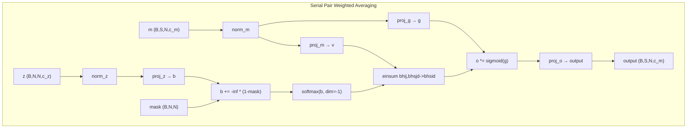
```mermaid
flowchart TD
    subgraph serial [Serial Pair Weighted Averaging]
        m["m (B,S,N,c_m)"]
        z["z (B,N,N,c_z)"]
        mask["mask (B,N,N)"]
        norm_m["norm_m"]
        norm_z["norm_z"]
        proj_m["proj_m → v"]
        proj_z["proj_z → b"]
        proj_g["proj_g → g"]
        mask_bias["b += -inf * (1-mask)"]
        softmax["softmax(b, dim=-1)"]
        einsum["einsum bhij,bhsjd->bhsid"]
        gate["o *= sigmoid(g)"]
        proj_o["proj_o → output"]
        m --> norm_m
        z --> norm_z
        norm_m --> proj_m
        norm_m --> proj_g
        norm_z --> proj_z
        proj_z --> mask_bias
        mask --> mask_bias
        mask_bias --> softmax
        proj_m --> einsum
        softmax --> einsum
        einsum --> gate
        proj_g --> gate
        gate --> proj_o
        proj_o --> output["output (B,S,N,c_m)"]
    end
```

**Tensor shape pipeline:** The pair representation z produces attention weights b over the N×N dimension; the MSA representation m contributes values v. The weighted sum contracts over one N dimension, producing an output with the same shape as m.

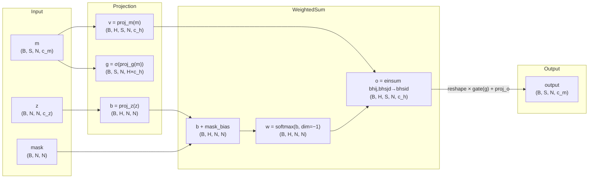
```mermaid
flowchart LR
    subgraph Input
        m["m<br/>(B, S, N, c_m)"]
        z["z<br/>(B, N, N, c_z)"]
        mask["mask<br/>(B, N, N)"]
    end
    subgraph Projection
        v["v = proj_m(m)<br/>(B, H, S, N, c_h)"]
        b["b = proj_z(z)<br/>(B, H, N, N)"]
        g["g = σ(proj_g(m))<br/>(B, S, N, H×c_h)"]
    end
    subgraph WeightedSum
        bm["b + mask_bias<br/>(B, H, N, N)"]
        w["w = softmax(b, dim=−1)<br/>(B, H, N, N)"]
        o["o = einsum bhij,bhsjd→bhsid<br/>(B, H, S, N, c_h)"]
    end
    subgraph Output
        out["output<br/>(B, S, N, c_m)"]
    end
    m --> v & g
    z --> b
    mask --> bm
    b --> bm --> w
    v & w --> o
    o -- "reshape × gate(g) + proj_o" --> out
```

- b is derived from the N×N pair tensor z and softmaxed over the last N dimension — forming attention weights.
- The einsum contracts the softmax dimension of b (j) with the value dimension of v (j), producing output indexed by (s, i).
- Output preserves the MSA shape `(B, S, N, c_m)` — the pair information is "injected" into the sequence via weighted averaging.

**Backward pass**: The serial backward pass is handled entirely by the PyTorch autograd engine. Gradients flow through the softmax, einsum, gating (sigmoid derivative), and projections automatically via `loss.backward()` without custom backward logic.

### DTensor CP Implementation

**Source**: [src/boltz/distributed/model/layers/pair_averaging.py](src/boltz/distributed/model/layers/pair_averaging.py)

**Sharding**: `(Shard(0), Shard(1), Shard(2))` on a 2D grid over dimensions 1 and 2 (S and N).

**Communication**: `Ring2DCommPairAveraging`. Forward: transpose bT across grid (`comm_2d_trans`); row init for v (row i shifts left by i); col init for bT (col j shifts up by j). Ring loop: shift v by row, bT by column; each step computes softmax on local bT block and einsum with v block; partial outputs merged with `tiled_softmax_attention_update`. Backward: ring over p (post-softmax weights), do, and d; db is accumulated and then sent with `comm_db` (virtual all-reduce); final `comm_db_final` restores gradient layout to match input b.

#### Forward Pass

**Distributed forward flow:**

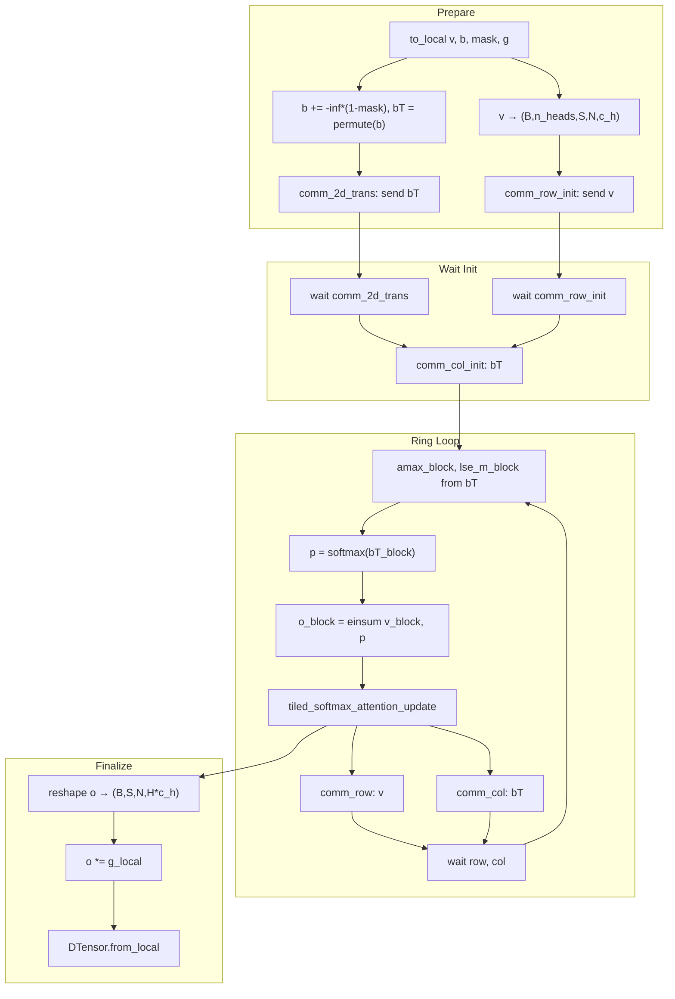
```mermaid
flowchart TD
    subgraph prep [Prepare]
        to_local["to_local v, b, mask, g"]
        reshape_v["v → (B,n_heads,S,N,c_h)"]
        mask_bias["b += -inf*(1-mask), bT = permute(b)"]
        v_send["comm_row_init: send v"]
        bT_send["comm_2d_trans: send bT"]
    end
    subgraph wait_init [Wait Init]
        wait_trans["wait comm_2d_trans"]
        wait_row["wait comm_row_init"]
        bT_col["comm_col_init: bT"]
    end
    subgraph ring_loop [Ring Loop]
        amax_lse["amax_block, lse_m_block from bT"]
        softmax_block["p = softmax(bT_block)"]
        o_block["o_block = einsum v_block, p"]
        tiled["tiled_softmax_attention_update"]
        row_shift["comm_row: v"]
        col_shift["comm_col: bT"]
        wait_ring["wait row, col"]
    end
    subgraph final [Finalize]
        reshape_o["reshape o → (B,S,N,H*c_h)"]
        gate_apply["o *= g_local"]
        from_local["DTensor.from_local"]
    end
    to_local --> reshape_v
    to_local --> mask_bias
    reshape_v --> v_send
    mask_bias --> bT_send
    bT_send --> wait_trans
    v_send --> wait_row
    wait_trans --> bT_col
    wait_row --> bT_col
    bT_col --> amax_lse
    amax_lse --> softmax_block
    softmax_block --> o_block
    o_block --> tiled
    tiled --> row_shift
    tiled --> col_shift
    row_shift --> wait_ring
    col_shift --> wait_ring
    wait_ring --> amax_lse
    tiled --> reshape_o
    reshape_o --> gate_apply
    gate_apply --> from_local
```

[Pair Weighted Averaging forward algorithm interactive visualization](cp_tech_guide_interactive/pair_weighted_averaging.html)

**Tensor data flow across ranks (P×P grid, example P=3):** Each cell shows which original data shard each rank holds. Notation: `T(i,j)` = shard of tensor `T` originally at grid position (i,j). `V` = values (from m), `B` = weights (from z, transposed). Cannon's pattern. Grid rows = cp0, columns = cp1.

```
Stage 0: Initial — rank(i,j) owns V(i,j) and B(i,j)

V:                     B:
V(0,0) V(0,1) V(0,2)   B(0,0) B(0,1) B(0,2)
V(1,0) V(1,1) V(1,2)   B(1,0) B(1,1) B(1,2)
V(2,0) V(2,1) V(2,2)   B(2,0) B(2,1) B(2,2)

      ↓ Transpose B: B(i,j) → position (j,i). V unchanged.

Stage 1: After B transpose

V:                     B:
V(0,0) V(0,1) V(0,2)   B(0,0) B(1,0) B(2,0)
V(1,0) V(1,1) V(1,2)   B(0,1) B(1,1) B(2,1)
V(2,0) V(2,1) V(2,2)   B(0,2) B(1,2) B(2,2)

      ↓ Cannon init shifts

Stage 2: Cannon-aligned

V:                     B:
V(0,0) V(0,1) V(0,2)   B(0,0) B(1,1) B(2,2)
V(1,1) V(1,2) V(1,0)   B(1,0) B(2,1) B(0,2)
V(2,2) V(2,0) V(2,1)   B(2,0) B(0,1) B(1,2)

      ↓ Step 0: compute + shift (V left-shift in rows; B up-shift in cols)

Stage 3: After first ring shift

V:                     B:
V(0,1) V(0,2) V(0,0)   B(1,0) B(2,1) B(0,2)
V(1,2) V(1,0) V(1,1)   B(2,0) B(0,1) B(1,2)
V(2,0) V(2,1) V(2,2)   B(0,0) B(1,1) B(2,2)

      ↓ Steps 1..P−1: repeat → full weighted average complete
```

- B is transposed so the ring aligns the softmax dimension (N) with the value's sequence dimension.
- The tiled softmax merge preserves numerical equivalence to the global softmax over the full N dimension.
- Backward uses the same ring pattern with an additional `comm_db` virtual all-reduce for the weight gradient.

#### Backward Pass

The backward pass propagates gradients through the softmax-weighted sum back to v, b, and g. It runs a single ring loop where three quantities rotate simultaneously: p (post-softmax weights, by column), do (output gradient, by row), and d (softmax correction scalar, by row). Value gradients accumulate locally while weight gradients are routed through a virtual all-reduce pattern.

**Saved tensors**: v_local (values), p_local (post-softmax weights = exp(b - amax - lse_m)), g_local (sigmoid of gate), o_local (output before gating).

**Backward algorithm:**

1. **Gate gradient**: `dg = (1 - g) * do * o` — sigmoid derivative, computed locally with no communication.
2. **Apply gate to do**: `do_local = do.to_local() * g_local` — dtype cast to match saved precision.
3. **Softmax correction scalar**: `d = sum_t(do * o)` — a per-head scalar needed for the softmax Jacobian.
4. **Initial communications**: Enqueue column init for p (`comm_col_init`), row init for do (`comm_row_init`) and d (`comm_d_init`).
5. **Ring loop** (P steps):
   - **dv accumulation**: `dv_local += einsum("bhti,bhij->bhtj", do_ready, p_ready)` — do carries the "query" gradient, p provides the softmax weight per key position.
   - **db computation**: `db_block = p * (einsum("bhti,bhtj->bhij", do_ready, v_local) - d)` — the softmax Jacobian: `p * (do^T @ v - d)`.
   - **db virtual all-reduce**: Accumulate db_block into the running db buffer and send via `comm_db`; each ring step passes partial sums downward along columns.
   - Enqueue next-step comms for p, do, d (if not last step); swap buffers.
6. **db ownership restoration**: `comm_db_final` sends db to the rank that owns the corresponding b shard.
7. **Output**: dv and db wrapped as DTensors; dg from step 1.

**Distributed backward flow:**

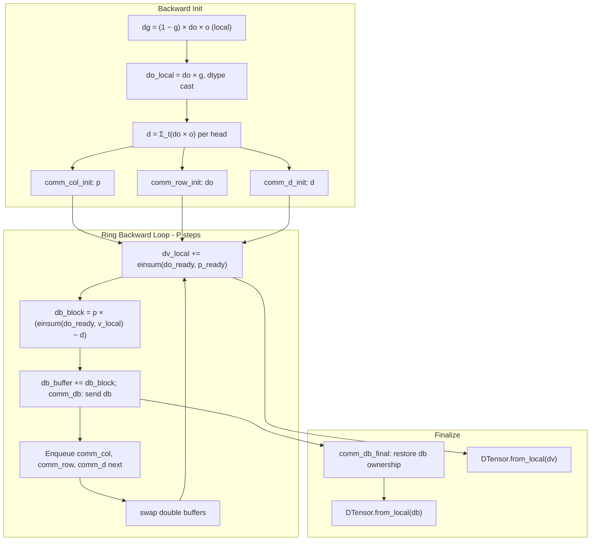
```mermaid
flowchart TD
    subgraph init_bwd [Backward Init]
        dg_comp["dg = (1 − g) × do × o (local)"]
        do_gate["do_local = do × g, dtype cast"]
        d_comp["d = Σ_t(do × o) per head"]
        col_init["comm_col_init: p"]
        row_init["comm_row_init: do"]
        d_init["comm_d_init: d"]
    end
    subgraph ring_bwd [Ring Backward Loop - P steps]
        dv_block["dv_local += einsum(do_ready, p_ready)"]
        db_block["db_block = p × (einsum(do_ready, v_local) − d)"]
        db_accum["db_buffer += db_block; comm_db: send db"]
        next_comm["Enqueue comm_col, comm_row, comm_d next"]
        swap_bwd["swap double buffers"]
    end
    subgraph final_bwd [Finalize]
        db_final["comm_db_final: restore db ownership"]
        wrap_dv["DTensor.from_local(dv)"]
        wrap_db["DTensor.from_local(db)"]
    end
    dg_comp --> do_gate --> d_comp
    d_comp --> col_init & row_init & d_init
    col_init --> dv_block
    row_init --> dv_block
    d_init --> dv_block
    dv_block --> db_block --> db_accum --> next_comm --> swap_bwd --> dv_block
    db_accum --> db_final
    dv_block --> wrap_dv
    db_final --> wrap_db
```

**Communication budget (backward):**

| Collective | Count | Volume per op |
| --- | --- | --- |
| col_init (p), row_init (do, d) | 3 | O(B × H × N/P × N/P), O(B × H × S×c_h/P × N/P), O(B × H × N/P) |
| Ring P2P (p, do, d) | (P−1) × 3 | Same as init volumes |
| comm_db | P | O(B × H × N/P × N/P) |
| comm_db_final | 1 | O(B × H × N/P × N/P) |

[Pair Weighted Averaging backward algorithm interactive visualization](cp_tech_guide_interactive/pair_weighted_averaging_backward.html)

**Tensor data flow across ranks (Backward, P×P grid, example P=3):** Notation: `p(i,j)` = post-softmax weight shard (pair-sharded), `do(i,j)` = output gradient shard, `d(i,j)` = softmax correction scalar, `db(i,j)` = weight gradient shard. p col-shifts up, do and d row-shift left (Cannon pattern). dv accumulates locally. db uses a virtual all-reduce along columns. Grid rows = cp0, columns = cp1.

```
Stage 0: Initial — p, do, d at identity layout

p:                        do:                       d:
p(0,0) p(0,1) p(0,2)   do(0,0) do(0,1) do(0,2)   d(0,0) d(0,1) d(0,2)
p(1,0) p(1,1) p(1,2)   do(1,0) do(1,1) do(1,2)   d(1,0) d(1,1) d(1,2)
p(2,0) p(2,1) p(2,2)   do(2,0) do(2,1) do(2,2)   d(2,0) d(2,1) d(2,2)

      ↓ Cannon init: p col up-shift by j, do row left-shift by i, d row left-shift by i

Stage 1: Cannon-aligned

p:                        do:                       d:
p(0,0) p(1,1) p(2,2)   do(0,0) do(0,1) do(0,2)   d(0,0) d(0,1) d(0,2)
p(1,0) p(2,1) p(0,2)   do(1,1) do(1,2) do(1,0)   d(1,1) d(1,2) d(1,0)
p(2,0) p(0,1) p(1,2)   do(2,2) do(2,0) do(2,1)   d(2,2) d(2,0) d(2,1)

      ↓ Ring step 0: dv += einsum(do,p); db_block = p×(einsum(do,v)−d);
        then shift: p up-shift cols, do left-shift rows, d left-shift rows

Stage 2: After first ring shift

p:                        do:                       d:
p(1,0) p(2,1) p(0,2)   do(0,1) do(0,2) do(0,0)   d(0,1) d(0,2) d(0,0)
p(2,0) p(0,1) p(1,2)   do(1,2) do(1,0) do(1,1)   d(1,2) d(1,0) d(1,1)
p(0,0) p(1,1) p(2,2)   do(2,0) do(2,1) do(2,2)   d(2,0) d(2,1) d(2,2)

      ↓ Steps 1..P−1: repeat → dv accumulation complete
```

```
db virtual all-reduce pattern (along columns):

Each ring step: db_buffer += local db_block, then send db_buffer up in column.
After P steps, each rank's db_buffer holds the column-sum of all P contributions.

      ↓ comm_db_final: col j down-shift by j (restores db ownership)

Final: db at identity layout — db(i,j) at rank (i,j)
```

- dv requires no communication; it accumulates locally across all P ring steps.
- db undergoes a virtual all-reduce (sum) along columns during the ring, then one restoration shift returns each gradient to its owning rank.

### CUDA Acceleration Kernels

No dedicated CUDA kernels; the implementation uses PyTorch einsum and softmax. `tiled_softmax_attention_update` is a Python/ PyTorch utility for numerically stable online softmax merging.

### Space and Time Complexity

| Aspect               | Serial                | Distributed (per rank)                               |
| -------------------- | --------------------- | ---------------------------------------------------- |
| Compute              | O(B × H × S × N² × D) | O(B × H × S/P × (N/P)² × D) per step; P steps        |
| Memory (activations) | O(B × H × S × N × D)  | O(B × H × S/P × N/P × D)                             |
| Comm (transpose)     | —                     | O(B × (N/P)² × H) once                               |
| Comm per step        | —                     | O(B × H × S/P × N/P × D) row + O(B × H × (N/P)²) col |
| Ring steps           | —                     | P                                                    |

### Source Files and Tests

- Implementation: [src/boltz/distributed/model/layers/pair_averaging.py](src/boltz/distributed/model/layers/pair_averaging.py)
- Tests: [tests/distributed/model/layers/test_dtensor_pair_weighted_averaging.py](tests/distributed/model/layers/test_dtensor_pair_weighted_averaging.py)

---

## 6. Outer Product Mean

### Overview and Problem Statement

Outer Product Mean builds a pair representation from a sequence (MSA) representation by averaging outer products over the sequence dimension:

```
z[i,j] = mean_s(a[s,i] ⊗ b[s,j])   with a = proj_a(m), b = proj_b(m)
```

Input: `m` (B, S, N, c_in). Output: `z` (B, N, N, c_out) with c_out = c_hidden² after flattening the outer product. The einsum is `einsum("bsic,bsjd->bijcd", a, b)` then divide by mask count. O(S × N² × D²) compute and O(N² × D²) pair memory require distribution for large N and S.

Training requires propagating gradients from the pair output z back to the sequence projections a and b. Since the forward contracts over the sequence dimension S via an outer product, the backward must invert this: each gradient requires contracting over one of the pair dimensions (i or j) with the other operand, producing two independent distributed ring loops that mirror the forward's Cannon pattern.

### Key Innovations

#### Forward Pass

- **Memory**: Per-rank pair block O((N/P)² × D²); a and b shards only; no full S×N×D or N²×D² materialization on any rank.
- **Computation**: Ring over sequence index: row-shift a and col-shift b; each step adds partial outer product to z_local; final divide by all-reduced mask count.
- **Distribution**: Transpose a across grid and row init; col init for b; symmetric ring so contraction over S is distributed across P steps.
- **Communication**: O(P) ring steps with O(B × S/P × N/P × D) per step; single all-reduce for num_mask; backward uses two independent ring loops for grad_a and grad_b.

#### Backward Pass

- **Memory**: Reuses saved a, b, mask, and num_mask; grad_z is unflattened and divided by num_mask once at the start. Two separate gradient accumulators (grad_a, grad_b) at O(B × S/P × N/P × D).
- **Computation**: Two independent ring loops — grad_a contracts grad_z with b over index j; grad_b contracts grad_z with a over index i — each using Cannon's row/col shift pattern. Mask is applied after each loop.
- **Distribution**: grad_a uses `comm_transpose_col_init` for grad_z (transpose + column init) and `comm_row_init` for b; grad_b uses `comm_col_init` for grad_z and `comm_row_init` for a. Both loops use the same `comm_row`/`comm_col` ring shifts.
- **Communication**: 2 × (init + P ring steps) with O(B × S/P × N/P × D) per step for a/b and O(B × (N/P)² × D²) for grad_z; no all-reduce in backward (num_mask was already reduced in forward).

### Executive Summary: From Serial Bottlenecks to Distributed Efficiency

Serial outer product mean forms all pairs (i,j) by averaging over sequence index s, requiring O(B × S × N² × D²) compute and O(N² × D²) pair storage. The distributed algorithm shards a and b along batch and the two sequence dimensions; one operand is transposed across the 2D grid and both undergo initial row/column shifts so that ring steps align the contracted (sequence) index. Each rank accumulates a block of z from partial outer products; mask count is all-reduced so the final mean is correct. Backward runs two separate ring loops for gradients to a and b, each with the appropriate transpose and shift pattern. This achieves scalable OPM without all-gathering the MSA or the pair tensor.

### Serial Reference Implementation

**Source**: [src/boltz/model/layers/outer_product_mean.py](src/boltz/model/layers/outer_product_mean.py)

| Tensor         | Shape                           | Meaning                      |
| -------------- | ------------------------------- | ---------------------------- |
| `m`            | `(B, S, N, c_in)`               | MSA                          |
| `mask`         | `(B, S, N)`                     | Sequence mask                |
| `a, b`         | `(B, S, N, c_hidden)`           | proj_a(m), proj_b(m), masked |
| `z` (pre-proj) | `(B, N, N, c_hidden, c_hidden)` | Outer product sum            |
| Output         | `(B, N, N, c_out)`              | proj_o(z.flatten(-2))        |

**Serial flow:**

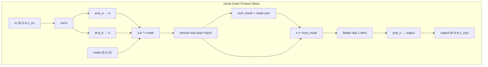
```mermaid
flowchart TD
    subgraph serial [Serial Outer Product Mean]
        m["m (B,S,N,c_in)"]
        mask["mask (B,S,N)"]
        norm["norm"]
        proj_a["proj_a → a"]
        proj_b["proj_b → b"]
        mask_apply["a,b *= mask"]
        einsum["einsum bsic,bsjd->bijcd"]
        num_mask["num_mask = mask sum"]
        mean["z /= num_mask"]
        flatten["flatten last 2 dims"]
        proj_o["proj_o → output"]
        m --> norm
        norm --> proj_a
        norm --> proj_b
        proj_a --> mask_apply
        proj_b --> mask_apply
        mask --> mask_apply
        mask_apply --> einsum
        einsum --> num_mask
        num_mask --> mean
        einsum --> mean
        mean --> flatten
        flatten --> proj_o
        proj_o --> output["output (B,N,N,c_out)"]
    end
```

**Tensor shape pipeline:** The einsum contracts over S (sequence) but creates an N×N pair output — an outer product. a contributes index i, b contributes index j. The mean divides by the sequence mask count.

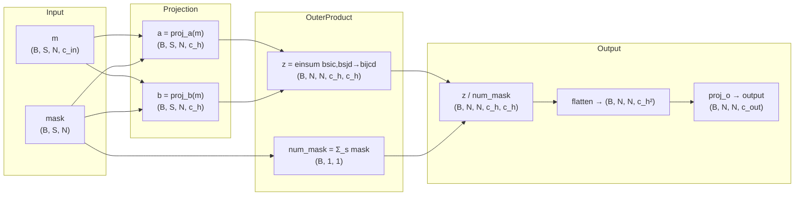
```mermaid
flowchart LR
    subgraph Input
        m["m<br/>(B, S, N, c_in)"]
        mask["mask<br/>(B, S, N)"]
    end
    subgraph Projection
        a["a = proj_a(m)<br/>(B, S, N, c_h)"]
        b["b = proj_b(m)<br/>(B, S, N, c_h)"]
    end
    subgraph OuterProduct
        z["z = einsum bsic,bsjd→bijcd<br/>(B, N, N, c_h, c_h)"]
        nm["num_mask = Σ_s mask<br/>(B, 1, 1)"]
    end
    subgraph Output
        mean["z / num_mask<br/>(B, N, N, c_h, c_h)"]
        flat["flatten → (B, N, N, c_h²)"]
        out["proj_o → output<br/>(B, N, N, c_out)"]
    end
    m --> a & b
    mask --> a & b & nm
    a & b --> z
    z & nm --> mean
    mean --> flat --> out
```

- The einsum contracts over S and produces an N×N pair tensor — O(B × S × N² × c_h²) compute.
- a[s,i] ⊗ b[s,j] forms outer products; averaging over s collapses the sequence dimension.
- Output is a pair tensor `(B, N, N, c_out)` projected from the flattened c_h² channels.

**Backward pass**: The serial backward pass is handled entirely by the PyTorch autograd engine. Gradients flow through the einsum outer product, mean division, masking, and projections automatically via `loss.backward()` without custom backward logic.

### DTensor CP Implementation

**Source**: [src/boltz/distributed/model/layers/outer_product_mean.py](src/boltz/distributed/model/layers/outer_product_mean.py)

**Sharding**: `(Shard(0), Shard(1), Shard(2))` on a 2D grid over batch and the two sequence/token dimensions (S and N for a/b; both N for z).

**Communication**: `Ring2DComm`. Forward: transpose a across grid and apply row init (row i shifts left by i); col init for b (col j shifts up by j). Ring loop: row-shift a, col-shift b; each step adds partial outer product `einsum("bsic,bsjd->bijcd", a_ready, b_ready)` to z_local. After loop, all-reduce mask count along group_col and divide z_local by num_mask. Backward: two separate ring loops—for grad_a use transposed grad_z and rotate b by row, grad_z by column; for grad_b use grad_z and rotate a by row, grad_z by column; then apply mask.

#### Forward Pass

**Distributed forward flow:**

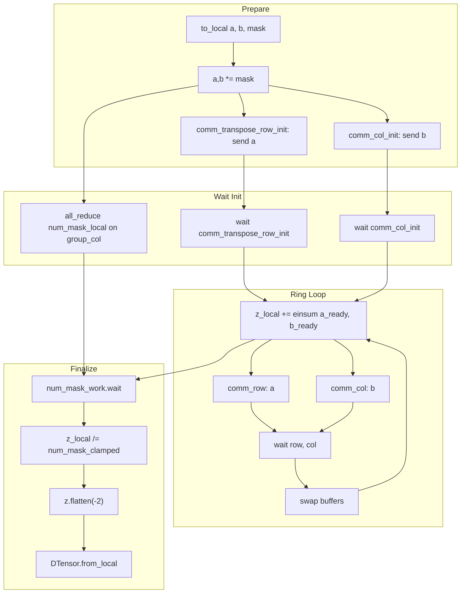
```mermaid
flowchart TD
    subgraph prep [Prepare]
        to_local["to_local a, b, mask"]
        mask_apply["a,b *= mask"]
        a_send["comm_transpose_row_init: send a"]
        b_send["comm_col_init: send b"]
    end
    subgraph wait_init [Wait Init]
        wait_a["wait comm_transpose_row_init"]
        wait_b["wait comm_col_init"]
        num_mask_ar["all_reduce num_mask_local on group_col"]
    end
    subgraph ring_loop [Ring Loop]
        z_accum["z_local += einsum a_ready, b_ready"]
        row_shift["comm_row: a"]
        col_shift["comm_col: b"]
        wait_ring["wait row, col"]
        swap["swap buffers"]
    end
    subgraph final [Finalize]
        num_mask_wait["num_mask_work.wait"]
        divide["z_local /= num_mask_clamped"]
        flatten["z.flatten(-2)"]
        from_local["DTensor.from_local"]
    end
    to_local --> mask_apply
    mask_apply --> a_send
    mask_apply --> b_send
    a_send --> wait_a
    b_send --> wait_b
    mask_apply --> num_mask_ar
    wait_a --> z_accum
    wait_b --> z_accum
    z_accum --> row_shift
    z_accum --> col_shift
    row_shift --> wait_ring
    col_shift --> wait_ring
    wait_ring --> swap
    swap --> z_accum
    z_accum --> num_mask_wait
    num_mask_ar --> num_mask_wait
    num_mask_wait --> divide
    divide --> flatten
    flatten --> from_local
```

[Outer Product Mean forward algorithm interactive visualization](cp_tech_guide_interactive/outer_product_mean.html)

**Tensor data flow across ranks (P×P grid, example P=3):** Each cell shows which original data shard each rank holds. Notation: `T(i,j)` = shard of tensor `T` originally at grid position (i,j). `A` = LHS (transposed), `B` = RHS. Cannon's pattern; the contracted S-dimension index matches at every rank after alignment. Grid rows = cp0, columns = cp1.

```
Stage 0: Initial — rank(i,j) owns A(i,j) and B(i,j)

A:                     B:
A(0,0) A(0,1) A(0,2)   B(0,0) B(0,1) B(0,2)
A(1,0) A(1,1) A(1,2)   B(1,0) B(1,1) B(1,2)
A(2,0) A(2,1) A(2,2)   B(2,0) B(2,1) B(2,2)

      ↓ Transpose A: A(i,j) → position (j,i). B unchanged.

Stage 1: After A transpose

A:                     B:
A(0,0) A(1,0) A(2,0)   B(0,0) B(0,1) B(0,2)
A(0,1) A(1,1) A(2,1)   B(1,0) B(1,1) B(1,2)
A(0,2) A(1,2) A(2,2)   B(2,0) B(2,1) B(2,2)

      ↓ Cannon init shifts

Stage 2: Cannon-aligned — contracted S-index matches at each rank

A:                     B:
A(0,0) A(1,0) A(2,0)   B(0,0) B(1,1) B(2,2)
A(1,1) A(2,1) A(0,1)   B(1,0) B(2,1) B(0,2)
A(2,2) A(0,2) A(1,2)   B(2,0) B(0,1) B(1,2)

      ↓ Step 0: accumulate + shift (A left-shift in rows; B up-shift in cols)

Stage 3: After first ring shift

A:                     B:
A(1,0) A(2,0) A(0,0)   B(1,0) B(2,1) B(0,2)
A(2,1) A(0,1) A(1,1)   B(2,0) B(0,1) B(1,2)
A(0,2) A(1,2) A(2,2)   B(0,0) B(1,1) B(2,2)

      ↓ Steps 1..P−1: repeat → outer product mean complete
```

- After transpose+init, each rank's A and B share the same S-dimension index — the outer product `einsum("bsic,bsjd->bijcd")` is correct locally.
- After P ring steps, z_local has accumulated contributions from all S-dimension shards.
- `num_mask` is all-reduced along `group_col` because different column ranks see different s-slices of the mask.

#### Backward Pass

The backward pass computes gradients for the two sequence projections a and b through two independent ring loops, each mirroring the forward's Cannon pattern. The upstream pair gradient grad_z is unflattened to `(B, N, N, c_hidden, c_hidden)` and pre-divided by `num_mask` (reusing the clamped count from forward) so the mean scaling propagates correctly.

**Saved tensors**: a_local, b_local (masked projections), mask_local, num_mask_local_clamped.

**Backward algorithm:**

1. **Prepare grad_z**: Unflatten the upstream gradient from `(B, N, N, c_hidden²)` to `(B, N, N, c_hidden, c_hidden)` and divide by `num_mask_local_clamped` — this distributes the mean's derivative. Clone for reuse in the grad_b loop.
2. **grad_a ring loop**:
   - **Init**: `comm_transpose_col_init` for grad_z (transpose across grid + column init), `comm_row_init` for b.
   - **Ring** (P steps): `grad_a_local += einsum("bijcd,bsjd->bsic", grad_z_ready, b_ready)`. Row-shift b, col-shift grad_z each step.
   - **Finalize**: `grad_a_local *= mask_local`.
3. **grad_b ring loop**:
   - **Init**: `comm_col_init` for grad_z (column init, no transpose), `comm_row_init` for a.
   - **Ring** (P steps): `grad_b_local += einsum("bijcd,bsic->bsjd", grad_z_ready, a_ready)`. Row-shift a, col-shift grad_z each step.
   - **Finalize**: `grad_b_local *= mask_local`.

The key asymmetry: grad_a requires transposing grad_z across the grid (via `comm_transpose_col_init`) because the contraction index j in the einsum "bijcd,bsjd->bsic" aligns with the column axis, while grad_b contracts over index i which already aligns with the row axis.

**Distributed backward flow:**

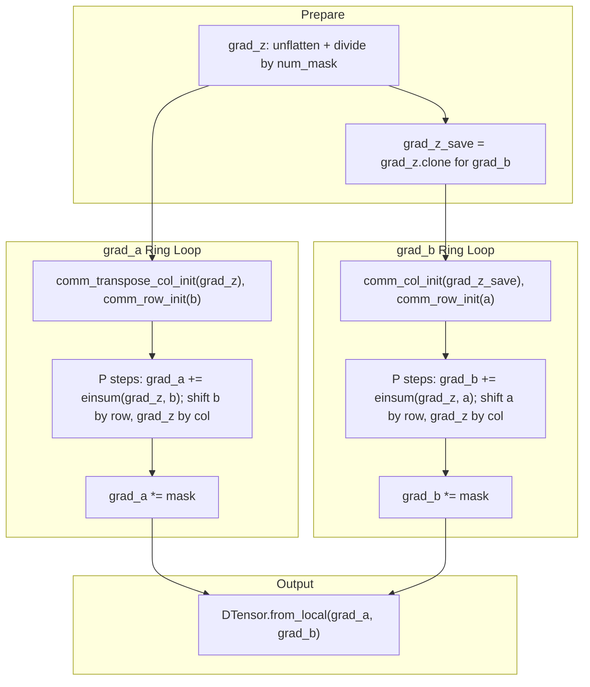
```mermaid
flowchart TD
    subgraph prep_bwd [Prepare]
        unflatten["grad_z: unflatten + divide by num_mask"]
        clone_gz["grad_z_save = grad_z.clone for grad_b"]
    end
    subgraph loop_a [grad_a Ring Loop]
        init_a["comm_transpose_col_init(grad_z), comm_row_init(b)"]
        ring_a["P steps: grad_a += einsum(grad_z, b); shift b by row, grad_z by col"]
        mask_a["grad_a *= mask"]
    end
    subgraph loop_b [grad_b Ring Loop]
        init_b["comm_col_init(grad_z_save), comm_row_init(a)"]
        ring_b["P steps: grad_b += einsum(grad_z, a); shift a by row, grad_z by col"]
        mask_b["grad_b *= mask"]
    end
    subgraph out_bwd [Output]
        wrap_ab["DTensor.from_local(grad_a, grad_b)"]
    end
    unflatten --> clone_gz
    unflatten --> init_a --> ring_a --> mask_a
    clone_gz --> init_b --> ring_b --> mask_b
    mask_a --> wrap_ab
    mask_b --> wrap_ab
```

**Communication budget (backward):**

| Collective | Count | Volume per op |
| --- | --- | --- |
| comm_transpose_col_init (grad_z) | 1 | O(B × (N/P)² × D²) |
| comm_row_init (b then a) | 2 | O(B × S/P × N/P × D) |
| comm_col_init (grad_z) | 1 | O(B × (N/P)² × D²) |
| Ring P2P (row + col) | 2 × (P−1) × 2 | O(B × S/P × N/P × D) and O(B × (N/P)² × D²) |

[Outer Product Mean backward algorithm interactive visualization](cp_tech_guide_interactive/outer_product_mean_backward.html)

**Tensor data flow across ranks (Backward, P×P grid, example P=3):** Notation: `G(i,j)` = upstream gradient (grad_z) shard at grid position (i,j), `a(i,j)` and `b(i,j)` = saved projection shards. Two independent Cannon rings compute grad_a and grad_b. The key asymmetry: grad_a requires transposing G across the grid (contraction index j aligns with columns), while grad_b uses G without transpose (contraction index i aligns with rows). Grid rows = cp0, columns = cp1.

```
grad_a ring: einsum("bijcd,bsjd->bsic") — G transposed + col init, b row init

Stage 0: Initial

G:                     b:
G(0,0) G(0,1) G(0,2)   b(0,0) b(0,1) b(0,2)
G(1,0) G(1,1) G(1,2)   b(1,0) b(1,1) b(1,2)
G(2,0) G(2,1) G(2,2)   b(2,0) b(2,1) b(2,2)

      ↓ Transpose G: G(i,j) → position (j,i). Then col init: col j up-shift by j.
      ↓ Row init b: row i left-shift by i.

Stage 1: Cannon-aligned for grad_a

G (transposed+col_init):   b (row_init):
G(0,0) G(1,1) G(2,2)      b(0,0) b(0,1) b(0,2)
G(0,1) G(1,2) G(2,0)      b(1,1) b(1,2) b(1,0)
G(0,2) G(1,0) G(2,1)      b(2,2) b(2,0) b(2,1)

      ↓ P ring steps: b left-shift rows, G up-shift cols → grad_a complete
```

```
grad_b ring: einsum("bijcd,bsic->bsjd") — G col init (no transpose), a row init

Stage 0: Initial

G:                     a:
G(0,0) G(0,1) G(0,2)   a(0,0) a(0,1) a(0,2)
G(1,0) G(1,1) G(1,2)   a(1,0) a(1,1) a(1,2)
G(2,0) G(2,1) G(2,2)   a(2,0) a(2,1) a(2,2)

      ↓ Col init G: col j up-shift by j (no transpose).
      ↓ Row init a: row i left-shift by i.

Stage 1: Cannon-aligned for grad_b

G (col_init):              a (row_init):
G(0,0) G(1,1) G(2,2)      a(0,0) a(0,1) a(0,2)
G(1,0) G(2,1) G(0,2)      a(1,1) a(1,2) a(1,0)
G(2,0) G(0,1) G(1,2)      a(2,2) a(2,0) a(2,1)

      ↓ P ring steps: a left-shift rows, G up-shift cols → grad_b complete
```

- Both grad_a and grad_b are finalized with `grad *= mask_local` after their respective ring loops.
- The transpose for grad_a is needed because the einsum contracts over j (the column index of the pair tensor), requiring G's j-axis to be aligned with the Cannon column-shift direction.

### CUDA Acceleration Kernels

No dedicated CUDA kernels; the implementation uses PyTorch einsum for the outer product accumulation.

### Space and Time Complexity

| Aspect                  | Serial             | Distributed (per rank)                     |
| ----------------------- | ------------------ | ------------------------------------------ |
| Compute                 | O(B × S × N² × D²) | O(B × S/P × (N/P)² × D²) per step; P steps |
| Memory (activations)    | O(B × N² × D²)     | O(B × (N/P)² × D²)                         |
| Comm (transpose + init) | —                  | O(B × S/P × N/P × D) for a and b           |
| Comm per step           | —                  | O(B × S/P × N/P × D) row + col             |
| Ring steps              | —                  | P                                          |

### Source Files and Tests

- Implementation: [src/boltz/distributed/model/layers/outer_product_mean.py](src/boltz/distributed/model/layers/outer_product_mean.py)
- Tests: [tests/distributed/model/layers/test_dtensor_outer_product_mean.py](tests/distributed/model/layers/test_dtensor_outer_product_mean.py) or equivalent

---

## 7. Attention Pair Bias (Ring)

### Overview and Problem Statement

Attention Pair Bias is standard multi-head attention with an additive pair bias `z` on the attention logits. The operation is:

```
Q, K, V = proj_q(s), proj_k(s), proj_v(s)       # from single repr s
g = sigmoid(proj_g(s))
attn = softmax(Q @ K^T / sqrt(d) + z + mask_bias)
o = attn @ V
output = proj_o(g * o)
```

Inputs: single representation `s` (B, N, c_s), pair representation `z` (B, N, N, c_z) or precomputed bias, mask (B, N) or (B, N, N). Output: (B, N, c_s). Global attention over N has O(N²) cost; the ring variant distributes key/value and pair bias across ranks and merges partial attention with tiled softmax.

Training requires propagating gradients through the attention scores, softmax, and pair bias back to the single representation s and the pair representation z. The distributed backward computes gradients using saved transposed K/V and LSE from forward, then transposes dk and dv back to their original layout and all-reduces dq, dk, dv across the CP axis to sum partial gradient contributions.

### Key Innovations

#### Forward Pass

- **Memory**: Queries stay local; k, v, z, and mask transposed then rotated so each rank holds a chunk; partial attention merged with LSE/amax without materializing full N×N scores.
- **Computation**: Ring attention: each step scores q @ k_chunk^T + z_chunk + mask; FlexAttention score_mod fuses pair-bias add with softmax; tiled_softmax_attention_update merges partial outputs.
- **Distribution**: AttentionPairBiasComm coordinates transpose of k, v, mask and ring shift of k, v, z; supports multiplicity broadcasting for batched pair bias.
- **Communication**: O(P) ring steps with O(B × N/P × D) per step for k, v, z; backward transposes and all-reduces dk, dv; dq all-reduced.

#### Backward Pass

- **Memory**: Reuses saved q, k_t (transposed keys), v_t (transposed values), z (pair bias with mask applied), LSE, and output o from forward; no additional ring buffers needed since gradients are computed in a single pass from saved tensors.
- **Computation**: Two backend paths: (1) REFERENCE — recompute attention scores from saved LSE and z, then manual einsum for dq, dk, dv, dz via the softmax Jacobian `a * (do^T @ v - do·o)`; (2) FLEX_ATTN — re-run forward under `torch.enable_grad()` on detached copies, apply a scaling trick `(out_local - out_global) * exp(lse_local - lse_global)` for multi-chunk softmax correctness, then `torch.autograd.grad`.
- **Distribution**: Transpose dk and dv back to original layout via `comm_transpose_k`/`comm_transpose_v`; all-reduce dq, dk, dv (SUM) over the CP axis (cp_axis_1_group) to combine partial gradient contributions from all chunks. dz stays local (pair-sharded).
- **Communication**: 2 transposes (dk, dv) + 3 all-reduces (dq, dk, dv) over the CP axis; no ring loop in backward.

### Executive Summary: From Serial Bottlenecks to Distributed Efficiency

Serial attention with pair bias computes full N×N attention scores (Q @ K^T + z + mask) and is infeasible for large N on a single device. The ring variant keeps queries on each rank and distributes keys, values, and pair bias along the context-parallel dimension: after transposing k, v, and mask for ring alignment, each rank receives a stream of (k, v, z) chunks and computes partial attention; FlexAttention’s score_mod adds the pair bias inside the fused kernel; partial log-sum-exp and weighted sums are merged with tiled softmax so the result is numerically equivalent to serial. Backward reuses the same ring in reverse with gradient transpose and all-reduce. This enables scalable multi-head attention with pairwise bias for sequence lengths that exceed single-GPU memory.

### Serial Reference Implementation

**Source**: [src/boltz/model/layers/attention.py](src/boltz/model/layers/attention.py), [src/boltz/model/layers/attentionv2.py](src/boltz/model/layers/attentionv2.py)

| Tensor    | Shape                              | Meaning                         |
| --------- | ---------------------------------- | ------------------------------- |
| `s`       | `(B, N, c_s)`                      | Single representation (queries) |
| `z`       | `(B, N, N, c_z)` or `(B, N, N, H)` | Pair bias or projected          |
| `q, k, v` | `(B, N, H, head_dim)`              | Projected and reshaped          |
| `attn`    | `(B, H, N, N)`                     | Attention weights               |
| Output    | `(B, N, c_s)`                      | proj_o(gated o)                 |

**Serial flow:**

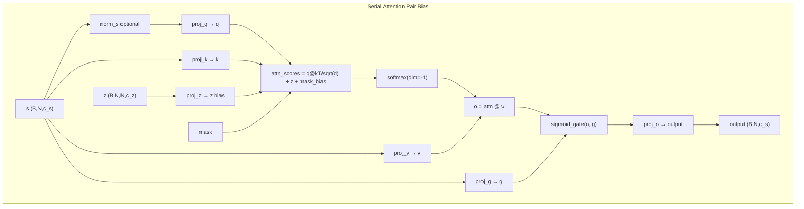
```mermaid
flowchart TD
    subgraph serial [Serial Attention Pair Bias]
        s["s (B,N,c_s)"]
        z["z (B,N,N,c_z)"]
        mask["mask"]
        norm["norm_s optional"]
        proj_q["proj_q → q"]
        proj_k["proj_k → k"]
        proj_v["proj_v → v"]
        proj_g["proj_g → g"]
        proj_z["proj_z → z bias"]
        scores["attn_scores = q@kT/sqrt(d) + z + mask_bias"]
        softmax["softmax(dim=-1)"]
        out_attn["o = attn @ v"]
        gate["sigmoid_gate(o, g)"]
        proj_o["proj_o → output"]
        s --> norm
        norm --> proj_q
        s --> proj_k
        s --> proj_v
        s --> proj_g
        z --> proj_z
        proj_q --> scores
        proj_k --> scores
        proj_z --> scores
        mask --> scores
        scores --> softmax
        softmax --> out_attn
        proj_v --> out_attn
        out_attn --> gate
        proj_g --> gate
        gate --> proj_o
        proj_o --> output["output (B,N,c_s)"]
    end
```

**Tensor shape pipeline:** Single representation s is 1D `(B, N, c_s)` — unlike the N×N pair tensor z. Full N×N attention scores are materialized, making distribution necessary for large N.

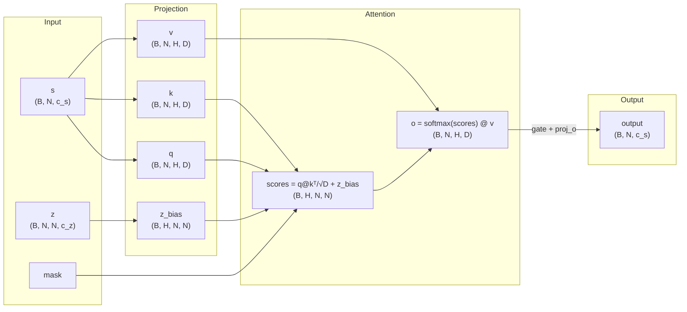
```mermaid
flowchart LR
    subgraph Input
        s["s<br/>(B, N, c_s)"]
        z["z<br/>(B, N, N, c_z)"]
        mask["mask"]
    end
    subgraph Projection
        q["q<br/>(B, N, H, D)"]
        k["k<br/>(B, N, H, D)"]
        v["v<br/>(B, N, H, D)"]
        zb["z_bias<br/>(B, H, N, N)"]
    end
    subgraph Attention
        sc["scores = q@kᵀ/√D + z_bias<br/>(B, H, N, N)"]
        o["o = softmax(scores) @ v<br/>(B, N, H, D)"]
    end
    subgraph Output
        out["output<br/>(B, N, c_s)"]
    end
    s --> q & k & v
    z --> zb
    q & k & zb --> sc
    mask --> sc
    sc --> o
    v --> o
    o -- "gate + proj_o" --> out
```

- The pair bias z is projected from `(B, N, N, c_z)` to `(B, H, N, N)` — one bias value per head per query-key pair.
- Attention scores are the full N×N matrix per head — O(B × H × N² × D) compute, O(B × H × N²) memory.
- Output collapses back to the 1D sequence shape `(B, N, c_s)`.

**Backward pass**: The serial backward pass is handled entirely by the PyTorch autograd engine. Gradients flow through the attention score computation (Q @ K^T / sqrt(d) + z), softmax, weighted sum (attn @ V), gating, and projections automatically via `loss.backward()` without custom backward logic.

### DTensor CP Implementation

**Source**: [src/boltz/distributed/model/layers/attention.py](src/boltz/distributed/model/layers/attention.py) (class `AttentionPairBias`), [src/boltz/distributed/model/layers/attention_impl.py](src/boltz/distributed/model/layers/attention_impl.py) (`_AttentionPairBiasContexVecImpl`, `ring_attention_simple_forward`)

**Sharding**: Sequence dimension (N) is sharded along the CP axis. q is local to each rank; k, v, z are transposed then rotated so each rank sees a chunk of keys/values and corresponding z slice per step.

**Communication**: `AttentionPairBiasComm`. Transpose k, v, mask via `comm_transpose_k`, `comm_transpose_v`, `comm_transpose_mask`. Ring: shift k, v, z along the CP axis (e.g. axis 1) by one each step. Each rank computes partial attention (q @ k_chunk^T + z_chunk + mask), then merges with `tiled_softmax_attention_update`. Backward: gradients for k and v are transposed and all-reduced over the CP group as needed.

#### Forward Pass

**Distributed forward flow:**

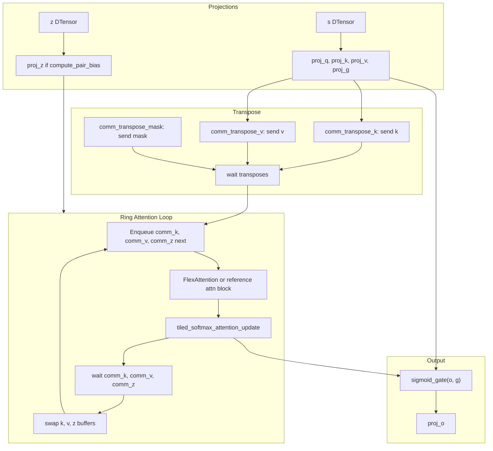
```mermaid
flowchart TD
    subgraph proj [Projections]
        s["s DTensor"]
        z["z DTensor"]
        proj_q["proj_q, proj_k, proj_v, proj_g"]
        proj_z["proj_z if compute_pair_bias"]
    end
    subgraph transpose [Transpose]
        k_send["comm_transpose_k: send k"]
        v_send["comm_transpose_v: send v"]
        mask_send["comm_transpose_mask: send mask"]
        wait_trans["wait transposes"]
    end
    subgraph ring_loop [Ring Attention Loop]
        next_kvz["Enqueue comm_k, comm_v, comm_z next"]
        flex_or_ref["FlexAttention or reference attn block"]
        tiled["tiled_softmax_attention_update"]
        wait_ring["wait comm_k, comm_v, comm_z"]
        swap["swap k, v, z buffers"]
    end
    subgraph out [Output]
        gate["sigmoid_gate(o, g)"]
        proj_o["proj_o"]
    end
    s --> proj_q
    z --> proj_z
    proj_q --> k_send
    proj_q --> v_send
    proj_z --> ring_loop
    k_send --> wait_trans
    v_send --> wait_trans
    mask_send --> wait_trans
    wait_trans --> next_kvz
    next_kvz --> flex_or_ref
    flex_or_ref --> tiled
    tiled --> wait_ring
    wait_ring --> swap
    swap --> next_kvz
    tiled --> gate
    proj_q --> gate
    gate --> proj_o
```

[Attention Pair Bias Ring forward algorithm interactive visualization](cp_tech_guide_interactive/attention_pair_bias_ring.html)

**Tensor data flow across ranks (P×P grid, example P=3):** Each cell shows which original data shard each rank holds. `q(r)` = query for N-shard r (stays local per row), `k(r)` = key/value for N-shard r, `z(i,j)` = pair bias originally at grid position (i,j). 1D ring: k/v are transposed so columns hold different N shards; k/v and z left-rotate within each row. Grid rows = cp0, columns = cp1.

```
Stage 0: Initial layout

q:               k:               z:
q(0) q(0) q(0)   k(0) k(0) k(0)   z(0,0) z(0,1) z(0,2)
q(1) q(1) q(1)   k(1) k(1) k(1)   z(1,0) z(1,1) z(1,2)
q(2) q(2) q(2)   k(2) k(2) k(2)   z(2,0) z(2,1) z(2,2)

      ↓ Transpose k/v: each row's copies spread across columns. q, z unchanged.

Stage 1: After k/v transpose

q:               k:               z:
q(0) q(0) q(0)   k(0) k(1) k(2)   z(0,0) z(0,1) z(0,2)
q(1) q(1) q(1)   k(0) k(1) k(2)   z(1,0) z(1,1) z(1,2)
q(2) q(2) q(2)   k(0) k(1) k(2)   z(2,0) z(2,1) z(2,2)

      ↓ Step 0: attn + left-shift k and z within each row. q unchanged.

Stage 2: After first ring shift

q:               k:               z:
q(0) q(0) q(0)   k(1) k(2) k(0)   z(0,1) z(0,2) z(0,0)
q(1) q(1) q(1)   k(1) k(2) k(0)   z(1,1) z(1,2) z(1,0)
q(2) q(2) q(2)   k(1) k(2) k(0)   z(2,1) z(2,2) z(2,0)

      ↓ Steps 1..P−1: repeat → full attention complete
```

- q stays local — each rank only owns queries for its N-shard (q(r) for row r).
- After P ring steps, each rank has attended to all k/v/z chunks covering the full N dimension.
- `tiled_softmax_attention_update` merges partial outputs using log-sum-exp and amax for numerical stability.
- FlexAttention's `score_mod` fuses pair-bias addition with the softmax kernel for each local attention block.

#### Backward Pass

Unlike the forward which uses a ring loop over chunks, the backward computes gradients in a single pass using the saved transposed K/V and the accumulated LSE from forward. The key insight is that the forward saves k_t and v_t (already transposed across the mesh), so the backward does not need to re-run the ring — it computes dq, dk, dv, dz directly, then transposes and all-reduces to combine partial gradient contributions.

**Saved tensors**: q, k_t (transposed keys), v_t (transposed values), z (pair bias with mask applied), lse_m (log-sum-exp), o (attention output).

**Backward algorithm (REFERENCE path):**

1. **Precompute softmax correction**: `do_o = sum(do * o, dim=-1)` — the dot product of output gradient with output, used in the softmax Jacobian.
2. **Recompute attention weights**: `s = einsum("bihd,bjhd->bhij", q, k_t) / sqrt(d)`, subtract lse_m, add z, exponentiate → reconstructed attention weights a.
3. **dv**: `dv = einsum("bihd,bhij->bjhd", do, a)` — gradient flows through `attn @ V`.
4. **dz and dS** (softmax Jacobian): `dS = a * (einsum("bihd,bjhd->bhij", do, v_t) - do_o)`. The pair bias gradient `dz = dS` (if multiplicity > 1, sum over the multiplicity dimension).
5. **dq**: `dq = einsum("bhij,bjhd->bihd", dS, k_t) / sqrt(d)`.
6. **dk**: `dk = einsum("bhij,bihd->bjhd", dS, q) / sqrt(d)`.

**Backward algorithm (FLEX_ATTN path):**

1. Re-run `flex_attention_compiled(q, k, v, score_mod)` under `torch.enable_grad()` on detached copies → `out_local`, `lse_local`.
2. **Scaling trick** for multi-chunk correctness: `out_scaled = (out_local - out_global) * exp(lse_local - lse_global)` — adjusts the local output to account for the global softmax normalization.
3. `dq, dk, dv, dz = torch.autograd.grad(out_scaled, [q, k, v, z], do)`.

**Communication (both paths):**

1. Transpose dv and dk back to original layout via `comm_transpose_v`, `comm_transpose_k`.
2. All-reduce (SUM) dq, dk, dv over `cp_axis_1_group` to combine partial gradient contributions across all chunks that each rank computed during the forward ring.

**Distributed backward flow:**

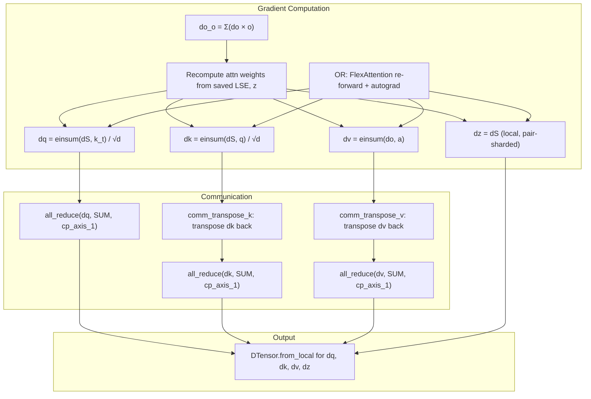
```mermaid
flowchart TD
    subgraph grad_comp [Gradient Computation]
        do_o["do_o = Σ(do × o)"]
        recompute["Recompute attn weights from saved LSE, z"]
        flex_path["OR: FlexAttention re-forward + autograd"]
        dq_comp["dq = einsum(dS, k_t) / √d"]
        dk_comp["dk = einsum(dS, q) / √d"]
        dv_comp["dv = einsum(do, a)"]
        dz_comp["dz = dS (local, pair-sharded)"]
    end
    subgraph comm_bwd [Communication]
        xpose_dv["comm_transpose_v: transpose dv back"]
        xpose_dk["comm_transpose_k: transpose dk back"]
        ar_dq["all_reduce(dq, SUM, cp_axis_1)"]
        ar_dk["all_reduce(dk, SUM, cp_axis_1)"]
        ar_dv["all_reduce(dv, SUM, cp_axis_1)"]
    end
    subgraph out_bwd [Output]
        wrap_grad["DTensor.from_local for dq, dk, dv, dz"]
    end
    do_o --> recompute --> dv_comp & dz_comp & dq_comp & dk_comp
    flex_path --> dv_comp & dz_comp & dq_comp & dk_comp
    dv_comp --> xpose_dv --> ar_dv
    dk_comp --> xpose_dk --> ar_dk
    dq_comp --> ar_dq
    ar_dq --> wrap_grad
    ar_dk --> wrap_grad
    ar_dv --> wrap_grad
    dz_comp --> wrap_grad
```

**Communication budget (backward):**

| Collective | Count | Volume per op |
| --- | --- | --- |
| Transpose (dk, dv) | 2 | O(B × N/P × H × D) |
| All-reduce SUM (dq, dk, dv) | 3 | O(B × N/P × H × D) |

[Attention Pair Bias Ring backward algorithm interactive visualization](cp_tech_guide_interactive/attention_pair_bias_ring_backward.html)

**Tensor data flow across ranks (Backward, P×P grid, example P=3):** Notation: `q(r)` = query for N-shard r, `k_t(c)` = transposed key for N-shard c (saved from forward), `z(i,j)` = pair bias. Each rank computes partial gradients from saved transposed tensors, then transposes and all-reduces to combine. Grid rows = cp0, columns = cp1.

```
Stage 0: Saved layout from forward (after k/v transpose)

q:               k_t:             z:
q(0) q(0) q(0)   k(0) k(1) k(2)   z(0,0) z(0,1) z(0,2)
q(1) q(1) q(1)   k(0) k(1) k(2)   z(1,0) z(1,1) z(1,2)
q(2) q(2) q(2)   k(0) k(1) k(2)   z(2,0) z(2,1) z(2,2)

      ↓ Each rank (i,j) computes partial gradients using q(i), k_t(j), v_t(j), z(i,j)

Stage 1: Partial gradients — each rank holds one partial contribution

dq_partial:                dk_partial:                dz (local, final):
dq_p(0,0) dq_p(0,1) dq_p(0,2)   dk_p(0,0) dk_p(0,1) dk_p(0,2)   dz(0,0) dz(0,1) dz(0,2)
dq_p(1,0) dq_p(1,1) dq_p(1,2)   dk_p(1,0) dk_p(1,1) dk_p(1,2)   dz(1,0) dz(1,1) dz(1,2)
dq_p(2,0) dq_p(2,1) dq_p(2,2)   dk_p(2,0) dk_p(2,1) dk_p(2,2)   dz(2,0) dz(2,1) dz(2,2)

  dq_p(i,j) is a partial gradient for dq(i) — all columns in row i contribute to dq(i)
  dk_p(i,j) is a partial gradient for dk(j) — scattered across the column axis

      ↓ Transpose dk, dv: dk_p(i,j) → position (j,i), aligning all partials for dk(r) into row r
      ↓ All-reduce SUM over cp1 (columns): combine partial contributions

Stage 2: Final — gradients at output layout

dq:               dk:               dz:
dq(0) dq(0) dq(0)   dk(0) dk(0) dk(0)   dz(0,0) dz(0,1) dz(0,2)
dq(1) dq(1) dq(1)   dk(1) dk(1) dk(1)   dz(1,0) dz(1,1) dz(1,2)
dq(2) dq(2) dq(2)   dk(2) dk(2) dk(2)   dz(2,0) dz(2,1) dz(2,2)

  dq(r) = Σ_j dq_p(r,j) — replicated across columns (same as input q layout)
  dk(r) = Σ_j dk_p(j,r) — replicated across columns (same as input k layout)
  dz(i,j) stays pair-sharded — no communication needed
```

- Unlike the ring-based forward, the backward is **one-shot**: all gradients are computed from saved transposed K/V without re-running the ring.
- The transpose + all-reduce replaces the P-step ring with two collectives, trading latency for simplicity.

### CUDA Acceleration Kernels

| Backend             | Usage                                                                                                                                                             |
| ------------------- | ----------------------------------------------------------------------------------------------------------------------------------------------------------------- |
| **TORCH_FLEX_ATTN** | `flex_attention_compiled(q, k, v, score_mod=add_pair_bias)` with `return_lse=True` for tiled softmax merge. `score_mod` adds z[b, h, q_idx, kv_idx] to the score. |
| **REFERENCE**       | PyTorch einsum for scores, softmax, and attn @ v; LSE/amax computed for `tiled_softmax_attention_update`.                                                         |

FlexAttention requires CUDA, head_dim power-of-2 and ≥ 16, and is used with `torch.compile`.

### Space and Time Complexity

| Aspect               | Serial        | Distributed (per rank)                     |
| -------------------- | ------------- | ------------------------------------------ |
| Compute              | O(B × H × N² × D) | O(B × H × (N/P) × N × D / P) per step; P steps |
| Memory (activations) | O(B × H × N × D)  | O(B × H × N/P × D)                             |
| Comm (transpose)     | —                 | O(B × H × N/P × D) for k, v, mask              |
| Comm per step        | —                 | O(B × H × N/P × D) for k, v, z                 |
| Ring steps           | —             | P                                          |

### Source Files and Tests

- Implementation: [src/boltz/distributed/model/layers/attention.py](src/boltz/distributed/model/layers/attention.py), [src/boltz/distributed/model/layers/attention_impl.py](src/boltz/distributed/model/layers/attention_impl.py)
- Tests: [tests/distributed/model/layers/test_dtensor_attention.py](tests/distributed/model/layers/test_dtensor_attention.py) or equivalent

---

## 8. Attention Pair Bias (Shardwise)

### Overview and Problem Statement

Attention Pair Bias Shardwise implements the same multi-head attention with pair bias as the ring variant, but on **window-batched** tensors: each rank holds a shard of query windows and the corresponding key/value and pair-bias windows. There is no cross-rank communication for the attention itself; each shard computes attention locally over its (K, W, H) windows. This is used in the atom transformer with window batching (e.g. after `distributed_gather_sliding_windows` and `distributed_outer_gather`).

Operation (per window): `attn = softmax(q @ k^T / sqrt(d) + z + mask_bias); o = attn @ v`. Inputs: `s` (B*M, K, W, c_s), `z` (B, K, W, H, c_z), `k_in` or `to_keys(s)`, mask (B, K, W) or (B, K, H). Output: (B*M, K, W, c_s).

Because each rank's windows are independent, the backward pass is also entirely local: PyTorch's autograd computes dq, dk, dv, dz on the local computation graph with no cross-rank communication required. Gradients are then propagated upstream to the distributed gather operations, which handle gradient routing across ranks in their own backward passes.

### Key Innovations

#### Forward Pass

- **Memory**: Each rank holds a shard of windows (K/P); q, k, v, z for those windows are local—no ring or transpose; activation memory scales with windows per rank.
- **Computation**: Local MHA with pair bias per window; FlexAttention or SDPA with score_mod for fused bias; no cross-rank attention computation.
- **Distribution**: Window dimension K is sharded by the data pipeline; upstream distributed_gather and distributed_outer_gather supply the correct key/value and pair-bias data per shard so this module is communication-free.
- **Communication**: None inside the module; scaling comes from upstream window batching and gather—linear in number of ranks for window count.

#### Backward Pass

- **Memory**: The forward saves detached copies of q, k, v, z (as autograd leaves) and the output o (with its computation graph); backward reuses these saved tensors for `torch.autograd.grad`.
- **Computation**: `torch.autograd.grad(o_local, [q, k, v, z], do)` runs standard attention backward on the local graph — the same backend (REFERENCE / SDPA / FlexAttention) that built the forward graph provides the backward. Computation runs in FP32 via `setup_tf32_env` with autocast disabled for precision.
- **Distribution**: Purely local — no transposes, no ring, no all-reduce. Each rank independently computes gradients for its K/P windows.
- **Communication**: Zero collectives. Cross-rank gradient routing is handled by the upstream `distributed_gather_sliding_windows` and `distributed_outer_gather` backward passes.

### Executive Summary: From Serial Bottlenecks to Distributed Efficiency

Shardwise attention pair bias applies the same multi-head attention with pair bias as the ring variant, but on window-batched tensors where each rank already owns a subset of windows. No ring or transpose is performed: each rank runs standard attention (FlexAttention or SDPA with pair bias) on its local (B*M, K/P, W, H, head_dim) tensors. The innovation is the division of labor: upstream window batching and distributed gather operations ensure that each rank receives exactly the key, value, and pair-bias data corresponding to its query windows, so that local computation is correct and no attention-time communication is required. This design is patent-relevant for combining window-based sparsity (O(W×H) per window instead of O(N²)) with context parallelism (K/P windows per rank) to scale atom-level or long-sequence attention without ring communication in the attention kernel itself.

### Serial Reference Implementation

**Source**: Same as ring—[src/boltz/model/layers/attention.py](src/boltz/model/layers/attention.py), [src/boltz/model/layers/attentionv2.py](src/boltz/model/layers/attentionv2.py)—but with window-batched shapes when used inside the atom transformer.

| Tensor | Shape                      | Meaning                            |
| ------ | -------------------------- | ---------------------------------- |
| `s`    | `(B*M, K, W, c_s)`         | Query single repr (windows)        |
| `z`    | `(B, K, W, H, num_heads)`  | Pair bias per window               |
| `q`    | `(B*M, K, W, H, head_dim)` | proj_q(s) reshaped                 |
| `k, v` | `(B*M, K, H, head_dim)`    | From k_in (to_keys(s) or provided) |
| Output | `(B*M, K, W, c_s)`         | proj_o(gated o)                    |

**Serial flow (window-batched):**

```mermaid
flowchart TD
    subgraph serial [Serial Shardwise Attention Pair Bias]
        s["s (B*M,K,W,c_s)"]
        z["z (B,K,W,H,num_heads)"]
        k_in["k_in or to_keys(s)"]
        mask["mask (B,K,W) or (B,K,H)"]
        proj_q["proj_q → q"]
        proj_k["proj_k → k"]
        proj_v["proj_v → v"]
        proj_g["proj_g → g"]
        proj_z["proj_z if compute_pair_bias"]
        scores["attn = q@kT/sqrt(d) + z + mask_bias"]
        softmax["softmax(dim=-1)"]
        out_attn["o = attn @ v"]
        gate["sigmoid_gate(o, g)"]
        proj_o["proj_o → output"]
        s --> proj_q
        s --> proj_g
        k_in --> proj_k
        k_in --> proj_v
        z --> proj_z
        proj_q --> scores
        proj_k --> scores
        proj_z --> scores
        mask --> scores
        scores --> softmax
        softmax --> out_attn
        proj_v --> out_attn
        out_attn --> gate
        proj_g --> gate
        gate --> proj_o
        proj_o --> output["output (B*M,K,W,c_s)"]
    end
```

**Tensor shape pipeline:** Window-batched attention computes K independent per-window attentions, each with W query positions attending to H key positions. The pair bias z is per-window `(W, H)`, not the full `(N, N)` pair tensor.

```mermaid
flowchart LR
    subgraph Input
        s["s<br/>(B×M, K, W, c_s)"]
        z["z<br/>(B, K, W, H, c_z)"]
        kin["k_in<br/>(B×M, K, H, c_s)"]
    end
    subgraph Projection
        q["q<br/>(B×M, K, W, n_heads, D)"]
        k["k<br/>(B×M, K, H, n_heads, D)"]
        v["v<br/>(B×M, K, H, n_heads, D)"]
        zb["z_bias<br/>(B, K, n_heads, W, H)"]
    end
    subgraph PerWindowAttn["Per-Window Attention — K independent windows"]
        scores["scores<br/>(B×M, K, n_heads, W, H)"]
        o["o = softmax × v<br/>(B×M, K, W, n_heads, D)"]
    end
    subgraph Out["Output"]
        out["output<br/>(B×M, K, W, c_s)"]
    end
    s --> q
    kin --> k & v
    z --> zb
    q & k & zb --> scores
    scores --> o
    v --> o
    o -- "gate + proj_o" --> out
```

- K windows are independent — no cross-window attention. Per-window cost is O(W × H × D) instead of O(N²).
- The pair bias z broadcasts along the multiplicity M dimension (diffusion samples share z).
- Naturally parallelizable: sharding K across ranks requires no attention-time communication.

**Backward pass**: The serial backward pass is handled entirely by the PyTorch autograd engine. Per-window attention gradients (dq, dk, dv, dz) are computed automatically via `loss.backward()` through the softmax, score computation, and gating operations without custom backward logic.

### DTensor CP Implementation

**Source**: [src/boltz/distributed/model/layers/attention.py](src/boltz/distributed/model/layers/attention.py) (class `AttentionPairBiasShardwise`), [src/boltz/distributed/model/layers/attention_impl.py](src/boltz/distributed/model/layers/attention_impl.py) (`_AttentionPairBiasShardwiseImpl`)

**Sharding**: Inputs are already sharded along the window (K) dimension by the data pipeline and window batching. Each rank holds a subset of windows; q, k, v, z for those windows are local. No ring or transpose is applied inside this module.

**Communication**: None. Forward and backward are local to each rank. Upstream (e.g. `distributed_gather_sliding_windows`, `distributed_outer_gather`) ensure that each rank has the correct key/value and pair-bias data for its windows.

#### Forward Pass

**Distributed (local shard) flow:**

```mermaid
flowchart TD
    subgraph local [Local Shard - No Communication]
        to_local["to_local q, k, v, z, mask"]
        reshape_q["reshape q → heads"]
        reshape_kv["reshape k, v → heads"]
        backend["REFERENCE / SDPA / FlexAttention"]
        add_bias["score_mod: add z bias"]
        gate["sigmoid_gate(o, g)"]
        proj_o["proj_o"]
        from_local["DTensor.from_local"]
        to_local --> reshape_q
        to_local --> reshape_kv
        reshape_q --> backend
        reshape_kv --> backend
        to_local --> add_bias
        add_bias --> backend
        backend --> gate
        to_local --> gate
        gate --> proj_o
        proj_o --> from_local
    end
```

**Tensor data flow across ranks (2×2 CP grid, P=4):** Each rank holds K/P windows and computes attention locally with no cross-rank communication. Upstream `distributed_gather_sliding_windows` and `distributed_outer_gather` supply the correct key/value and pair-bias data for each shard.

```
2×2 CP grid — sharded windows (P=4). All tensors local, no communication.

rank (0,0): windows 0..K/4−1          rank (1,0): windows K/2..3K/4−1
            q, k, v, z all local                   q, k, v, z all local

rank (0,1): windows K/4..K/2−1        rank (1,1): windows 3K/4..K−1
            q, k, v, z all local                   q, k, v, z all local

→ Local MHA per rank → Output: local window shard
```

- Each rank runs standard multi-head attention (FlexAttention / SDPA / reference) independently on its K/P windows.
- Communication cost is zero inside this module — linear scaling comes from upstream window batching and gather operations.
- The window dimension K is the only sharded axis; W (query window size) and H (key window size) are local to each window.

#### Backward Pass

The backward pass is entirely local — no communication is required. The forward saves detached copies of q, k, v, z as autograd leaf tensors and the local output o with its computation graph intact. The backward calls `torch.autograd.grad(o_local, [q, k, v, z], grad_output_local)` to compute all four gradients in a single pass through whatever backend (REFERENCE / SDPA / FlexAttention) built the forward graph. This runs under `setup_tf32_env(Precision.FP32)` with autocast disabled for numerical precision.

**Backward algorithm:**

1. Extract `grad_output_local = grad_output.to_local()`.
2. Identify which of {q, k, v, z} require gradients.
3. `torch.autograd.grad(outputs=o_local, inputs=[q, k, v, z], grad_outputs=grad_output_local)` — the PyTorch engine computes:
   - `dv = einsum("bkwhi,bkwid->bkhid", attn, grad_output)` (value gradient)
   - `d_pre_softmax = attn * (d_attn - sum(attn * d_attn, dim=h))` (softmax Jacobian)
   - `dz = d_pre_softmax` (pair bias gradient)
   - `dq = einsum("bkwhi,bkhid->bkwid", d_pre_softmax, k) / sqrt(d)` (query gradient)
   - `dk = einsum("bkwhi,bkwid->bkhid", d_pre_softmax, q) / sqrt(d)` (key gradient)
4. Wrap each gradient as a DTensor with the same placements as the corresponding input.

**Communication budget (backward):** Zero collectives.

**Tensor data flow across ranks (Backward, 2×2 CP grid, P=4):** All backward computation is local. No cross-rank communication occurs — `torch.autograd.grad` runs on the saved local computation graph independently per rank.

```
2×2 CP grid — local backward only (P=4). Zero communication.

rank (0,0): ∇q, ∇k, ∇v, ∇z        rank (1,0): ∇q, ∇k, ∇v, ∇z
            for windows 0..K/4−1                 for windows K/2..3K/4−1
            computed locally                     computed locally

rank (0,1): ∇q, ∇k, ∇v, ∇z        rank (1,1): ∇q, ∇k, ∇v, ∇z
            for windows K/4..K/2−1               for windows 3K/4..K−1
            computed locally                     computed locally

→ Each rank wraps local gradients as DTensors with same placements as inputs
```

- This is the simplest backward of all attention variants: the forward saved detached local inputs with their computation graph, so the backward is a single `torch.autograd.grad` call per rank.
- Upstream modules (sliding windows, outer gather) handle the cross-rank gradient routing for the window inputs.

### CUDA Acceleration Kernels

| Backend                            | Usage                                                                                                                                                            |
| ---------------------------------- | ---------------------------------------------------------------------------------------------------------------------------------------------------------------- |
| **REFERENCE**                      | PyTorch einsum for scores, softmax, and attn @ v.                                                                                                                |
| **TORCH_SDPA_EFFICIENT_ATTENTION** | `scaled_dot_product_attention` with `SDPBackend.EFFICIENT_ATTENTION`; bias added separately (e.g. add z to scores before SDPA if supported, or use custom path). |
| **TORCH_FLEX_ATTN**                | `flex_attention_compiled(q, k, v, score_mod=add_bias_to_attn_score)` where the score_mod adds the pair bias z.                                                   |

FlexAttention and SDPA allow fused attention with bias on the window-batched shapes (B*M, K, W, H, head_dim) and (B, K, W, H, num_heads).

### Space and Time Complexity

| Aspect               | Serial                   | Distributed (per rank)                            |
| -------------------- | ------------------------ | ------------------------------------------------- |
| Compute              | O(B × M × K × W × H × D) | O(B × M × K/P × W × H × D)                        |
| Memory (activations) | O(B × M × K × W × D)     | O(B × M × K/P × W × D)                            |
| Comm                 | —                        | None (handled by upstream gather/window batching) |

Shardwise avoids ring communication; cost scales with the number of windows per rank (K/P).

### Source Files and Tests

- Implementation: [src/boltz/distributed/model/layers/attention.py](src/boltz/distributed/model/layers/attention.py), [src/boltz/distributed/model/layers/attention_impl.py](src/boltz/distributed/model/layers/attention_impl.py)
- Tests: [tests/distributed/model/layers/test_dtensor_attention_shardwise.py](tests/distributed/model/layers/test_dtensor_attention_shardwise.py) or equivalent

---

## 9. Window Batching and Distributed Gather

This section presents the CP framework's approach to **window batching and distributed gather**—a complement to ring-based CP that exploits sliding-window sparsity for linear-scaling atom-level attention. The techniques are general-purpose; Boltz's atom transformer serves as the testbed and validation target. Topics include Toeplitz-structured sliding windows, translational symmetry for distribution, and interval-based P2P gather for token-to-atom mapping.

### Overview

#### The Problem: Quadratic Attention in Atom Transformers

Any model operating at **atom-level resolution**—where the number of atoms N can exceed 100,000 for large complexes—faces O(N²) memory and compute for standard self-attention. **Sequence-local atom attention** (also called "window batching") addresses this by restricting each query atom to H nearby atoms within a sliding window, reducing complexity to O(N×H). The CP framework implements this for distributed multi-GPU execution; the testbed is the Boltz protein structure prediction model (similar to AlphaFold3).

#### This Document

This section covers the complete CP implementation of window batching, from mathematical foundations to distributed multi-GPU execution. We present:

1. **Mathematical Framework**: The window batching operation has an underlying **block Toeplitz matrix structure** with universal properties (range formulas, +2 shift invariance, translational symmetry) that enable both correctness proofs and efficient algorithms.

2. **Single-Device Optimization**: We replace the original O(2K×h×K) sparse indexing matrix with an O(1)-memory `torch.unfold()` approach that exploits the Toeplitz structure—same results, zero matrix allocation.

3. **Distributed Sliding Windows**: Leveraging translational symmetry (Theorem 6), each GPU computes locally with coordinate-adjusted offsets, exchanging only small halos (~48 atoms) with neighbors. This achieves linear scaling across GPUs with no global synchronization.

4. **Distributed Gather Operations**: Token-to-atom representation mapping traditionally uses O(N×T×D) matmul or O(N²×T²×D) einsum. We introduce `distributed_gather` and `distributed_outer_gather` that use **interval-based P2P communication**—exploiting the fact that atoms in a window map to contiguous token ranges—reducing communication from O(T) to O(interval) where interval is typically 5-10 tokens.

#### Key Innovations

- **Sliding Window**: O(1) virtual view (`torch.unfold`) replaces O(2K x h x K) sparse indexing matrix, exploiting the block Toeplitz structure of the window-to-half-window mapping.
- **Distributed Sliding Window** (`distributed_gather_sliding_windows`): Halo exchange + translational symmetry enables each rank to compute its windows locally with coordinate-adjusted offsets, achieving linear GPU scaling with neighbor-only P2P.
- **Distributed Pack/Unpack** (`distributed_pack_and_pad`, `distributed_unpad_and_unpack`): Variable-length inputs are packed into balanced contiguous segments across ranks via prefix-sum and P2P redistribution, preparing data for windowed attention.
- **Distributed 1D Gather** (`distributed_gather`): Index-based gather with interval-based P2P communication replaces dense matmul for token-to-atom single representation mapping, reducing communication from O(T) to O(interval).
- **Distributed 2D Outer Gather** (`distributed_outer_gather`): Cartesian-product gather with 2D interval overlap for token-pair-to-atom-pair mapping, handling 2D-sharded pair representations.
- **Distributed Scatter-Reduce** (`distributed_scatter_reduce`): The inverse of gather -- aggregates atom-level results back to token-level via scatter with reduction (sum or mean), using interval-based P2P to route contributions to the correct owning rank.

---

### Executive Summary: From Serial Bottlenecks to Distributed Efficiency

#### The Challenge: Single-Device Implementation Limitations

The serial (single-device) implementation relies on two computationally expensive patterns that become bottlenecks at scale:

##### 1. Indexing Matrix Approach for Window Batching

The window batching mechanism groups atoms into overlapping windows for efficient attention. The single-device implementation uses an **explicit sparse indexing matrix**:

```python
# Creates a sparse (2K, h*K) matrix defining window-to-half-window mappings
indexing_matrix = get_indexing_matrix(K, W, H, device)

# Applies via einsum: O(2K × h*K) matrix storage + O(B × K × H × D) computation
keys = torch.einsum("b j i d, j k -> b k i d", half_windows, indexing_matrix)
```

**Limitations**:
- **Memory overhead**: Materializes a `(2K, h*K)` sparse matrix that grows with sequence length
- **Redundant computation**: The einsum performs sparse matrix multiplication when a sliding window view suffices
- **No parallelization**: Single-device operation cannot scale beyond one GPU's memory

##### 2. Matrix Multiplication / Einsum for Token-to-Atom Mapping

Projecting token representations to atoms uses dense matrix operations:

```python
# Token single → Atom single: O(B × N × T × D) via batch matmul
atom_repr = torch.bmm(atom_to_token, token_repr)  # (B, N, T) × (B, T, D)

# Token pair → Atom pair: O(B × N² × T² × D) via einsum
atom_pair = torch.einsum("bijd,bmi,bnj->bmnd", z, atom_to_token, atom_to_token)
```

**Limitations**:
- **Quadratic memory**: Token pair `z` is O(T²×D), atom pair is O(N²×D)
- **Quadratic computation**: The einsum has O(B × N² × T² × D) complexity
- **Full materialization**: Even with one-hot `atom_to_token`, the full matrix multiply is performed
- **Distribution barrier**: Sharded tensors require cross-rank communication for gather operations

##### 3. Distribution Requires a Suite of Coordinated Primitives

Moving from single-device to distributed execution is not simply sharding the serial code. The window-batching workflow requires a **pipeline of five distributed primitives** that each handle a different data movement pattern:

1. **`distributed_pack_and_pad`** -- rebalance variable-length inputs across ranks so each rank holds an equal contiguous segment, divisible by the window size, ready for the Toeplitz unfold operation.
2. **`distributed_gather_sliding_windows`** -- halo-based windowed attention where each rank computes its local query windows by exchanging small halo regions (typically 3 half-windows) with immediate neighbors.
3. **`distributed_gather`** -- token-to-atom single representation mapping, where atoms on one rank reference tokens owned by another rank, requiring interval-based P2P to fetch contiguous token ranges.
4. **`distributed_outer_gather`** -- token-pair-to-atom-pair mapping over 2D-sharded pair representations, requiring Cartesian-product communication over a 2D submesh.
5. **`distributed_scatter_reduce`** -- atom-to-token aggregation (the reverse path), where atom-level results must be routed back to the token-owning rank and reduced (sum or mean).

Each primitive addresses a specific sharding challenge (variable-length rebalancing, 1D halo exchange, 1D interval gather, 2D interval gather, interval-based scatter-reduce) and they are composed sequentially in the `_atom_encoder` function (`src/boltz/distributed/model/modules/encoders.py`).

#### The Solution: Distributed-First Design with Mathematical Insights

This document presents optimized implementations that address these limitations through three key innovations:

##### 1. Toeplitz-Based Sliding Window (Sections 1-3)

**Insight**: The indexing matrix has a **block Toeplitz structure** - constant values along diagonals with a universal +2 shift between consecutive windows.

**Optimization**: Replace sparse matrix multiplication with `torch.unfold()`:
- **O(1) memory** for the "matrix" (virtual view, no allocation)
- **Minimal padding** based on actual offset range
- **Same O(N×H) computation** but with better cache locality

```python
# Efficient alternative: No matrix allocation
windows = padded_input.unfold(axis, window_size, stride=1)
result = windows.index_select(axis, offsets + pad_top)
```

##### 2. Translational Symmetry for Distribution (Sections 4-5)

**Insight**: The Toeplitz operation has **translational symmetry** (Theorem 6):
```
T(x[j_s:j_e], offsets - j_s) = T(x, offsets)[k_s:k_e]
```

**Optimization**: Each GPU computes locally with coordinate-adjusted offsets:
- Ranks exchange only **small halos** (typically 3 half-windows, ~48 atoms)
- No global synchronization required
- Linear scaling with number of GPUs

##### 3. Index-Based Gather with Interval Communication (Sections 6-9)

**Insight**: For token-to-atom mapping, atoms in a window map to a **contiguous token range**. Instead of full matrix operations, use gather with bounding-box communication.

**Optimization**:
- **1D Gather**: `distributed_gather()` - O(need_interval) communication, not O(K×W)
- **2D Outer Gather**: `distributed_outer_gather()` - Cartesian product with 2D interval overlap
- **Backward efficiency**: Reverse communication pattern with `scatter_add_`

##### 4. Index-Based Scatter-Reduce with Interval Communication

**Insight**: After atom-level processing, results must be aggregated back to token representations. The serial code uses `atom_to_token_mean.T @ q_to_a`; the distributed code replaces this with `distributed_scatter_reduce(..., "mean")` because atoms on one rank may contribute to tokens owned by another rank.

**Optimization**: `distributed_scatter_reduce()` uses the same interval-based P2P pattern as gather but with reversed data flow -- atom-space indices determine which token-space ranks receive contributions. Communication is O(interval x D), not O(N_src x D). Reference usage in the atom encoder at `encoders.py:1242`.

**Computational Complexity:**

| Operation              | Serial Complexity   | Distributed (per rank)                       |
| ---------------------- | ------------------- | -------------------------------------------- |
| Window batching matrix | O(2K × h×K) storage | O(1) virtual view                            |
| Sliding window gather  | O(K × H × D)        | O(K/P × H × D) compute                       |
| Token→Atom single      | O(N × T × D)        | O(N/P × D) compute + O(interval × D) comm    |
| Token→Atom pair        | O(N² × T² × D)      | O(N²/P² × D) compute + O(interval² × D) comm |
| Atom→Token scatter     | O(N × T × D)        | O(N/P × D) compute + O(interval × D) comm    |

**Memory Complexity:**

| Data Structure    | Serial Memory | Distributed (per rank) |
| ----------------- | ------------- | ---------------------- |
| Indexing matrix   | O(2K × h×K)   | O(1) (virtual view)    |
| Token single repr | O(T × D)      | O(T/P × D)             |
| Token pair repr   | O(T² × D)     | O(T²/P² × D)           |
| Atom single repr  | O(N × D)      | O(N/P × D)             |
| Atom pair repr    | O(N² × D)     | O(N²/P² × D)           |
| Comm buffer (1D)  | N/A           | O(interval × D)        |
| Comm buffer (2D)  | N/A           | O(interval² × D)       |

*Variables: N = number of atoms, T = number of tokens (residues/nucleotides), K = number of query windows, H = keys per window, D = feature dimension, P = number of GPUs, interval = local token range needed by a rank (typically << T)*

---

### Implementation: `GatherSlidingWindows`

The core operation is implemented by the `GatherSlidingWindows` autograd function (and its distributed variant `DistributedGatherSlidingWindows`). These functions gather overlapping sliding windows from an input sequence at specified starting positions.

**Key Function**:
```python
gather_sliding_windows(
    input,                  # Input sequence
    window_start_offsets,   # Starting position for each window
    window_size,            # Size of each window (h)
    axis                    # Dimension to gather along
)
```

**Mathematical Foundation**: The window gathering operation has an underlying **block Toeplitz matrix structure** with universal mathematical properties. Sections 1-3 below provide rigorous proofs of these properties (range formulas, shift properties, translational symmetry) that enable both efficient single-device computation and distributed multi-GPU implementations.

#### 1. The Indexing Matrix Approach

##### Problem Statement

Given N atoms with embeddings, we want to:
- Organize them into K query windows (W=32 atoms each)
- Each query window attends to H=128 nearby keys (not all N atoms)
- Windows should overlap to ensure smooth information flow across the sequence

##### Hyperparameters (from `structure.yaml`)

```python
W = 32   # atoms_per_window_queries
H = 128  # atoms_per_window_keys
```

Derived values:
```python
K = N // W                    # Number of query windows
half_window_size = W // 2 = 16
num_half_windows = 2 * K
h = H // (W // 2) = 8        # Half-windows per query window
```

##### 1.1 `get_indexing_matrix(K, W, H, device)`

Creates a sparse selector matrix that defines which half-windows each query window sees.

###### Algorithm

```python
def get_indexing_matrix(K, W, H, device):
    h = H // (W // 2)  # h = 8

    # Create relative distance matrix
    arange = torch.arange(2 * K, device=device)
    index = ((arange.unsqueeze(0) - arange.unsqueeze(1)) + h // 2).clamp(min=0, max=h + 1)

    # Select rows for query windows (0, 2, 4, 6, ...)
    index = index.view(K, 2, 2 * K)[:, 0, :]

    # One-hot encode and keep classes 1-h
    onehot = one_hot(index, num_classes=h + 2)[..., 1:-1].transpose(1, 0)

    return onehot.reshape(2 * K, h * K).float()
```

**Output**: Sparse matrix of shape `(2K, h*K)` where each column selects exactly one half-window.

###### Key Formula Breakdown

**The index computation**:
```python
index[i, j] = (j - i + h//2).clamp(0, h+1)
```

For h=8, this becomes:
```python
index[i, j] = (j - i + 4).clamp(0, 9)
```

**Intuition**:
- The `j - i` term creates relative distances between half-windows
- The `+ h//2` centers the visibility window
- The clamp creates boundaries (0 and h+1) that get trimmed
- Only values in [1, h] are kept after trimming

###### Example: K=3, W=32, H=128

**Step 1**: Clamped index matrix (rows = query windows 0,1,2 at i=0,2,4):

```
QW   j=0  j=1  j=2  j=3  j=4  j=5
0 [  4    5    6    7    8    9  ]
1 [  2    3    4    5    6    7  ]
2 [  0    1    2    3    4    5  ]
```

**Step 2**: One-hot encoding (value v → slot position v-1):

**Query Window 0** (8 slots × 6 half-windows):
```
          j=0  j=1  j=2  j=3  j=4  j=5
slot0  [   0    0    0    0    0    0  ]  empty
slot1  [   0    0    0    0    0    0  ]  empty
slot2  [   0    0    0    0    0    0  ]  empty
slot3  [   1    0    0    0    0    0  ]  ← j=0 (value 4 → slot 3)
slot4  [   0    1    0    0    0    0  ]  ← j=1 (value 5 → slot 4)
slot5  [   0    0    1    0    0    0  ]  ← j=2 (value 6 → slot 5)
slot6  [   0    0    0    1    0    0  ]  ← j=3 (value 7 → slot 6)
slot7  [   0    0    0    0    1    0  ]  ← j=4 (value 8 → slot 7)
```

Reading the table: QW0 uses half-windows {0,1,2,3,4} in slots {3,4,5,6,7}.

**Query Window 1**:
```
          j=0  j=1  j=2  j=3  j=4  j=5
slot0  [   0    0    0    0    0    0  ]  empty
slot1  [   1    0    0    0    0    0  ]  ← j=0 (value 2 → slot 1)
slot2  [   0    1    0    0    0    0  ]  ← j=1 (value 3 → slot 2)
slot3  [   0    0    1    0    0    0  ]  ← j=2 (value 4 → slot 3)
slot4  [   0    0    0    1    0    0  ]  ← j=3 (value 5 → slot 4)
slot5  [   0    0    0    0    1    0  ]  ← j=4 (value 6 → slot 5)
slot6  [   0    0    0    0    0    1  ]  ← j=5 (value 7 → slot 6)
slot7  [   0    0    0    0    0    0  ]  empty
```

QW1 uses half-windows {0,1,2,3,4,5} in slots {1,2,3,4,5,6}.

**Query Window 2**:
```
          j=0  j=1  j=2  j=3  j=4  j=5
slot0  [   0    1    0    0    0    0  ]  ← j=1 (value 1 → slot 0)
slot1  [   0    0    1    0    0    0  ]  ← j=2 (value 2 → slot 1, shifted +2 from QW1's slot 1)
slot2  [   0    0    0    1    0    0  ]  ← j=3 (value 3 → slot 2, shifted +2 from QW1's slot 2)
slot3  [   0    0    0    0    1    0  ]  ← j=4 (value 4 → slot 3, shifted +2 from QW1's slot 3)
slot4  [   0    0    0    0    0    1  ]  ← j=5 (value 5 → slot 4, shifted +2 from QW1's slot 4)
slot5  [   0    0    0    0    0    0  ]  empty (j=6 would be +2 from QW1's slot 5, but doesn't exist)
slot6  [   0    0    0    0    0    0  ]  empty (QW1's slot 6 had j=5, +2 would be j=7 which doesn't exist)
slot7  [   0    0    0    0    0    0  ]  empty
```

QW2 uses half-windows {1,2,3,4,5} in slots {0,1,2,3,4}.

**Observation**: The pattern shifts by +2 in the j (half-window) dimension between consecutive query windows!

##### 1.2 `single_to_keys(single, indexing_matrix, W, H)`

Applies the indexing matrix to transform dense atom features into windowed keys.

###### Algorithm

```python
def single_to_keys(single, indexing_matrix, W, H):
    B, N, D = single.shape                    # (batch, 1024, features)
    K = N // W

    # Reshape into half-windows
    single = single.view(B, 2 * K, W // 2, D)  # (B, 64, 16, D)

    # Apply sparse indexing via einsum
    result = torch.einsum("b j i d, j k -> b k i d", single, indexing_matrix)
    # (B, 2 * K, W // 2, D) × (2 * K, h * K) → (B, h * K, W // 2, D)
    # Note that by definition H = h * (W // 2) and hence the following reshape

    # Reshape to query windows
    return result.reshape(B, K, H, D)         # (B, 32, 128, D)
```

###### The Einsum Operation

The einsum `"b j i d, j k -> b k i d"` performs:
```python
result[b, k, i, d] = Σ_j single[b, j, i, d] × indexing_matrix[j, k]
```

Since `indexing_matrix[j, k]` is **one-hot** (exactly one j has value 1.0 for each k), this becomes a **gather** operation that selects specific half-windows.

###### Example Walkthrough

For K=3, atoms 0-95:

**Input**:
```
Atoms:        [0-15][16-31][32-47][48-63][64-79][80-95]
Half-windows:  HW0   HW1    HW2    HW3    HW4    HW5
```

**After single_to_keys**:

**Query Window 0**:
- Slot 3 (positions 48-63): copies HW0 = atoms [0-15]
- Slot 4 (positions 64-79): copies HW1 = atoms [16-31]
- Slot 5 (positions 80-95): copies HW2 = atoms [32-47]
- Slot 6 (positions 96-111): copies HW3 = atoms [48-63]
- Slot 7 (positions 112-127): copies HW4 = atoms [64-79]
- Slots 0-2 (positions 0-47): zeros

**Output**: `[zeros(48), atoms 0-15, 16-31, 32-47, 48-63, 64-79]` = `[zeros(48), atoms 0-79]`

**Query Window 2**:
- Slot 0 (positions 0-15): copies HW1 = atoms [16-31]
- Slot 1 (positions 16-31): copies HW2 = atoms [32-47]
- Slot 2 (positions 32-47): copies HW3 = atoms [48-63]
- Slot 3 (positions 48-63): copies HW4 = atoms [64-79]
- Slot 4 (positions 64-79): copies HW5 = atoms [80-95]
- Slots 5-7 (positions 80-127): zeros

**Output**: `[atoms 16-31, 32-47, 48-63, 64-79, 80-95, zeros(48)]` = `[atoms 16-95, zeros(48)]`

---

#### 2. The Efficient Alternative: `efficient_toeplitz_matmul_unfold()`

##### Mathematical Foundation: Toeplitz Structure

The indexing matrix exhibits **block Toeplitz structure**:
```
M[i, j, slot] = M[i+Δ, j+Δ, slot]  (constant along diagonals)
```

**Key insight**: Toeplitz matrix operations can be computed efficiently using **sliding windows** instead of explicit matrix multiplication!

**NOTE**: in our implementation, the following `efficient_toeplitz_matmul_unfold()` was
enhanced with an additional boolean `mask` input that indicates the valid vs invalid
elements in the input `dense_vector` and this new version of function is
`unmask_and_reshape_for_gather_sliding_windows()`.

##### The Implementation

```python
def efficient_toeplitz_matmul_unfold(dense_vector, offsets, output_len):
    """
    Optimized Toeplitz multiplication using Sliding Window Views (unfold).
    Memory: O(In_Len * Features) - no explicit index matrix
    """
    in_len = dense_vector.shape[0]

    # Step 1: Analyze offset range
    min_k = offsets.min().item()
    max_k = offsets.max().item()

    # Step 2: Calculate tight padding
    pad_top = max(0, -min_k)                       # For negative offsets
    pad_bottom = max(0, max_k + output_len - in_len)  # For large offsets

    # Step 3: Create padded vector
    if pad_top == 0 and pad_bottom == 0:
        padded_vector = dense_vector
    else:
        padded_vector = torch.nn.functional.pad(
            dense_vector, (0, 0, pad_top, pad_bottom)
        )

    # Step 4: Create sliding window view (O(1) memory!)
    windows = padded_vector.unfold(0, output_len, 1)

    # Step 5: Select windows at specified offsets
    slice_indices = offsets + pad_top
    batch_windows = windows.index_select(0, slice_indices)

    # Step 6: Transpose to standard format
    return batch_windows.transpose(1, 2)
```

##### Example Walkthrough: K=3, offsets=[-3, -1, 1]

**Input**: 6 half-windows `[HW0, HW1, HW2, HW3, HW4, HW5]` of shape `(6, 16)`

**Step 1-2**: Padding calculation
```python
min_k = -3 → pad_top = 3
max_k = 1, output_len = 8 → needed = 9, in_len = 6 → pad_bottom = 3
```

**Step 3**: Padded vector (12 half-windows)
```
[ZERO, ZERO, ZERO, HW0, HW1, HW2, HW3, HW4, HW5, ZERO, ZERO, ZERO]
 ├─────────────┤                                   ├─────────────┤
   pad_top=3                                          pad_bottom=3
```

**Step 4**: Unfold creates sliding windows of size 8
```
Index 0: [ZERO, ZERO, ZERO, HW0, HW1, HW2, HW3, HW4]
Index 1: [ZERO, ZERO, HW0, HW1, HW2, HW3, HW4, HW5]
Index 2: [ZERO, HW0, HW1, HW2, HW3, HW4, HW5, ZERO]
Index 3: [HW0, HW1, HW2, HW3, HW4, HW5, ZERO, ZERO]
Index 4: [HW1, HW2, HW3, HW4, HW5, ZERO, ZERO, ZERO]
```

**Step 5**: Select windows at indices = offsets + pad_top = [-3, -1, 1] + 3 = [0, 2, 4]
```
QW0 (index 0): [ZERO, ZERO, ZERO, HW0, HW1, HW2, HW3, HW4]
QW1 (index 2): [ZERO, HW0, HW1, HW2, HW3, HW4, HW5, ZERO]
QW2 (index 4): [HW1, HW2, HW3, HW4, HW5, ZERO, ZERO, ZERO]
```

After flattening each window's 8 half-windows × 16 atoms = 128 keys:
```
QW0: [zeros(48), atoms 0-79]           (5 HW: slots 3-7 filled)
QW1: [zeros(16), atoms 0-95]           (6 HW: slots 1-6 filled)
QW2: [atoms 16-95, zeros(48)]          (5 HW: slots 0-4 filled)
```

**This exactly matches the output of `get_indexing_matrix() + single_to_keys()`!** ✓

##### Equivalence

The two methods are **mathematically equivalent**:

```python
# Method 1: Explicit indexing matrix
idx_mat = get_indexing_matrix(K, W, H, device)
result1 = single_to_keys(single, idx_mat, W, H)

# Method 2: Unfold-based (equivalent and more efficient)
offsets = torch.arange(-3, 2*(K-1)-2, 2)  # [-3, -1, 1, 3, ..., 2K-5]
h = H // (W // 2)
single_hw = single.view(B, 2*K, W//2, D).squeeze(0).squeeze(-1)
result2 = gather_sliding_windows(single_hw, offsets, h, axis=0).reshape(B, K, H, D)

# result1 == result2  (verified across 100 K values)
```

**Empirically verified**: Tested across K∈[2,200] with multiple (W,H) configurations. All tests show perfect equivalence.

##### Why This is More Efficient

| Aspect             | `get_indexing_matrix + single_to_keys` | `efficient_toeplitz_matmul_unfold` |
| ------------------ | -------------------------------------- | ---------------------------------- |
| **Matrix Storage** | O(2K × hK) sparse matrix               | No explicit matrix                 |
| **Memory**         | Allocates indexing matrix              | O(1) view via unfold               |
| **Padding**        | Implicit zeros in output               | Minimal explicit padding           |
| **Operation**      | Einsum with sparse matrix              | index_select on view               |
| **Complexity**     | O(N × H) computation                   | O(N × H) computation               |

**Key advantages**:
1. **No matrix allocation**: Saves memory for large K
2. **O(1) unfold**: Creates virtual view, not a copy
3. **Minimal padding**: Only pads what's needed based on offset range
4. **Hardware optimized**: Uses PyTorch's optimized unfold and index_select

##### The Offset Formula

```python
offsets = torch.arange(-3, 2*(K-1)-3+1, 2)
```

This generates:
```
For K=3:  [-3, -1, 1]
For K=5:  [-3, -1, 1, 3, 5]
For K=10: [-3, -1, 1, 3, 5, 7, 9, 11, 13, 15]
```

**Formula breakdown**:
- **Start**: `-3 = -(h//2 - 1)` allows first window to center properly
- **Step**: `2` (the universal +2 shift between consecutive windows)
- **End**: `2*(K-1) - 2 = 2K - 4` (starting position of last window)

This exactly corresponds to the `j_min` values from the mathematical formula for each query window!

##### Design Intuition

The function exploits the fact that:
1. Each query window needs a **contiguous window** of h half-windows
2. Consecutive query windows' neighborhoods are **shifted by 2**
3. This is exactly what **sliding windows** (unfold) provide
4. We only need to select the K windows at the right offsets

By recognizing the Toeplitz structure, we can replace:
- Complex sparse matrix operations → Simple sliding window extraction

##### Mathematical Properties

The following theorems establish universal properties of the Toeplitz indexing structure that underpin correctness of the unfold-based approach and enable distributed implementation.

##### Theorem 1: Range of Half-Window Indices

**Statement**: For any query window i ∈ [0, K-1], the range of half-window indices j that have ones in the indexing matrix is:

```
j ∈ [max(0, 2i + 1 - h/2), min(2K - 1, 2i + h/2)]
```

**Proof**:

From the index formula:
```
index[2i, j] = (j - 2i + h//2).clamp(min=0, max=h + 1)
```

After [1:-1] trimming, we keep values v ∈ [1, h]:
```
1 ≤ j - 2i + h//2 ≤ h
1 - h//2 ≤ j - 2i ≤ h - h//2
2i + 1 - h//2 ≤ j ≤ 2i + h - h//2

For even h:
2i + 1 - h/2 ≤ j ≤ 2i + h/2
```

Applying physical constraints j ∈ [0, 2K):
```
j_min = max(0, 2i + 1 - h/2)
j_max = min(2K - 1, 2i + h/2)
```

**QED** ∎

**Empirical verification**: Tested across 315 query windows with 15 different (W, H) configurations. 0 violations.

##### Theorem 2: The Universal +2 Shift Property

**Statement**: For any consecutive query windows k and k+1, if both windows have a one at the same slot s, then:

```
j_{k+1} = j_k + 2
```

**Proof**:

For a value v ∈ [1, h] (which maps to slot s = v-1):

In query window k:
```
j_k - 2k + h//2 = v
⟹ j_k = v + 2k - h//2
```

In query window k+1:
```
j_{k+1} - 2(k+1) + h//2 = v
⟹ j_{k+1} = v + 2k + 2 - h//2
```

Therefore:
```
j_{k+1} - j_k = (v + 2k + 2 - h//2) - (v + 2k - h//2) = 2
```

**Key observation**: The shift is independent of v, k, h, W, and H!

**QED** ∎

**Empirical verification**:
- Tested 4,950 consecutive query window pairs across K∈[1,100]
- Tested 627,280 pairs across multiple (W,H) configurations
- **All observed shifts: {2}**
- **Violations: 0**

##### Theorem 3: Diagonal Offset for First Query Window

**Statement**: For the first query window (i=0), all non-zero elements lie on a single diagonal with offset:

```
diagonal_offset = 1 - h/2
```

where the diagonal offset is defined as `j - slot` for a non-zero element at position (slot, j).

**Proof**:

From the index formula for query window 0 (row i=0):
```
index[0, j] = (j - 0 + h//2).clamp(0, h+1)
            = (j + h//2).clamp(0, h+1)
```

After [1:-1] trimming, we keep values v ∈ [1, h]:
```
1 ≤ j + h//2 ≤ h
1 - h//2 ≤ j ≤ h - h//2
```

For a half-window j with value v:
```
v = j + h//2
```

One-hot encoding maps value v to slot position:
```
slot = v - 1 = (j + h//2) - 1 = j + h//2 - 1
```

Solving for j:
```
j = slot - h//2 + 1 = slot + 1 - h//2
```

The diagonal offset is:
```
diagonal = j - slot
         = (slot + 1 - h//2) - slot
         = 1 - h//2
```

**This is constant for all (slot, j) pairs!** QED ∎

**Examples**:
- h=4: diagonal = 1 - 2 = **-1**
- h=8: diagonal = 1 - 4 = **-3** (standard configuration)
- h=16: diagonal = 1 - 8 = **-7**

**Verification** (h=8, K=10, QW0):
- slot 3 → j=0: diagonal = 0 - 3 = -3 ✓
- slot 4 → j=1: diagonal = 1 - 4 = -3 ✓
- slot 5 → j=2: diagonal = 2 - 5 = -3 ✓

All elements on diagonal offset **-3**.

##### Theorem 4: Number of Ones in Boundary Windows

**First window (i=0)**:
```
count = min(2K, h/2 + 1)
```

**Last window (i=K-1)**:
```
count = min(2K, h/2 + 1)
```

**Interior windows**:
```
count = h  (when k/2 ≤ i ≤ K - 1 - h/2, approximately)
```

**Proof**: Direct application of the range formula.

For h=8:
- Boundary windows: min(2K, 5) ones
- Interior windows: 8 ones

---

#### Key Insights

##### 1. Half-Window Design

**Why use half-windows (W//2 = 16 atoms) instead of full windows?**

The half-window granularity allows **overlapping with fine control**:
- Query windows are spaced W = 32 atoms apart
- Each query window sees h = 8 half-windows = 128 keys
- Shift of 2 half-windows = 32 atoms between consecutive query windows
- Overlap of 6 half-windows = 96 keys (75%)

If we used full windows (32 atoms), we couldn't achieve the smooth 75% overlap pattern.

##### 2. The +2 Shift Property

**Universal across all parameters**: Any consecutive query windows k and k+1 have their key neighborhoods shifted by exactly 2 half-windows.

**Consequences**:
- **75% overlap**: Adjacent windows share h-2 out of h half-windows
- **Smooth information flow**: No artificial boundaries
- **Toeplitz structure**: Enables efficient computation via unfold

##### 3. Boundary Handling

**Boundary windows** (first and last) have:
- Fewer half-windows available (< h)
- Zero padding to maintain consistent H=128 key count
- Number of valid half-windows: min(2K, h/2 + 1)

**Interior windows** have full h half-windows with no padding.

##### 4. Memory Efficiency Comparison

For N=1024 atoms, W=32, H=128:
- Full attention: 1024² = 1,048,576 pairs
- Windowed attention: 32 windows × 32 × 128 = 131,072 pairs (**~8× reduction**)

**Indexing matrix storage**:
- Method 1: (64, 256) = 16,384 elements
- Method 2: No matrix, only offsets = 32 integers

---

#### Usage Examples

##### Basic Usage with Indexing Matrix

```python
from boltz.model.modules.encoders import get_indexing_matrix, single_to_keys

K, W, H = 32, 32, 128
N = K * W  # 1024 atoms

# Input: (batch, 1024, features)
atom_embeddings = get_atom_embeddings(...)  # (B, 1024, D)

# Create indexing matrix (can be cached)
indexing_matrix = get_indexing_matrix(K, W, H, device)

# Transform to windowed keys
windowed_keys = single_to_keys(atom_embeddings, indexing_matrix, W, H)
# Output: (B, 32, 128, D) - 32 query windows, 128 keys each
```

##### Efficient Usage with Unfold

```python
from boltz.model.modules.encoders import efficient_toeplitz_matmul_unfold

K, W, H = 32, 32, 128
h = H // (W // 2)  # 8

# Input: (batch, 1024, features)
atom_embeddings = get_atom_embeddings(...)

# Convert to half-windows
half_windows = atom_embeddings.view(B, 2*K, W//2, D).squeeze(0).squeeze(-1)
# (64, 16) for single batch, single feature

# Compute offsets
offsets = torch.arange(-3, 2*(K-1)-2, 2)  # [-3, -1, 1, ..., 59]

# Apply efficient Toeplitz operation
windowed_keys = efficient_toeplitz_matmul_unfold(half_windows, offsets, h)
# Output: (K, h, 16)

# Reshape to match standard format
windowed_keys = windowed_keys.reshape(B, K, H, D)
# Output: (B, 32, 128, D)
```

##### Query Window Key Range Lookup

```python
def get_query_window_key_range(W, H, K, i_query_window):
    """Get range of half-window indices for a query window."""
    h = H // (W // 2)
    j_min = max(0, 2 * i_query_window + 1 - h // 2)
    j_max = min(2 * K - 1, 2 * i_query_window + h // 2)
    return (j_min, j_max)

# Example: Which half-windows does QW 5 see?
j_min, j_max = get_query_window_key_range(32, 128, 32, 5)
# Returns: (7, 14) - half-windows 7 through 14
# Atom range: [112, 239]
```

---

#### Distributed Implementation

##### Overview

The `distributed_gather_sliding_windows()` function extends the windowed attention to multi-GPU settings by sharding query windows across ranks. Each rank owns a contiguous subset of query windows and exchanges halo data with immediate neighbors.

##### Data Ownership Strategy

**Ownership is derived from DTensor sharding** (no explicit assignment needed):
```python
# DTensor is sharded along axis with global length 2*K
local_hw_len = local_tensor.shape[axis]
hw_start = rank * local_hw_len
hw_end = (rank + 1) * local_hw_len

# Query windows: QW i owns HW [2i, 2i+1], so:
qw_start = hw_start // 2
qw_end = hw_end // 2
```

**Compute halo requirements**:
```python
ownership = compute_query_window_ownership(W, H, K, qw_start, qw_end)
# Returns: hw_owned (inferred), hw_needed, left_halo_size, right_halo_size
```
- Infers `hw_owned = [2*qw_start, 2*qw_end)` (each QW i owns HW [2i, 2i+1])
- Uses `get_query_window_key_range()` to determine needed half-windows
- Computes halos as difference between needed and owned ranges

**Halo Exchange**:
- Only immediate neighbors (rank ± 1) exchange data
- Typical halo size: 3 half-windows (for h=8)

##### Detailed Example: K=12, n_ranks=3

**Configuration**:
- W = 32, H = 128, K = 12, n_ranks = 3
- h = 8, Total half-windows = 24

**Ownership**:
```
Rank 0:
  Owns Query Windows: [0, 1, 2, 3]
  Owns Half-Windows:  [0, 1, 2, 3, 4, 5, 6, 7]
  Needs Half-Windows: [0, 1, 2, 3, 4, 5, 6, 7, 8, 9, 10]
  Left halo:  0 (first rank)
  Right halo: 3 (needs HW[8,9,10] from Rank 1)

Rank 1:
  Owns Query Windows: [4, 5, 6, 7]
  Owns Half-Windows:  [8, 9, 10, 11, 12, 13, 14, 15]
  Needs Half-Windows: [5, 6, 7, 8, 9, 10, 11, 12, 13, 14, 15, 16, 17, 18]
  Left halo:  3 (needs HW[5,6,7] from Rank 0)
  Right halo: 3 (needs HW[16,17,18] from Rank 2)

Rank 2:
  Owns Query Windows: [8, 9, 10, 11]
  Owns Half-Windows:  [16, 17, 18, 19, 20, 21, 22, 23]
  Needs Half-Windows: [13, 14, 15, 16, 17, 18, 19, 20, 21, 22, 23]
  Left halo:  3 (needs HW[13,14,15] from Rank 1)
  Right halo: 0 (last rank)
```

**Visual Diagram**:
```
Half-Windows:  [0 1 2 3 4 5 6 7][8 9 10 11 12 13 14 15][16 17 18 19 20 21 22 23]
               └─────Rank 0─────┘└──────Rank 1────────┘└──────Rank 2────────┘

Query Windows:
  QW0-3 (Rank 0):  Need HW[0-10]
                   └─────owns────┘└─right halo─┘

  QW4-7 (Rank 1):  Need HW[5-18]
               └left halo┘└─────owns────┘└right halo┘

  QW8-11 (Rank 2): Need HW[13-23]
                   └left halo┘└─────owns────┘
```

[Distributed Gather Sliding Windows forward algorithm interactive visualization](cp_tech_guide_interactive/distributed_gather_sliding_windows.html)

**Halo Exchange Pattern**:

Forward Pass:
```
Rank 0 → Rank 1: Send HW[5,6,7]     (left halo for Rank 1)
Rank 1 → Rank 0: Send HW[8,9,10]    (right halo for Rank 0)
Rank 1 → Rank 2: Send HW[13,14,15]  (left halo for Rank 2)
Rank 2 → Rank 1: Send HW[16,17,18]  (right halo for Rank 1)
```

Backward Pass (reverse direction, gradients):
```
Rank 1 → Rank 0: Send ∇HW[8,9,10]
Rank 0 → Rank 1: Send ∇HW[5,6,7]
Rank 2 → Rank 1: Send ∇HW[16,17,18]
Rank 1 → Rank 2: Send ∇HW[13,14,15]
```

Gradients for shared half-windows are **accumulated** (summed) at the owning rank.

##### Usage

```python
from boltz.distributed.model.layers.utils import distributed_gather_sliding_windows
from torch.distributed.tensor import DTensor, Shard, DeviceMesh

W, H, K = 32, 128, 32
h = H // (W // 2)

# Input: DTensor sharded along sequence dimension
device_mesh = DeviceMesh("cuda", torch.arange(world_size))
input_dtensor = DTensor.from_local(local_input, device_mesh, [Shard(axis)])

# Distributed computation
output_dtensor = distributed_gather_sliding_windows(
    input_dtensor, W, H, K, h, axis=axis
)
# Output: DTensor sharded on query window dimension
```

##### Translational Symmetry: Why Local Computation Works

**Key insight**: The Toeplitz operation has **translational symmetry** (proven in Theorem 6) - each rank can compute its output by:

1. Taking an input slice with halos: `extended_local = input[hw_need_start:hw_need_end]`
2. Adjusting offsets to local coordinates: `local_offsets = global_offsets[qw_start:qw_end] - hw_need_start`
3. Computing locally: `local_result = Toeplitz_unfold(extended_local, local_offsets, h)`

**Result**: `local_result == global_result[qw_start:qw_end]`

This is guaranteed by Theorem 6 below, which proves the operation is translation-equivariant. The halos provide necessary context, coordinate adjustment preserves Toeplitz structure, and local padding (when needed) maintains equivalence.

###### Theorem 6: Translational Symmetry of Toeplitz Multiplication

**Statement**: The Toeplitz matrix operation has translational symmetry - a local computation on a translated input slice with adjusted coordinates produces the same result as slicing the global output.

**Formal Statement**: Let T be the block Toeplitz operator with window size h. For query windows `[k_s, k_e)` requiring input half-windows `[j_s, j_e)`:

```
T(x[j_s:j_e], offsets[k_s:k_e] - j_s) = T(x, offsets)[k_s:k_e]
```

where x is the input and offsets specify query window positions. **NOTE that here `(j_s, j_e)` is determined by `(k_s, k_e)` where the latter is user input, i.e., this translational symmetry theorem is limited wrt. `(k_s, k_e)`**

**Proof**:

**Step 1**: Toeplitz structure

From Theorem 3, each query window k has a Toeplitz matrix T_k with diagonal offset that depends only on k. The output for window k is:

```
y_k = T_k × x[j_min_k : j_max_k + 1]
```

where `j_min_k, j_max_k` are determined by Theorem 1.

**Step 2**: Coordinate transformation

Consider translating coordinates by δ = j_s:
- New input: `x' = x[j_s:]`
- New offsets: `offset'_k = offset_k - j_s`
- New indices: `j'_min = j_min - j_s`, `j'_max = j_max - j_s`

**Step 3**: Toeplitz invariance

The Toeplitz matrix T_k depends only on the **relative positions** within the window, not absolute coordinates. Therefore:

```
T_k × x[j_min : j_max + 1] = T_k × x'[j'_min : j'_max + 1]
```

where `x'[j'] = x[j' + j_s]`

**Step 4**: Padding equivalence

When `offset_k < 0` (first query window):
- Global: Pads input with `|offset_0|` zeros at start
- Local with δ=0: Same padding needed
- Local with δ>0: If `offset_k - δ < 0`, padding still needed

The padding is **relative to the coordinate system**. As long as:
```
pad_local = max(0, -min(offsets - δ))
```

the computation preserves correctness.

**Conclusion**:

For a contiguous slice of query windows and sufficient input span:
```
T(x[j_s:j_e], offsets[k_s:k_e] - j_s, h) = T(x, offsets, h)[k_s:k_e]
```

**QED** ∎

**Implication for Distributed Implementation**:

Each rank computes:
1. Extract input slice with halos: `extended_local = input[hw_need_start:hw_need_end]`
2. Adjust offsets to local coordinates: `local_offsets = global_offsets - hw_need_start`
3. Apply Toeplitz unfold: `local_result = T(extended_local, local_offsets, h)`
4. Result is equivalent to `global_result[qw_start:qw_end]`

The halos provide the necessary context, and coordinate adjustment preserves the Toeplitz structure. If the first rank has negative local offsets, the unfold function automatically applies the required padding, maintaining equivalence.

**Empirical verification**: The `test_translational_symmetry` test verifies this property across 6 (W,H,K,n_ranks) combinations for both forward and backward passes.

**Concrete Example: Translating a Subset Computation**

**Setup**: We want to compute a subset of query windows using only a slice of the input.

- Total available: K=6 query windows over 12 half-windows (HW0-11)
- h=8 half-windows per query window
- Global offsets: `[-3, -1, 1, 3, 5, 7]` (for QW0-5)
- **Subset**: Compute only QW[2,3,4] from the full computation

**Method 1: Global Computation + Slicing**
```python
input_full = [HW0, HW1, ..., HW11]  # All 12 half-windows
offsets_full = [-3, -1, 1, 3, 5, 7]
result_full = Toeplitz_unfold(input_full, offsets_full, h=8)
result_subset = result_full[2:5]  # Extract QW[2,3,4]
```

**Method 2: Translated Local Computation**

**Step 1**: Determine input span needed (using Theorem 1)
```
QW2 with offset=1:  reads j ∈ [1, 8]   (from Theorem 1: [max(0,2*2+1-4), min(11,2*2+4)])
QW3 with offset=3:  reads j ∈ [3, 10]
QW4 with offset=5:  reads j ∈ [5, 11]

Union: need HW[1, 11] (indices 1-11 inclusive)
```

**Step 2**: Extract input slice and translate offsets
```python
input_slice = input_full[1:12]  # HW[1-11], length 11
translation_shift = 1  # We removed HW[0]

offsets_translated = [1, 3, 5] - translation_shift = [0, 2, 4]
```

**Step 3**: Compute with translated coordinates
```python
result_local = Toeplitz_unfold(input_slice, offsets_translated, h=8)
```

**Step 4**: Equivalence verification

| QW  | Global Operation                                   | Local Operation (translated by δ=1)                 | Same? |
| --- | -------------------------------------------------- | --------------------------------------------------- | ----- |
| QW2 | offset=1 reads input_full[1:9] = HW[1-8]           | offset=0 reads input_slice[0:8] = HW[1-8]           | ✓     |
| QW3 | offset=3 reads input_full[3:11] = HW[3-10]         | offset=2 reads input_slice[2:10] = HW[3-10]         | ✓     |
| QW4 | offset=5 reads input_full[5:12,pad] = HW[5-11,pad] | offset=4 reads input_slice[4:11,pad] = HW[5-11,pad] | ✓     |

**Result**: `result_local == result_subset` ✓

**Translational Symmetry in Backward Pass**

**Statement**: The backward pass also exhibits translational symmetry:

```
∇_x T(x[j_s:j_e], offsets[k_s:k_e] - j_s) = (∇_x T(x, offsets))[j_s:j_e]
```

Given gradients for a subset of outputs, computing gradients w.r.t. a translated input slice gives the same result as slicing the full input gradient.

**Proof**:

**Setup**:
- Forward: `y = T(x, offsets)` where `y_k` depends on `x[offset_k : offset_k + h]`
- Backward: Given `∇y`, compute `∇x`

**Step 1**: Gradient accumulation formula

By chain rule, the gradient w.r.t. input index j is:
```
∇x[j] = Σ_{k: j ∈ [offset_k, offset_k + h)} ∇y_k[j - offset_k]
```

This sums contributions from all query windows k whose input window contains position j.

**Step 2**: Translated gradient computation

For translated coordinates with shift δ = j_s:
- Translated input: `x' = x[j_s:]` where `x'[j'] = x[j' + j_s]`
- Translated offsets: `offsets' = offsets[k_s:k_e] - j_s`
- Gradient: `∇x'[j']` for the translated system

Applying the gradient formula:
```
∇x'[j'] = Σ_{k' ∈ [0, k_e-k_s): j' ∈ [offset'_k', offset'_k' + h)} ∇y'_k'[j' - offset'_k']
```

**Step 3**: Coordinate correspondence

Substitute k' = k - k_s and j' = j - j_s:
```
offset'_k' = offset_{k'-k_s} - j_s = offset_k - j_s

Condition becomes:
j - j_s ∈ [offset_k - j_s, offset_k - j_s + h)
⟺ j ∈ [offset_k, offset_k + h)

Gradient index:
∇y'_k'[(j - j_s) - (offset_k - j_s)] = ∇y_k[j - offset_k]
```

**Step 4**: Equivalence

Both conditions and values are identical after accounting for translation:
```
∇x'[j'] = Σ_{k ∈ [k_s, k_e): (j'+j_s) ∈ [offset_k, offset_k + h)} ∇y_k[(j'+j_s) - offset_k]
        = ∇x[j' + j_s]
```

**Conclusion**:
```
∇x'[j'] = ∇x[j' + j_s]  for all j' ∈ [0, j_e - j_s)

Therefore: ∇x' = (∇x)[j_s:j_e]
```

**QED** ∎

**Key Property**: The gradient accumulation in backward pass has the same translational invariance as the forward pass. This is because:
1. **Locality**: `∇x[j]` receives contributions only from windows that read position j
2. **Relative indexing**: Gradient contribution from window k to position j depends on `j - offset_k` (relative position)
3. **Translation preserves structure**: Shifting both j and offset_k by δ preserves the relative position

**Practical Implication**: Computing gradients on a translated input slice (with adjusted output gradient slice and translated offsets) is mathematically equivalent to slicing the full input gradient. This property is independent of any distributed implementation and is an inherent property of the Toeplitz structure.

##### Key Properties

1. **Symmetric halos for interior ranks**: All interior ranks have halos of size h/2-1 (=3 for h=8) on both sides (Theorem 5)
2. **One-sided halos for boundary ranks**: First and last ranks only need halos from one side
3. **Neighbor-only communication**: Only ranks differing by 1 exchange data (proven by Theorem 5)
4. **Gradient accumulation**: Overlapping gradients are summed across ranks
5. **No coordination needed**: Each rank independently computes halo sizes; automatic symmetry
6. **Translational symmetry**: Local computation with halos ≡ slicing global computation
7. **Memory efficient**: Each rank processes only owned query windows + small halos (typically 3 HWs per side)

###### Theorem 5: Symmetric Halo Sizes Between Neighbors

**Statement**: For adjacent ranks i and i+1 with contiguous query window assignment:
```
right_halo_size[rank_i] = left_halo_size[rank_{i+1}] = h/2 - 1
```

**Proof**:

**Setup**: With contiguous assignment:
- Rank i owns QW `[qw_i_start, qw_i_end)`
- Rank i+1 owns QW `[qw_{i+1}_start, qw_{i+1}_end)`
- Contiguity: `qw_{i+1}_start = qw_i_end`
- Half-window boundary: `hw_i_end = 2*qw_i_end = hw_{i+1}_start`

**Step 1**: Rank i's right halo

For rightmost owned query window `qw_i_end - 1`:
```
j_max = min(2K-1, 2*(qw_i_end - 1) + h/2)
```

For interior ranks (no clamping):
```
j_max = 2*qw_i_end - 2 + h/2
hw_i_need_end = j_max + 1 = 2*qw_i_end - 1 + h/2
```

Therefore:
```
right_halo_i = hw_i_need_end - hw_i_end
             = (2*qw_i_end - 1 + h/2) - 2*qw_i_end
             = h/2 - 1
```

**Step 2**: Rank i+1's left halo

For leftmost owned query window `qw_{i+1}_start = qw_i_end`:
```
j_min = max(0, 2*qw_{i+1}_start + 1 - h/2)
```

For interior ranks (no clamping):
```
j_min = 2*qw_i_end + 1 - h/2
hw_{i+1}_need_start = j_min = 2*qw_i_end + 1 - h/2
```

Therefore:
```
left_halo_{i+1} = hw_{i+1}_start - hw_{i+1}_need_start
                = 2*qw_i_end - (2*qw_i_end + 1 - h/2)
                = h/2 - 1
```

**Conclusion**:
```
right_halo_i = h/2 - 1 = left_halo_{i+1}
```

**QED** ∎

**For h=8 (standard)**: Both halos = 3 half-windows

**Implication**: Each rank can independently compute its halo sizes, and they automatically match with neighbor expectations. No coordination needed!

##### Backward Pass

The backward pass of `DistributedGatherSlidingWindows` reverses the forward's halo exchange: gradients for halo data are sent back to the owning rank and accumulated (summed) with the local gradient.

**Backward algorithm:**

1. **Local scatter-add**: Apply `gather_sliding_windows_backward` on the local gradient `grad_output.to_local()`. This uses `index_add_` to accumulate gradients from the window layout `(n_windows, window_size, features)` back into the extended local buffer `(left_halo + local + right_halo, features)`. Overlapping windows produce multiple gradient contributions to the same position, which are summed.
2. **Split extended gradient**: Partition the extended gradient buffer into three regions: `grad_left_halo`, `grad_local`, `grad_right_halo`.
3. **Reverse halo exchange**: For each halo received in the forward pass, send the corresponding gradient slice back to the peer that originally provided the data. For each halo sent in the forward pass, receive the gradient and add it to `grad_local` at the appropriate offset. This reversal uses the same P2P metadata (peer rank, offset, length) computed during forward, with send and recv roles swapped.
4. **Wrap as DTensor**: `DTensor.from_local(grad_local)` with the original input's placements.

**Distributed backward flow:**

```mermaid
flowchart TD
    subgraph local_scatter [Local Scatter-Add]
        grad_in["grad_output.to_local()"]
        idx_add["index_add: accumulate window grads into extended buffer"]
        split["Split: grad_left_halo | grad_local | grad_right_halo"]
    end
    subgraph halo_bwd [Reverse Halo Exchange]
        send_left["Send grad_left_halo to left neighbor"]
        send_right["Send grad_right_halo to right neighbor"]
        recv_left["Recv grad from left neighbor → add to grad_local"]
        recv_right["Recv grad from right neighbor → add to grad_local"]
    end
    subgraph out_bwd [Output]
        wrap["DTensor.from_local(grad_local)"]
    end
    grad_in --> idx_add --> split
    split --> send_left & send_right
    split --> recv_left & recv_right
    recv_left --> wrap
    recv_right --> wrap
    send_left --> wrap
    send_right --> wrap
```

**Communication budget (backward):** Same as forward — O(halo_size × features) per neighbor, neighbor-only P2P (rank ± 1). For h=8, this is typically 3 half-windows per side.

[Distributed Gather Sliding Windows backward algorithm interactive visualization](cp_tech_guide_interactive/distributed_gather_sliding_windows_backward.html)

**Tensor data flow across ranks (Backward, 3 ranks, h=8, W=32, K=12):** Gradients arrive in the window layout `(n_windows, window_size, features)`. The backward scatter-adds them back to the sequence layout, then reverses the forward's halo exchange.

```
Stage 0: Gradient arrives in window layout — scatter-add into extended buffer

Rank 0:                         Rank 1:                         Rank 2:
∇QW[0..3]                       ∇QW[4..7]                       ∇QW[8..11]
  ↓ index_add_ (overlapping       ↓ index_add_                    ↓ index_add_
    windows sum gradients)

Extended grad buffer:           Extended grad buffer:           Extended grad buffer:
[∇HW 0..10]                     [∇HW 5..18]                     [∇HW 13..23]
 ↑owns↑ ↑right↑                  ↑left↑ ↑owns↑ ↑right↑           ↑left↑ ↑ owns ↑
 0...7   8..10                   5..7   8...15  16..18           13..15  16...23

      ↓ Split into: grad_left_halo | grad_local | grad_right_halo

Stage 1: Reverse halo exchange — send halo gradients back to owners

Rank 0                          Rank 1                          Rank 2
∇HW[8,9,10] ──────────────────→ += ∇HW[8,9,10]
             ←────────────────── ∇HW[5,6,7]
             += ∇HW[5,6,7]
                                 ∇HW[16,17,18] ────────────────→ += ∇HW[16,17,18]
                                               ←──────────────── ∇HW[13,14,15]
                                 += ∇HW[13,14,15]

Stage 2: Final — each rank holds accumulated gradient for its owned half-windows

Rank 0: ∇HW[0..7]              Rank 1: ∇HW[8..15]             Rank 2: ∇HW[16..23]
  (includes received             (includes received              (includes received
   ∇HW[5,6,7] from Rank 1)       ∇HW[8..10] from Rank 0         ∇HW[13..15] from Rank 1
                                  + ∇HW[13..15] from Rank 2)
```

- Gradients for shared half-windows (halos) are **summed** at the owning rank, correctly implementing the chain rule for the overlapping gather.
- Boundary ranks (0 and 2) have one-sided halos; interior ranks (1) exchange with both neighbors.

##### Space and Time Complexity

| Aspect | Serial | Distributed (per rank) |
| --- | --- | --- |
| **Compute** | O(K × H × D) unfold + index_select | O(K/P × H × D) local unfold + index_select |
| **Communication** | N/A (single device) | O(halo × D) neighbor-only P2P, where halo = h/2 - 1 half-windows per side |
| **Memory (activations)** | O(K × H × D) window output | O(K/P × H × D) per rank |
| **Memory (comm buffer)** | N/A | O(halo × D) per neighbor (typically 3 × 16 × D for h=8) |
| **Backward compute** | O(K × H × D) scatter-add | O(K/P × H × D) local scatter-add |
| **Backward comm** | N/A | O(halo × D) reverse halo exchange |

*The communication cost is independent of the total sequence length N and depends only on the halo size h/2 - 1, which is a constant determined by the window configuration (typically 3 half-windows for h=8).*

##### Implementation Details

For complete implementation, tests, and ownership diagrams, see:
- Implementation: `src/boltz/distributed/model/layers/utils.py`
- Tests: `tests/distributed/model/layers/test_window_ownership.py`
- Tests (DTensor): `tests/distributed/model/layers/test_dtensor_window_batch_utils.py`

### Distributed Unmasking and Reshaping

#### Problem
Variable-length inputs (proteins of different lengths) are sharded across ranks. Valid elements (atoms) are sparse and irregular. To efficiently process them with windowed attention, we must:
1.  Extract valid elements (discard padding).
2.  Pack them into a contiguous global sequence.
3.  Redistribute this sequence evenly across ranks.
4.  Reshape into query/half-windows for the Toeplitz operation.

#### Algorithm: Global Pack-Left
We implement a distributed "Pack-Left" algorithm that maps local valid indices to a global contiguous index space.

1.  **Local Unmask**: Each rank extracts its valid elements.
2.  **Prefix Sum**: Ranks exchange valid counts to compute their global start index in the packed stream.
    *   `global_start[rank] = sum(count[0]...count[rank-1])`
3.  **Target Partitioning**: We calculate a balanced global target length (divisible by `W` and `world_size`).
    *   Rank `t` is assigned the global range `[t * target, (t+1) * target)`.
4.  **Redistribution**: Each rank computes the intersection of its valid data range `[start, end)` with every target rank's assigned range.
    *   Data is sent P2P (batched) to the target rank.
5.  **Local Reshape**: Each rank receives its portion of the globally packed sequence and reshapes it to `(2K, W/2)` for windowing.

This ensures load balancing and prepares the data for `distributed_gather_sliding_windows`.

[Distributed Pack forward algorithm interactive visualization](cp_tech_guide_interactive/distributed_pack.html)

**Tensor data flow across ranks (Forward pack, 3 ranks):** Example with variable-length inputs. Each rank starts with a different number of valid elements; after packing, all ranks hold equal-length contiguous segments.

```
Stage 0: Initial — padded, sharded input (total capacity 24, valid 15)

Rank 0: [a b c d e _ _ _]     5 valid, 3 padding
Rank 1: [f g h _ _ _ _ _]     3 valid, 5 padding
Rank 2: [i j k l m n o _]     7 valid, 1 padding

      ↓ Local unmask: extract valid elements
      ↓ All-gather valid counts → prefix sum: offsets [0, 5, 8]

Stage 1: Prefix sum + target partitioning (target = ceil(15/3) = 5 per rank)

Rank 0: [a b c d e]     global [0,5)   → Target Rank 0: [0,5)
Rank 1: [f g h]         global [5,8)   → Target Rank 1: [5,10)
Rank 2: [i j k l m n o] global [8,15)  → Target Rank 2: [10,15)

      ↓ P2P redistribution: each rank sends overlapping portions to target ranks

Stage 2: P2P communication

Rank 0 → Rank 0: [a b c d e]  (all local, stays)
Rank 1 → Rank 1: [f g h]      (local portion of target [5,10))
Rank 2 → Rank 1: [i j]        (global [8,10) fills target Rank 1's quota)
Rank 2 → Rank 2: [k l m n o]  (global [10,15) fills target Rank 2's quota)

Stage 3: Final — balanced, contiguous packed output

Rank 0: [a b c d e]     (5 elements)
Rank 1: [f g h i j]     (5 elements)
Rank 2: [k l m n o]     (5 elements)

      ↓ Local reshape to (2K, W/2) for windowing
```

#### Backward Pass

The pack and unpack operations form a dual pair: the backward of packing is unpacking, and vice versa. This duality ensures gradients flow correctly through the reshaping and redistribution:

- **`DistributedPackAndPad` backward**: Calls `_distributed_unpad_and_unpack` — the inverse of the forward pack. Gradients in the packed layout are mapped back to their original sparse positions using the saved `argsort_mask` and `valid_counts_all_ranks`, with the same all-gather + P2P pattern used in the forward unpack operation.
- **`DistributedUnpadAndUnpack` backward**: Calls `_distributed_pack_and_pad` — the inverse of the forward unpack. Gradients in the sparse layout are packed back into the contiguous layout using the same prefix-sum and redistribution pattern.

In both cases, the backward reuses the metadata (valid counts per rank, argsort indices) saved during the forward pass. The communication pattern (all-gather of counts + P2P data redistribution) is identical to the corresponding forward operation, just applied in the opposite direction. This ensures that gradients propagate through the variable-length packing/unpacking without loss or misalignment.

[Distributed Pack backward algorithm interactive visualization](cp_tech_guide_interactive/distributed_pack_backward.html)

**Tensor data flow across ranks (Backward of pack, 3 ranks):** Gradients in the packed layout are redistributed back to original sparse positions (reverse of forward pack = forward unpack).

```
Stage 0: Gradient arrives in packed layout

Rank 0: [∇a ∇b ∇c ∇d ∇e]     (5 elements)
Rank 1: [∇f ∇g ∇h ∇i ∇j]     (5 elements)
Rank 2: [∇k ∇l ∇m ∇n ∇o]     (5 elements)

      ↓ Reverse P2P: send gradient slices back to original data owners

Stage 1: Reverse redistribution

Rank 1 → Rank 2: [∇i ∇j]     (gradient for Rank 2's data that was sent during forward)
All other slices stay local.

Stage 2: Final — gradients at original sparse positions, re-padded with zeros

Rank 0: [∇a ∇b ∇c ∇d ∇e  0  0  0]     (re-padded)
Rank 1: [∇f ∇g ∇h  0  0  0  0  0]     (re-padded)
Rank 2: [∇i ∇j ∇k ∇l ∇m ∇n ∇o  0]     (re-padded)
```

- The backward of unpack is the forward pack applied to gradients — it collects sparse gradients and packs them into the contiguous layout using the same prefix-sum and redistribution pattern.

#### Space and Time Complexity

| Aspect | Serial | Distributed (per rank) |
| --- | --- | --- |
| **Compute** | O(N) unmask + reshape | O(N/P) local unmask + O(P) prefix sum |
| **Communication** | N/A (single device) | O(N/P × D) P2P redistribution (variable-length rebalancing) |
| **Memory (output)** | O(N × D) contiguous packed | O(N/P × D) per rank balanced segment |
| **Memory (metadata)** | N/A | O(P) valid counts + prefix offsets |
| **Backward compute** | O(N) unpack + re-pad | O(N/P) local unpack + re-pad |
| **Backward comm** | N/A | O(N/P × D) reverse P2P redistribution |

*The redistribution cost depends on the imbalance between ranks: in the best case (perfectly balanced inputs), no P2P is needed; in the worst case (all valid elements on one rank), O(N × D) data is redistributed. Typical protein structures have moderate imbalance, so redistribution is a fraction of the total data.*

---

### Gather Operations: Token-to-Atom Representation Mapping

#### Motivation

In the testbed architecture (Boltz), **tokens** (residues/nucleotides) and **atoms** have different representation granularities. The model maintains:
- **Token single representation** `s_trunk`: shape `(B, T, D)` where `T` is the number of tokens
- **Token pair representation** `z`: shape `(B, T, T, D)`
- **Atom single representation** `c`: shape `(B, N, D)` where `N` is the number of atoms
- **Atom pair representation** `p`: shape `(B, N, N, D)` or `(B, K, W, H, D)` in window-batched form

To project token-level information to atoms, we need **gather operations** that use the `atom_to_token` mapping matrix.

#### Serial Implementation: Matrix Multiplication and Einsum

##### 1D Gather: Token Single → Atom Single

The original implementation uses batch matrix multiplication:

```python
# atom_to_token: (B, N, T) - one-hot mapping from atoms to tokens
# s_to_c: (B, T, D) - token single representation to be projected

# Serial implementation:
atom_single = torch.bmm(atom_to_token, s_to_c)  # (B, N, D)
```

**Mathematical interpretation**: Each atom `i` gathers the token representation from its parent token `j = argmax(atom_to_token[b, i, :])`.

##### 2D Outer Gather: Token Pair → Atom Pair

The original implementation uses einsum for a Cartesian product gather:

```python
# z_to_p: (B, T, T, D) - token pair representation
# atom_to_token_queries: (B, K, W, T) - reshaped atom-to-token for query atoms
# atom_to_token_keys: (B, K, H, T) - window-batched atom-to-token for key atoms

# Serial implementation with window batching:
atom_pair = torch.einsum(
    "bijd,bwki,bwlj->bwkld",
    z_to_p,
    atom_to_token_queries,
    atom_to_token_keys,
)  # (B, K, W, H, D)

# Without window batching:
atom_pair = torch.einsum(
    "bijd,bmi,bnj->bmnd",
    z_to_p,
    atom_to_token,  # (B, N, T)
    atom_to_token,  # (B, N, T)
)  # (B, N, N, D)
```

**Mathematical interpretation**: For each atom pair `(m, n)`, gather the token pair representation from `(i, j)` where `i = token(m)` and `j = token(n)`.

#### Limitations of Serial Implementation

1. **Memory**: Full materialization of `(B, N, N, D)` or `(B, T, T, D)` tensors
2. **Computation**: O(N² × T) or O(N² × T²) for the einsum operations
3. **Distribution**: Cannot efficiently shard across the gather dimension when data is distributed

---

### Distributed 1D Gather: `distributed_gather`

#### Problem Statement

Given:
- `x_dtensor`: DTensor with shape `(*batch, N, *features)` sharded along axis `N`
- `idx_dtensor`: DTensor with shape `(*batch, K, W)` containing gather indices

Compute: `output[..., k, w, :] = x[..., idx[..., k, w], :]`

This replaces the serial `torch.bmm(atom_to_token, s_to_c)` with index-based gather when data is sharded and indices cross rank boundaries. The challenge is that indices on one rank may point to data owned by another rank.

[Distributed Gather forward algorithm interactive visualization](cp_tech_guide_interactive/distributed_gather.html)

#### Algorithm

```
                    Rank 0              Rank 1              Rank 2
                    owns x[0:N/3]       owns x[N/3:2N/3]    owns x[2N/3:N]

Step 1: Metadata   ┌─────────────┐     ┌──────────────┐     ┌──────────────┐
Exchange           │    need:    │     │    need:     │     │    need:     │
(all-gather        │   [5, 25)   │     │   [20, 45)   │     │   [40, 60)   │
 need intervals)   └─────────────┘     └──────────────┘     └──────────────┘
                          │                   │                   │
                          └───────────────────┼───────────────────┘
                                              ▼
                                    Global Need Table

Step 2: P2P        Rank 0 sends x[5:20] to Rank 1
Communication      Rank 1 sends x[20:N/3] to Rank 0
                   Rank 1 sends x[40:2N/3] to Rank 2
                   Rank 2 sends x[2N/3:45] to Rank 1
                   (batched isend/irecv)

Step 3: Local      Each rank assembles received chunks into local buffer
Gather             Performs gather: out = x_buffer[idx - need_start]
```

#### Key Innovation: Interval-Based Communication

Instead of gathering individual elements (which would require O(K×W) messages), we:

1. **Compute bounding box**: `[min(idx), max(idx)+1)` - the needed interval
2. **Exchange intervals** (metadata only): All-gather of 2 integers per rank
3. **Compute overlaps**: Using `get_overlap_from_peers()` to determine which peers own data we need
4. **Bulk transfer**: Send/recv contiguous chunks

**Assumption**: `are_ids_contiguous=True` - indices map to approximately contiguous blocks. This is true for `atom_to_token` since atoms within a window typically belong to consecutive tokens.

#### Backward Pass

The backward of a gather is a scatter-add: gradients from the output (atom space) must be routed back to the input (token space), with contributions from multiple atoms that share the same token being summed. The P2P communication pattern is the exact reverse of the forward.

**Backward algorithm:**

1. **Local scatter-add**: Adjust indices to the local buffer coordinate system (`local_idx = idx_local - need_start`). Use `scatter_add_(1, idx_flat, grad_flat)` to accumulate the output gradients into a gradient buffer of the same shape as the forward's communication buffer. When multiple atoms point to the same token, their gradients are summed — this correctly implements the many-to-one derivative of the gather operation.
2. **Apply index mask**: If `idx_mask` was provided, zero out gradients for masked indices.
3. **Reverse P2P communication**: For each chunk that was *received* from a peer during forward, *send* the corresponding gradient slice back to that peer. For each chunk that was *sent* to a peer during forward, *receive* the gradient and add it to `grad_x_local`. This uses the same `(peer, interval, length)` metadata from the forward's send/recv plans, with roles swapped.
4. **Wrap as DTensor**: `DTensor.from_local(grad_x_local)` with the original input's placements.

**Communication pattern (same example as forward):**

```
Forward:     Rank 0 sends x[5:20]  → Rank 1
Backward:    Rank 1 sends ∇x[5:20] → Rank 0 (gradient for data Rank 0 provided)

Forward:     Rank 1 sends x[20:N/3] → Rank 0
Backward:    Rank 0 sends ∇x[20:N/3] → Rank 1 (gradient for data Rank 1 provided)
```

**Communication budget (backward):** Same as forward — proportional to the needed interval, not the index count. Typically much smaller than O(K×W) due to the contiguity assumption.

[Distributed Gather backward algorithm interactive visualization](cp_tech_guide_interactive/distributed_gather_backward.html)

**Tensor data flow across ranks (Backward, 3 ranks, N=60, T=60):** Gradients flow from atom space back to token space. The scatter-add accumulates gradients from multiple atoms that share the same token.

```
                    Rank 0              Rank 1              Rank 2
                    owns x[0:20]        owns x[20:40]       owns x[40:60]

Step 1: Local      ┌─────────────┐     ┌──────────────┐     ┌──────────────┐
scatter-add        │  ∇out → ∇buf│     │  ∇out → ∇buf │     │  ∇out → ∇buf │
(index_add_ with   │  scatter_add│     │  scatter_add │     │  scatter_add │
 adjusted indices) │  into [5,25)│     │  into [20,45)│     │  into [40,60)│
                   └─────────────┘     └──────────────┘     └──────────────┘

Step 2: Reverse    Rank 1 sends ∇buf[5:20]  → Rank 0   (reverse of fwd recv)
P2P                Rank 0 sends ∇buf[20:25] → Rank 1   (reverse of fwd recv)
(swap send/recv    Rank 2 sends ∇buf[40:45] → Rank 1   (reverse of fwd recv)
 roles from fwd)   Rank 1 sends ∇buf[45:60] → Rank 2   (reverse of fwd recv)

Step 3: Accumulate ┌─────────────┐     ┌──────────────┐     ┌──────────────┐
                   │ ∇x[0:20]  = │     │ ∇x[20:40] =  │     │ ∇x[40:60] =  │
                   │ local ∇buf  │     │ local ∇buf   │     │ local ∇buf   │
                   │ + recv from │     │ + recv from  │     │ + recv from  │
                   │   Rank 1    │     │  Rank 0 & 2  │     │   Rank 1     │
                   └─────────────┘     └──────────────┘     └──────────────┘

→ DTensor.from_local(∇x_local) with original input placements
```

- The many-to-one nature of the gather (multiple atoms → same token) means the backward scatter-add **sums** gradient contributions, correctly implementing ∂gather/∂x.
- Reverse P2P ensures gradients for data that crossed rank boundaries in the forward are returned to the originating rank.

#### Space and Time Complexity

| Aspect | Serial | Distributed (per rank) |
| --- | --- | --- |
| **Compute** | O(N × T × D) batch matmul (`atom_to_token @ token_repr`) | O(K × W × D / P) local gather |
| **Communication** | N/A (single device) | O(interval × D) P2P per peer, where interval = max(idx) - min(idx) + 1 |
| **Memory (output)** | O(N × D) atom representations | O(N/P × D) per rank |
| **Memory (comm buffer)** | N/A | O(interval × D) per peer (typically << T × D) |
| **Backward compute** | O(N × T × D) scatter-add | O(K × W × D / P) local scatter-add |
| **Backward comm** | N/A | O(interval × D) reverse P2P |

*The interval is the contiguous token range needed by atoms on this rank. Due to spatial locality of atom-to-token mappings, the interval is typically 5-10 tokens -- far smaller than the full token range T.*

#### Implementation

```python
from boltz.distributed.model.layers.gather import distributed_gather

# x_dtensor: (B, T, D) sharded on dim 1
# idx_dtensor: (B, K, W) sharded on dim 1 (same mesh/placements as x)

output = distributed_gather(
    x_dtensor,
    idx_dtensor,
    axis=1,
    are_ids_contiguous=True
)
# output: (B, K, W, D) with same mesh/placements as idx_dtensor
```

---

### Distributed 2D Outer Gather: `distributed_outer_gather`

#### Problem Statement

Given:
- `z_dtensor`: DTensor with shape `(*batch, N, M, *features)` sharded along both `N` and `M` axes
- `idx_n_dtensor`: DTensor with shape `(*batch, K, W)` - indices into `N`
- `idx_m_dtensor`: DTensor with shape `(*batch, K, H)` - indices into `M`

Compute: `output[..., k, w, h, :] = z[..., idx_n[..., k, w], idx_m[..., k, h], :]`

This replaces the serial `torch.einsum("bijd,bwki,bwlj->bwkld", ...)` for 2D-sharded pair representations, where the einsum would require materializing the full `(T, T)` pair tensor on a single device.

This is a **Cartesian product gather**: for each pair of index sets, gather a rectangular sub-block.

#### Why "Outer" Gather?

The term "outer" refers to the Cartesian product nature:
- Given W query indices and H key indices per window
- We gather a W × H block from the (N, M) pair representation
- Analogous to outer product: `(W,) × (H,) → (W, H)`

#### 2D Sharding Challenge

With 2D sharding, data for a single (w, h) element may reside on any of the `Grid_N × Grid_M` ranks:

```
                 M dimension (sharded across Grid_M ranks)
                 ┌──────────┬──────────┬──────────┐
              N  │ Rank(0,0)│ Rank(0,1)│ Rank(0,2)│
             dim │          │          │          │
           (Grid │──────────┼──────────┼──────────│
             _N  │ Rank(1,0)│ Rank(1,1)│ Rank(1,2)│
           ranks)│          │          │          │
                 └──────────┴──────────┴──────────┘

A single window's (W, H) block may span multiple shards!
```

[Distributed Outer Gather forward algorithm interactive visualization](cp_tech_guide_interactive/distributed_outer_gather.html)

#### Algorithm

```
Step 1: Compute 2D Needed Interval
        need_interval = [[min(idx_n), max(idx_n)+1],
                         [min(idx_m), max(idx_m)+1]]  # shape (2, 2)

Step 2: Two-Stage All-Gather (Metadata)
        - All-gather along M dimension: (Grid_M,) → (Grid_M, 2, 2)
        - All-gather along N dimension: (Grid_N, Grid_M, 2, 2)
        Result: Full table of all ranks' needed intervals

Step 3: 2D Overlap Computation
        For each peer in (Grid_N × Grid_M) submesh:
          - Compute intersection of peer's owned (N, M) chunk with my needed interval
          - If non-empty: add to recv_plan

Step 4: P2P Communication
        - Send/recv rectangular z chunks (contiguous after .narrow().narrow())
        - Assemble into z_buffer of shape (*batch, need_N, need_M, *features)

Step 5: Local Outer Gather
        Using OuterGather.apply():
        - Broadcast idx_n: (K, W) → (K, W, H)
        - Broadcast idx_m: (K, H) → (K, W, H)
        - Linear indexing: linear_idx = batch * (N*M) + q * M + k
        - Gather: out = z_buffer[batch_idx, local_idx_n, local_idx_m]
```

#### Mesh Flexibility

The function supports two mesh configurations:

1. **Same mesh**: `idx_dtensor.device_mesh == z_dtensor.device_mesh`
   - One of `(mesh_dim_axis, mesh_dim_axis_plus_1)` shards `idx` on dim `-2`
   - The other must be `Replicate()` for `idx`

2. **Flattened mesh**: `idx_dtensor.device_mesh = flatten(z_dtensor.device_mesh, dims=(mesh_dim_axis, mesh_dim_axis_plus_1))`
   - All `Grid_N × Grid_M` ranks shard `idx` along dim `-2`
   - More efficient when K is large enough to distribute

#### Co-Sharding/Co-Replicating Requirements

For axes outside `(axis, axis+1)`:
- **Co-sharding**: If `z` is sharded on dim `d`, `idx_n` and `idx_m` must also be sharded on `d`
- **Co-replicating**: If `z` is replicated on mesh dim `m`, `idx` must also be replicated on `m`

These constraints ensure P2P communication is confined to the `(Grid_N, Grid_M)` submesh.

#### Backward Pass

The backward of a 2D outer gather is a 2D scatter-add: gradients from the output `(K, W, H, D)` space must be routed back to the input `(N, M, D)` pair tensor, with contributions from multiple (window, query, key) positions that map to the same (n, m) pair being summed.

**Backward algorithm:**

1. **2D scatter-add via linear indexing**: Broadcast `idx_n` to `(K, W, H)` and `idx_m` to `(K, W, H)` to form the Cartesian product. Compute linear indices `linear_idx = batch * (N * M) + idx_n_broad * M + idx_m_broad`. Use `index_add_(0, linear_idx_flat, grad_source_flat)` to accumulate gradients into `grad_z_buffer` of shape `(B × need_N × need_M, D)`. Multiple (w, h) positions within the same window or across windows that reference the same (n, m) pair produce gradient contributions that are summed.

```python
def outer_gather_backward(grad_output, z_shape, idx_q, idx_k, axis):
    linear_idx = batch_idx * (N * M) + q_broad * M + k_broad
    linear_idx_flat = linear_idx.view(-1)

    grad_z_flat = torch.zeros((B * N * M, D), ...)
    grad_z_flat.index_add_(0, linear_idx_flat, grad_source_flat)

    return grad_z_flat.reshape(z_shape)
```

2. **Reverse 2D P2P communication**: For each 2D rectangular chunk `z[need_start_n:need_end_n, need_start_m:need_end_m]` that was *received* from a peer during forward, *send* the corresponding gradient slice back. For each chunk *sent* during forward, *receive* the gradient and add it to `grad_z_local`. This extends the 1D reverse pattern to the 2D `(Grid_N × Grid_M)` submesh — each peer's contribution is a rectangular sub-block of the gradient buffer.

3. **Replicate-axis normalization**: If the output tensor was replicated along a mesh dimension (`mesh_dim_replicate_idx`), divide `grad_z_local` by the replicate mesh size to correctly average the gradient across replicated copies.

4. **Wrap as DTensor**: `DTensor.from_local(grad_z_local)` with the original pair tensor's placements.

**Communication budget (backward):** Same as forward — proportional to the 2D needed interval `[need_start_n:need_end_n] × [need_start_m:need_end_m]`, which is typically much smaller than the full N×M pair space due to spatial locality of the atom-to-token mapping.

[Distributed Outer Gather backward algorithm interactive visualization](cp_tech_guide_interactive/distributed_outer_gather_backward.html)

**Tensor data flow across ranks (Backward, 3×3 Grid_N × Grid_M submesh):** Gradients flow from the atom-pair `(K, W, H, D)` space back to the token-pair `(N, M, D)` space. The 2D scatter-add accumulates contributions, then a reverse 2D P2P returns gradient slices to their original owners.

```
                 M dimension (sharded across Grid_M ranks)
                 ┌──────────┬──────────┬──────────┐
              N  │ Rank(0,0)│ Rank(0,1)│ Rank(0,2)│
             dim │ owns z   │ owns z   │ owns z   │
           (Grid │ [0:N/3,  │ [0:N/3,  │ [0:N/3,  │
             _N  │  0:M/3]  │  M/3:2M/3│  2M/3:M] │
           ranks)│──────────┼──────────┼──────────│
                 │ Rank(1,0)│ Rank(1,1)│ Rank(1,2)│
                 │ owns z   │ owns z   │ owns z   │
                 │ [N/3:2N/3│ [N/3:2N/3│ [N/3:2N/3│
                 │  0:M/3]  │  M/3:2M/3│  2M/3:M] │
                 │──────────┼──────────┼──────────│
                 │ Rank(2,0)│ Rank(2,1)│ Rank(2,2)│
                 │ owns z   │ owns z   │ owns z   │
                 │ [2N/3:N, │ [2N/3:N, │ [2N/3:N, │
                 │  0:M/3]  │  M/3:2M/3│  2M/3:M] │
                 └──────────┴──────────┴──────────┘

Step 1: Local 2D scatter-add (per rank)
        linear_idx = batch * (need_N * need_M) + idx_n_broad * need_M + idx_m_broad
        ∇z_buffer.index_add_(0, linear_idx_flat, ∇out_flat)
        Multiple (w,h) positions mapping to same (n,m) → gradients summed

Step 2: Reverse 2D P2P — return gradient rectangular sub-blocks to owners
        For each peer that sent z[n_start:n_end, m_start:m_end] in forward:
          Send ∇z_buffer[n_start:n_end, m_start:m_end] back to that peer
        For each chunk received in forward:
          Receive ∇z from peer, add to ∇z_local

Step 3: (If replicated) Divide ∇z_local by replicate_mesh_size

→ DTensor.from_local(∇z_local) with original pair tensor placements
```

- The 2D Cartesian product nature of the forward gather means the backward scatter-add maps each `(w, h)` gradient contribution back to its `(n, m)` origin via linear indexing.
- The reverse 2D P2P extends the 1D gather backward pattern to the `(Grid_N × Grid_M)` submesh — each peer's contribution is a rectangular sub-block.

#### Space and Time Complexity

| Aspect | Serial | Distributed (per rank) |
| --- | --- | --- |
| **Compute** | O(K × W × H × T² × D) einsum | O(K × W × H × D / P) local 2D gather |
| **Communication** | N/A (single device) | O(interval_N × interval_M × D) P2P per peer in 2D submesh |
| **Memory (input pair)** | O(T² × D) full pair tensor | O(T²/P² × D) per rank (2D-sharded) |
| **Memory (output)** | O(K × W × H × D) atom pairs | O(K × W × H × D / P) per rank |
| **Memory (comm buffer)** | N/A | O(interval_N × interval_M × D) per peer |
| **Backward compute** | O(K × W × H × T² × D) 2D scatter-add | O(K × W × H × D / P) local 2D scatter-add |
| **Backward comm** | N/A | O(interval_N × interval_M × D) reverse 2D P2P |

*The 2D intervals (interval_N, interval_M) bound the token ranges needed along each axis. Due to the Cartesian product structure, the communicated data is a rectangular sub-block of the pair tensor, typically much smaller than the full T × T space.*

#### Implementation

```python
from boltz.distributed.model.layers.outer_gather import distributed_outer_gather

# z_dtensor: (B, T, T, D) sharded on dims 1 and 2
# idx_n_dtensor: (B, K, W) sharded on dim 1
# idx_m_dtensor: (B, K, H) sharded on dim 1

output = distributed_outer_gather(
    z_dtensor,
    idx_n_dtensor,
    idx_m_dtensor,
    axis=1,
    are_ids_contiguous=True
)
# output: (B, K, W, H, D) with same mesh/placements as idx tensors
```

---

### Distributed Scatter-Reduce: `distributed_scatter_reduce`

#### Problem Statement

Given:
- `src_dtensor`: DTensor with shape `(*batch, N_src, *features)` sharded along `N_src` -- atom-level results to aggregate
- `idx_dtensor`: DTensor with shape `(*batch, N_src)` -- scatter indices mapping each atom to its parent token
- `output_size_per_rank`: Size of the output's scatter axis per rank (T / P)

Compute: `output[..., idx[..., i], :] += src[..., i, :]` with reduction (sum or mean) for duplicate indices.

This replaces the serial `atom_to_token_mean.T @ q_to_a` matmul for distributed atom-to-token aggregation. In the atom encoder (`src/boltz/distributed/model/modules/encoders.py:1239-1250`), after the AtomTransformer processes window-batched atom features, the results must be aggregated back to token representations:

```python
a = distributed_scatter_reduce(
    n_tokens_per_shard, 1, atom_to_token_ids_global_mul, q_to_a, "mean",
    idx_mask=atom_mask_bool_mul, are_ids_contiguous=True,
)
```

The challenge is that atoms on one rank may contribute to tokens owned by another rank, requiring cross-rank communication of (batch_index, destination_index, value) triples.

[Distributed Scatter-Reduce forward algorithm interactive visualization](cp_tech_guide_interactive/distributed_scatter_reduce.html)

#### Algorithm

```
                    Rank 0              Rank 1              Rank 2
                    owns atoms[0:N/3]   owns atoms[N/3:2N/3] owns atoms[2N/3:N]
                    owns output[0:T/3]  owns output[T/3:2T/3] owns output[2T/3:T]

Step 1: Metadata    ┌─────────────┐     ┌──────────────┐     ┌──────────────┐
Exchange            │ write range:│     │ write range: │     │ write range: │
(all-gather         │   [2, 18)   │     │   [15, 35)   │     │   [30, 45)   │
 write intervals)   └─────────────┘     └──────────────┘     └──────────────┘
                          │                   │                   │
                          └───────────────────┼───────────────────┘
                                              ▼
                                    Global Write Table

Step 2: Filter &    For each peer whose owned [0:T/3), [T/3:2T/3), [2T/3:T)
Route               overlaps with my write range:
                      Filter local (batch_idx, dst_idx, src_values) triples
                      that fall in peer's owned interval

Step 3: P2P         Rank 0 sends triples targeting [T/3:2T/3) to Rank 1
Communication       Rank 1 sends triples targeting [0:T/3) to Rank 0
(batched            Rank 1 sends triples targeting [2T/3:T) to Rank 2
 isend/irecv)       Rank 2 sends triples targeting [T/3:2T/3) to Rank 1

Step 4: Local       Each rank receives triples from peers + uses local triples
scatter_add_        linear_idx = batch_idx * T/P + dst_local_idx
                    output.scatter_add_(0, linear_idx, src_values)

Step 5: Mean        For "mean" reduction: output /= count.clamp(min=1)
(if applicable)     count tracks how many atoms scattered to each token position
```

#### Key Innovation: Interval-Based Scatter Communication

The same insight as `distributed_gather` applies in reverse: atoms in a window map to contiguous tokens, so each rank's write interval `[min(idx), max(idx)+1)` is compact. Communication is O(interval x D), not O(N_src x D). The algorithm:

1. **Compute write interval**: `[min(idx), max(idx)+1)` -- the bounding box of scatter destinations
2. **All-gather write intervals** (metadata only): 2 integers per rank
3. **Compute overlaps**: Determine which peers own output ranges that intersect with our write interval
4. **Filter and send**: For each target peer, filter `(batch_idx, local_dst_idx, src_values)` triples that fall in the peer's owned output range and send via P2P
5. **Receive and scatter**: Each rank receives triples from all contributing peers and accumulates them into its local output shard via `scatter_add_`
6. **Mean normalization**: For "mean" reduction, divide accumulated sums by per-position counts (clamped to min=1)

#### Backward Pass

The backward of scatter-reduce is a gather: `grad_src[i] = grad_output[idx[i]]` (for "sum") or `grad_src[i] = grad_output[idx[i]] / count[idx[i]]` (for "mean"). The communication pattern reverses: each rank gathers gradient slices from the output-owning ranks.

**Backward algorithm:**

1. **Scale gradients** (mean only): Compute `grad_gather_source = grad_output / count.clamp(min=1)` so that gathered values are automatically divided by count from the owning rank.
2. **Compute need interval**: `[min(idx), max(idx)+1)` -- bounding box of gradient positions this rank needs.
3. **All-gather need intervals**: Exchange metadata with all peers (2 integers per rank).
4. **Gather communication**: For each peer whose owned output range overlaps with our need interval, receive the corresponding gradient slice. Send our gradient slices to peers that need them. This is identical to the `distributed_gather` forward pattern.
5. **Assemble gradient buffer**: Concatenate received chunks into a contiguous buffer spanning `[need_start, need_end)`.
6. **Local gather**: `grad_src[i] = grad_buffer[idx[i] - need_start]`, with masking for invalid indices.
7. **Wrap as DTensor**: `DTensor.from_local(grad_src_local)` with the original source's placements.

**Communication budget (backward):** Same as `distributed_gather` forward -- proportional to the needed interval, not the source count. The P2P metadata (peer, interval, count) from the forward's write-interval computation is not directly reused; instead, the backward independently computes need intervals using the gather pattern.

[Distributed Scatter-Reduce backward algorithm interactive visualization](cp_tech_guide_interactive/distributed_scatter_reduce_backward.html)

**Tensor data flow across ranks (Backward, 3 ranks):**

```
Stage 0: Gradient arrives at output positions (token space)

Rank 0: ∇out[0:T/3]           Rank 1: ∇out[T/3:2T/3]        Rank 2: ∇out[2T/3:T]
  ↓ (mean): ∇out / count        ↓ (mean): ∇out / count         ↓ (mean): ∇out / count

Stage 1: Gather pattern — each rank needs gradients at positions idx[i]

Rank 0 needs [2,18)         Rank 1 needs [15,35)            Rank 2 needs [30,45)
  ↓ P2P: recv from             ↓ P2P: recv from                ↓ P2P: recv from
    Rank 1 [T/3:18)              Rank 0 [15:T/3)                Rank 1 [30:2T/3)
                                 Rank 2 [2T/3:35)

Stage 2: Local gather from assembled buffer

grad_src[i] = grad_buffer[idx[i] - need_start]

→ DTensor.from_local(grad_src_local) with original source placements
```

#### Space and Time Complexity

| Aspect | Serial | Distributed (per rank) |
| --- | --- | --- |
| **Compute** | O(N × T × D) matmul (`atom_to_token.T @ src`) | O(N/P × D) local scatter_add_ |
| **Communication** | N/A (single device) | O(interval × D) P2P per peer, where interval = max(idx) - min(idx) + 1 |
| **Memory (output)** | O(T × D) | O(T/P × D) per rank |
| **Memory (comm buffer)** | N/A | O(count × D) per peer, where count = elements in write interval overlap |
| **Memory (count)** | N/A (implicit in matmul) | O(T/P) for mean reduction count tracking |
| **Backward compute** | O(N × T × D) (gather from gradient) | O(N/P × D) local gather |
| **Backward comm** | N/A | O(interval × D) P2P (same as distributed_gather forward) |

*The serial matmul `atom_to_token.T @ src` has O(N × T × D) complexity because `atom_to_token` is (N, T) and `src` is (N, D). The distributed version avoids materializing the full (N, T) matrix by using index-based scatter with P2P communication proportional to the write interval, not the full token range.*

#### Implementation

```python
from boltz.distributed.model.layers.scatter import distributed_scatter_reduce

# src_dtensor: (B, N, D) sharded on dim 1
# idx_dtensor: (B, N) sharded on dim 1 (same mesh/placements as src)
# n_tokens_per_shard: T // world_size

output = distributed_scatter_reduce(
    n_tokens_per_shard,
    axis=1,
    idx=idx_dtensor,
    src=src_dtensor,
    reduce="mean",
    idx_mask=mask_dtensor,
    are_ids_contiguous=True,
)
# output: (B, T, D) with same mesh/placements as idx_dtensor
```

---

### Advantages of Distributed Operations

#### 1. Memory Efficiency

| Aspect               | Serial                    | Distributed                          |
| -------------------- | ------------------------- | ------------------------------------ |
| Token pair storage   | `O(T²×D)` full tensor     | `O(T²×D / world_size)` per rank      |
| Atom pair storage    | `O(N²×D)` or `O(K×W×H×D)` | Sharded across ranks                 |
| Communication buffer | N/A                       | `O(need_interval)` - typically small |

#### 2. Computation Scaling

- **Serial einsum**: O(B × K × W × H × T × T × D) total work
- **Distributed**: Same total work, but divided across `world_size` ranks
- **Bonus**: Smaller local tensors → better cache utilization

#### 3. Communication Efficiency

**Key insight**: For the atom-to-token mapping (as used in Boltz):
- Atoms within a window typically map to a **contiguous range** of tokens
- The needed interval `[min(idx), max(idx))` is much smaller than the full token range
- Communication is proportional to the **needed interval**, not the index count

Example:
- Window with 128 atoms → might need tokens [45, 52)
- Only 7 tokens worth of data communicated, not 128

#### 4. Overlap with Computation

The P2P communication uses `batch_isend_irecv()` which can overlap:
- Sending to peer A while receiving from peer B
- Network transfers while local copies complete

#### 5. Scatter-Reduce Shares the Same Advantages

`distributed_scatter_reduce` uses the same interval-based P2P pattern as the gather operations, with reversed data flow. All four advantages above apply equally: memory is sharded, computation scales linearly, communication is proportional to the write interval (not the source count), and P2P transfers can overlap with local scatter accumulation.

---

### Implementation Details

#### Source Files

- **1D Gather**: `src/boltz/distributed/model/layers/gather.py`
  - `DistributedGather` - autograd function with forward/backward
  - `distributed_gather()` - convenience wrapper

- **2D Outer Gather**: `src/boltz/distributed/model/layers/outer_gather.py`
  - `OuterGather` - single-device autograd function
  - `outer_gather()` - convenience wrapper using one-hot → index conversion
  - `DistributedOuterGather` - distributed autograd function
  - `distributed_outer_gather()` - convenience wrapper
  - `get_overlap_from_peers()` - interval overlap computation utility
  - `compute_interval_overlap()` - n-dimensional interval intersection

- **Scatter-Reduce**: `src/boltz/distributed/model/layers/scatter.py`
  - `DistributedScatterReduce` - autograd function with forward/backward
  - `distributed_scatter_reduce()` - convenience wrapper

#### Utility Functions

```python
def get_overlap_from_peers(rank_peers, intervals_a, intervals_b):
    """
    Compute overlapping intervals between owned and needed ranges.

    Args:
        rank_peers: Tensor of shape (...) containing peer ranks
        intervals_a: Tensor of shape (..., n_dim, 2) - owned intervals [start, end)
        intervals_b: Tensor of shape (..., n_dim, 2) - needed intervals (broadcastable)

    Returns:
        List[Dict]: [{"peer": int, "interval": Tensor(n_dim, 2)}, ...]
    """
```

#### Testing

- `tests/distributed/model/layers/test_dtensor_gather.py` - 1D gather tests
- `tests/distributed/model/layers/test_dtensor_outer_gather.py` - 2D outer gather tests
- `tests/distributed/model/layers/test_dtensor_scatter.py` - scatter-reduce tests

Tests verify:
1. Forward correctness against serial `torch.bmm` / `torch.einsum` / `scatter_reduce_`
2. Backward gradient correctness via `torch.autograd.gradcheck`
3. Multi-rank communication patterns
4. Edge cases: empty indices, boundary conditions, masked indices

---

## 10. Confidence Model

### Overview and Problem Statement

The confidence model predicts four structural quality metrics for protein structure predictions:

- **pLDDT** (predicted Local Distance Difference Test): per-residue structural accuracy score based on pairwise distance comparisons within a local distance cutoff.
- **PDE** (Predicted Distance Error): per-pair predicted distance error between token pairs, capturing how well the model predicts inter-residue distances.
- **PAE** (Predicted Aligned Error): per-pair predicted alignment error, measuring the expected positional error of one residue given alignment on another.
- **Experimentally Resolved**: binary classification predicting whether each atom/residue was resolved in the experimental structure.

The serial implementation (`src/boltz/model/modules/confidence.py`) processes all four metrics on a single device. The core computational bottleneck is the O(N²) pairwise distance computation required by pLDDT and PDE, implemented via `torch.cdist`, which materializes full N × N distance matrices in memory. For structures with thousands of tokens, these matrices consume hundreds of megabytes per sample.

**Distribution challenge**: All four loss heads require pair-level or coordinate-level operations on data that is sharded across a 2D CP device mesh. The pLDDT loss requires pairwise distances across (N_token × N_R) pairs where rows and columns reside on different CP ranks. The PDE loss operates on (N_token × N_token) pair representations sharded on both token axes. Cross-shard aggregation with proper normalization is required for all loss heads.

This section focuses on the two losses with the richest distributed algorithms: **pLDDT loss** and **PDE loss**. The resolved loss and PAE loss follow similar DTensor patterns.

### Key Innovations

1. **Full DTensor parallelization**: All confidence loss operations are implemented as custom `torch.autograd.Function` subclasses operating on DTensors (`_PLDDTLossImpl`, `_PDELossImpl`, `_ResolvedNegativeLogLikelihoodImpl`, `_PAELossImpl`), with explicit collective communication and no implicit DTensor operator dispatch on differentiable paths.
2. **Factorized pair masks**: `pair_mask[i,j] = mask_row[i] × mask_col[j]` avoids materializing the full `[B, N_row, N_col]` pair mask matrix. Row and column masks are computed independently via `einsum(token_to_rep, resolved_mask)`.
3. **`redistribute_transpose` for column shards**: Column-axis tensors change DTensor placements from `(S(0), S(1), R)` to `(S(0), R, S(1))` via all-to-all communication, avoiding a full all-gather. Each rank then holds a different column shard for its local computation.
4. **Fused Triton kernel `cdist_lddt`** (pLDDT target): Fuses pairwise distance computation + 4-threshold lDDT scoring + masking + tiled reduction into a single forward-only kernel. Eliminates all O(N_row × N_col) intermediate distance matrices.
5. **Fused Triton kernel `cdist_pde`** (PDE loss): Fuses pairwise distance computation + binning + log_softmax + cross-entropy + masking into a single forward kernel with a custom backward kernel. Eliminates O(N_row × N_col) distance and one-hot intermediate matrices.
6. **All-reduce subgraph trick**: The forward pass fuses the entire loss pipeline (Triton kernel → `all_reduce(SUM)` over CP → normalize → `all_reduce(SUM)` over DP → mean) into a single autograd subgraph. The backward pass uses `torch.autograd.grad` through this subgraph; since `all_reduce(SUM)` has identity gradient (∂L/∂x_i = ∂L/∂y), autograd produces the correct distributed gradient by treating `all_reduce` as invisible.

### Serial Reference Implementation

- Source: [src/boltz/model/modules/confidence.py](src/boltz/model/modules/confidence.py) (`ConfidenceModule`, `ConfidenceHeads`)
- Loss functions: [src/boltz/model/loss/confidencev2.py](src/boltz/model/loss/confidencev2.py) (`plddt_loss`, `pde_loss`, `lddt_dist`)

The serial confidence pipeline processes all metrics in a single forward pass:

```mermaid
flowchart TD
    A[s_inputs, s, z] --> B[Embedding Update]
    B --> C["s_to_z projection + distogram<br/>(uses torch.cdist for pairwise distances)"]
    C --> D[Pairformer Stack]
    D --> E[s, z updated representations]
    E --> F["to_plddt_logits(s)"]
    E --> G["to_pde_logits(z + z^T)"]
    E --> H["to_resolved_logits(s)"]
    E --> I["to_pae_logits(z)"]
    F --> J["plddt_loss:<br/>torch.cdist → lddt_dist → bin → CE → masked mean"]
    G --> K["pde_loss:<br/>torch.cdist × 2 → |d_true − d_pred| → bin → CE → masked mean"]
    H --> L["resolved_loss:<br/>binary CE → masked mean"]
    I --> M["pae_loss:<br/>bin → CE → masked mean"]
    J --> N["total = plddt + pde + resolved + α_pae × pae"]
    K --> N
    L --> N
    M --> N
```

### DTensor CP Implementation Overview

- Source: [src/boltz/distributed/model/loss/confidencev2.py](src/boltz/distributed/model/loss/confidencev2.py)

The Embedding Update and Pairformer Stack each have their own DTensor CP implementations. In particular, the distributed Pairformer Stack reuses the Triangle Attention (Section 3), Triangle Multiplication (Section 4), and Attention Pair Bias — Ring (Section 6) algorithms described earlier in this document. These upstream modules are not detailed further here; this section focuses on the loss computation.

Each of the four loss heads is implemented as a custom `torch.autograd.Function`:

| Loss Head | Function | Gradient Target | Communication |
| --------- | -------- | --------------- | ------------- |
| pLDDT | `_PLDDTLossImpl` | `pred_lddt` logits | `all_reduce(SUM)` over CP and DP |
| PDE | `_PDELossImpl` | `pred_pde` logits | `redistribute_transpose` + `all_reduce(SUM)` over CP and DP |
| Resolved | `_ResolvedNegativeLogLikelihoodImpl` | `pred_resolved` logits | Shardwise (no communication) |
| PAE | `_PAELossImpl` | `pred_pae` logits | `all_reduce(SUM)` over CP and DP |

DTensor utility composition is used for final aggregation across the confidence loss function: `elementwise_op`, `sharded_sum`, `scalar_tensor_op`. The resolved loss requires no inter-rank communication due to the block-diagonal structure of `token_to_rep_atom` with intersperse padding.

---

### pLDDT Loss: `plddt_loss`

#### Overview and Problem Statement

pLDDT (predicted Local Distance Difference Test) measures per-residue structural accuracy. For each token, the loss computes a target lDDT score by comparing predicted and true pairwise distances within a cutoff radius, then applies cross-entropy between predicted logits and binned target scores.

The computation has two phases:

1. **Phase 1** (`lddt_resolved_token`): Compute non-differentiable target lDDT scores using factorized pairwise distances between N_token row atoms and N_R column R-set atoms. This phase uses the `cdist_lddt` Triton kernel.
2. **Phase 2** (`_PLDDTLossImpl`): Compute the differentiable cross-entropy loss between predicted logit bins and the target lDDT scores from Phase 1.

**Distribution challenge**: Phase 1 requires pairwise distances across the (N_token × N_R) space, which is sharded across CP ranks — row tokens on cp_axis_0, column R-set elements on cp_axis_1. Phase 2 requires cross-shard summation for proper normalization of the masked loss.

#### Key Innovations

1. **Factorized pair masks**: `pair_mask[i,j] = mask_row[i] × mask_col[j]` where `mask_row = einsum(token_to_rep, resolved)` and `mask_col = einsum(r_set_to_rep, resolved)`. Avoids materializing the full `[N_token, N_R]` pair mask. The validity condition (both atoms resolved) decomposes as a product of independent row and column masks.
2. **`redistribute_transpose` for R-set column operands**: Five column-axis tensors (predicted/true R-coords, mask_col, cutoff_col, rep_atom_r_set) are transposed from `(S(0), S(1), R)` to `(S(0), R, S(1))` via all-to-all, so each rank holds a different N_R shard for its local `cdist_lddt` call.
3. **Fused `cdist_lddt` Triton kernel**: Computes pairwise distances + 4-threshold scoring + masking + tiled reduction in a single kernel, returning partial `(num, denom)` per token. Forward-only since targets are non-differentiable.
4. **`all_reduce(SUM)` over cp_axis_1**: Aggregates partial numerator/denominator across N_R shards to produce full-N_R lDDT scores per token.
5. **Fused cross-entropy subgraph**: `_PLDDTLossImpl` fuses CE errors → mask → sum(CP) → normalize → sum(DP) → mean into a single autograd subgraph. Backward uses `torch.autograd.grad` — `all_reduce(SUM)` has identity gradient and is invisible to autograd.

#### Serial Reference Implementation

- Source: [src/boltz/model/loss/confidencev2.py](src/boltz/model/loss/confidencev2.py) (`plddt_loss`, `lddt_dist`)

```mermaid
flowchart TD
    A["pred_coords, true_coords<br/>(B, N_atom, 3)"] --> B["token_to_rep @ coords<br/>→ token coords (B, N_token, 3)"]
    B --> C["torch.cdist(pred_token, pred_token)<br/>→ d_pred (B, N_token, N_R)"]
    B --> D["torch.cdist(true_token, true_token)<br/>→ d_true (B, N_token, N_R)"]
    C --> E["lddt_dist: |d_true − d_pred| < {0.5, 1, 2, 4}Å<br/>score = 0.25 × Σ thresholds"]
    D --> E
    E --> F["target_lddt per token<br/>masked mean over pairs"]
    F --> G["bin_index = floor(target × num_bins)"]
    G --> H["one_hot(bin_index, num_bins)"]
    H --> I["CE = −Σ(one_hot × log_softmax(pred_lddt))"]
    I --> J["loss = masked_mean(CE)"]
```

#### DTensor CP Implementation

##### Forward Pass

The distributed forward pass for `plddt_loss` orchestrates Phase 1 (target computation via `cdist_lddt`) and Phase 2 (cross-entropy loss via `_PLDDTLossImpl`) across the 2D CP mesh:

```mermaid
flowchart TD
    A["to_local() on DTensor inputs<br/>pred/true atom coords (S(0),S(1),R)"] --> B["einsum: atom → token coords (row)<br/>einsum: atom → R-set coords (col)"]
    B --> C["Factorized masks via einsum<br/>mask_row, mask_col"]
    C --> D["redistribute_transpose × 5<br/>pred/true R-coords, mask_col,<br/>cutoff_col, rep_atom_r_set<br/>(S(0),S(1),R) → (S(0),R,S(1))"]
    D --> E["cdist_lddt Triton kernel<br/>(row_local, col_t.to_local())<br/>→ (num, denom) per token"]
    E --> F["all_reduce(SUM) num, denom<br/>over cp_axis_1 group"]
    F --> G["all_reduce(MAX) mask_no_match<br/>over cp_axis_1 group"]
    G --> H["target_lddt = (ε + num) / (ε + denom)<br/>combined_mask = mask_row × mask_no_match"]
    H --> I["_PLDDTLossImpl.forward:<br/>CE errors → mask → sum"]
    I --> J["all_reduce(SUM) num/denom<br/>over CP axis"]
    J --> K["normalize: num / clamp(denom)"]
    K --> L["sum over batch → all_reduce(SUM)<br/>over DP axis"]
    L --> M["loss = loss_sum / B_global<br/>from_local() → scalar DTensor (R,R,R)"]
```

**Inter-rank tensor data flow** (P × P mesh, P=2 example):

```
Phase 1: Target lDDT via cdist_lddt

  Step 1: redistribute_transpose for column R-set operands
  ┌──────────────────────────────────────────────────────────────────┐
  │                    cp_axis_1                                     │
  │              col 0            col 1                              │
  │         ┌─────────────┬─────────────┐                            │
  │  row 0  │ R-coords    │ R-coords    │  Before: each rank has     │
  │         │ [0:N_R/2]   │ [N_R/2:N_R] │  R-set co-sharded with     │
  │ cp      ├─────────────┼─────────────┤  its row atoms             │
  │ axis    │ R-coords    │ R-coords    │                            │
  │  _0     │ [0:N_R/2]   │ [N_R/2:N_R] │  After transpose: each     │
  │  row 1  │             │             │  row gets a DIFFERENT      │
  │         └─────────────┴─────────────┘  N_R shard as column       │
  │                                                                  │
  │              ┌──── all-to-all ────┐                              │
  │              ▼                    ▼                              │
  │         ┌─────────────┬─────────────┐                            │
  │  row 0  │ tok[0:T/2]  │ tok[0:T/2]  │  Local cdist_lddt:         │
  │         │ × R[0:R/2]  │ × R[R/2:R]  │  each rank computes its    │
  │         ├─────────────┼─────────────┤  (row_shard × col_shard)   │
  │  row 1  │ tok[T/2:T]  │ tok[T/2:T]  │  partial lDDT              │
  │         │ × R[0:R/2]  │ × R[R/2:R]  │                            │
  │         └─────────────┴─────────────┘                            │
  │                                                                  │
  │  Step 2: all_reduce(SUM) num, denom over cp_axis_1               │
  │         ┌─────────────┬─────────────┐                            │
  │  row 0  │◄────────── SUM ──────────►│  Each row gets full-N_R    │
  │         │ lDDT[0:T/2] │ lDDT[0:T/2] │  lDDT per token            │
  │         ├─────────────┼─────────────┤                            │
  │  row 1  │◄────────── SUM ──────────►│                            │
  │         │ lDDT[T/2:T] │ lDDT[T/2:T] │                            │
  │         └─────────────┴─────────────┘                            │
  └──────────────────────────────────────────────────────────────────┘

Phase 2: Cross-entropy loss via _PLDDTLossImpl

  Step 3: all_reduce(SUM) CE numerator/denominator over CP axis
  ┌──────────────────────────────────────────────────────────────────┐
  │         ┌─────────────┬─────────────┐                            │
  │  row 0  │◄────────── SUM ──────────►│  Aggregate masked CE       │
  │         │ CE_n[0:T/2] │ CE_n[0:T/2] │  across token shards       │
  │         ├─────────────┼─────────────┤                            │
  │  row 1  │◄────────── SUM ──────────►│                            │
  │         │ CE_n[T/2:T] │ CE_n[T/2:T] │                            │
  │         └─────────────┴─────────────┘                            │
  │                                                                  │
  │  Step 4: all_reduce(SUM) batch sum over DP axis                  │
  │         ┌─────────────┐                                          │
  │  row 0  │      ▲      │  Aggregate per-sample losses across      │
  │         │    SUM      │  batch shards to get global loss         │
  │  row 1  │      ▼      │                                          │
  │         └─────────────┘                                          │
  └──────────────────────────────────────────────────────────────────┘
```

**Communication budget**:

| Operation | Type | Count | Purpose |
| --------- | ---- | ----- | ------- |
| `redistribute_transpose` | all-to-all | 5 | R-set column operands: pred/true R-coords, mask_col, cutoff_col, rep_atom_r_set |
| `all_reduce(SUM)` | all-reduce | 2 | Aggregate lDDT num/denom over cp_axis_1 |
| `all_reduce(MAX)` | all-reduce | 1 | Aggregate mask_no_match over cp_axis_1 |
| `all_reduce(SUM)` | all-reduce | 2 | Aggregate CE num/denom over CP axis |
| `all_reduce(SUM)` | all-reduce | 1 | Aggregate batch sum over DP axis |

##### Backward Pass

The backward pass exploits the all-reduce identity gradient property:

```mermaid
flowchart TD
    A["grad_loss (scalar, replicated)"] --> B["torch.autograd.grad(loss_local, pred_lddt_local)"]
    B --> C["1/B_global scaling"]
    C --> D["sum_DP → identity (all_reduce invisible)"]
    D --> E["per_sample_loss → num/denom_safe"]
    E --> F["sum_CP → identity (all_reduce invisible)"]
    F --> G["masked_errors → log_softmax grad"]
    G --> H["grad_pred_lddt_local"]
    H --> I["DTensor.from_local() with original placements"]
```

The key insight is that `all_reduce(SUM)` in the forward pass is invisible to autograd. Since `all_reduce(SUM)` has identity gradient (∂y/∂x_i = 1 for y = Σ x_i), autograd "accidentally" produces the correct local gradient by passing the upstream gradient through unchanged. No explicit backward communication is needed — the forward all-reduces ensure all ranks have identical loss values, and the identity gradient property ensures each rank's local gradient is already correct.

Only `pred_lddt` receives gradients; `target_lddt` and `combined_mask` are non-differentiable (computed from step functions in Phase 1).

#### Fused Triton Kernel: `cdist_lddt`

- Source: [src/boltz/distributed/model/loss/triton/cdist_lddt.py](src/boltz/distributed/model/loss/triton/cdist_lddt.py)

**What it fuses**: `torch.cdist` (predicted coords) + `torch.cdist` (true coords) + 4 distance thresholds ({0.5, 1.0, 2.0, 4.0} Å) + masking (validity, diagonal self-pair, distance cutoff) + tiled reduction via `atomic_add`.

**Forward-only**: The kernel is non-differentiable because it computes lDDT *targets* (not losses). The target values use hard step functions `(dist < threshold)` which have zero gradient almost everywhere.

**Tiled algorithm**: Grid `(B_mul, ⌈N_row/32⌉, ⌈N_col/32⌉)`, BLOCK_M = BLOCK_N = 32. Per-tile computation:

1. Load BLOCK coords for row (m) and col (n) operands
2. Compute `d_pred[m,n] = ‖pred_row[m] − pred_col[n]‖`, `d_true[m,n] = ‖true_row[m] − true_col[n]‖`
3. Build masks: `validity = mask_row[m] × mask_col[n]`, `cutoff = d_true < cutoff_col[n]`, `diagonal = (atom_idx_row[m] ≠ atom_idx_col[n])`
4. `dist_diff = |d_true − d_pred|`
5. `score = 0.25 × ((d < 0.5) + (d < 1.0) + (d < 2.0) + (d < 4.0))`
6. `num_tile = Σ(score × combined_mask)`, `denom_tile = Σ(combined_mask)`
7. `atomic_add(out_num[b,t], num_tile)`, `atomic_add(out_denom[b,t], denom_tile)`

**Complexity**:

| Aspect | Unfused (`torch.cdist` + `lddt_dist`) | Fused (`cdist_lddt`) |
| ------ | ------------------------------------- | -------------------- |
| Peak memory | O(B × N_token × N_R) for 2 distance matrices | O(BLOCK²) per program (tile-local) |
| Output | O(B × N_token) per-token scores | Same |
| Kernel launches | Multiple (cdist, abs, threshold ×4, sum) | Single kernel |
| Time | O(B × N_token × N_R) | Same FLOPs, better locality |

#### Space and Time Complexity

| Aspect | Serial `plddt_loss` | Distributed per-rank |
| ------ | ------------------- | -------------------- |
| Compute (Phase 1) | O(B × N_token × N_R) | O(B × N_token/P × N_R/P) |
| Compute (Phase 2) | O(B × N_token × num_bins) | O(B/P × N_token/P × num_bins) |
| Memory (Phase 1) | O(B × N_token × N_R) distance matrices | O(BLOCK²) tile-local (fused kernel) |
| Memory (Phase 2) | O(B × N_token × num_bins) | O(B/P × N_token/P × num_bins) |
| Communication | None | 5 all-to-all + 6 all-reduce |

where P is the total number of CP ranks.

#### Source Files and Tests

- Serial: `src/boltz/model/loss/confidencev2.py` (`plddt_loss`, `lddt_dist`)
- Distributed: `src/boltz/distributed/model/loss/confidencev2.py` (`plddt_loss`, `lddt_resolved_token`, `_PLDDTLossImpl`)
- Triton kernel: `src/boltz/distributed/model/loss/triton/cdist_lddt.py`
- Tests:
  - `tests/distributed/model/loss/test_dtensor_confidence_plddt_loss.py` — DTensor pLDDT loss parity tests
  - `tests/distributed/model/loss/test_cdist_lddt_triton.py` — Triton kernel unit tests
  - `tests/model/loss/test_cdist_lddt_validation.py` — Serial validation tests

---

### PDE Loss: `pde_loss`

#### Overview and Problem Statement

PDE (Predicted Distance Error) measures per-pair structural accuracy. For each token pair (i, j), the target is `|d_true(i,j) − d_pred(i,j)|`, binned into discrete intervals and compared to predicted logits via cross-entropy.

**Pair-level computation**: The PDE loss requires pairwise distances across the full (N_token × N_token) space for both predicted and true coordinates, producing two N² distance matrices.

**Distribution challenge**: The predicted PDE logits `pred_pde` have placements `(S(0), S(1), S(2))` — sharded on the batch axis and *both* token axes. Row and column token coordinates live on different CP ranks. The fused Triton kernel `cdist_pde` computes distances + cross-entropy per local tile, then `all_reduce` aggregates across the CP mesh.

#### Key Innovations

1. **Rectangular token-token cdist**: Projects atom coordinates to token space via `einsum("bta,bmac→bmtc", token_to_rep, coords)`, then clones and transposes column tokens via `redistribute_transpose`. This avoids materializing atom-level pair distances.
2. **Fused `cdist_pde` Triton kernel**: Fuses `cdist` (predicted + true) + target PDE `|d_true − d_pred|` + binning + `log_softmax` + cross-entropy + masking + tiled reduction into one forward kernel, with a custom backward kernel that recomputes distances in-kernel.
3. **All-reduce subgraph trick**: Same as pLDDT — forward fuses `cdist_pde` → `all_reduce(SUM)` over CP → normalize → `all_reduce(SUM)` over DP → mean. Backward via `autograd.grad` leveraging identity gradient of `all_reduce(SUM)`.
4. **Factorized mask**: `mask_row` from `einsum(token_to_rep, resolved)`, `mask_col` obtained via `redistribute_transpose` of a clone of `mask_row`.

#### Serial Reference Implementation

- Source: [src/boltz/model/loss/confidencev2.py](src/boltz/model/loss/confidencev2.py) (`pde_loss`, `get_target_pde`)

```mermaid
flowchart TD
    A["pred/true atom coords (B, N_atom, 3)"] --> B["token_to_rep @ coords<br/>→ token coords (B, N_token, 3)"]
    B --> C["d_true = torch.cdist(true_token, true_token)<br/>→ (B, N_token, N_token)"]
    B --> D["d_pred = torch.cdist(pred_token, pred_token)<br/>→ (B, N_token, N_token)"]
    C --> E["target_pde = |d_true − d_pred|<br/>→ (B, N_token, N_token)"]
    D --> E
    E --> F["bin_index = clamp(floor(target × num_bins / max_dist))"]
    F --> G["pde_one_hot = one_hot(bin_index, num_bins)"]
    G --> H["CE = −Σ(one_hot × log_softmax(pred_pde), dim=−1)"]
    H --> I["loss = Σ(CE × mask) / Σ(mask)<br/>mean over batch"]
```

#### DTensor CP Implementation

##### Forward Pass

```mermaid
flowchart TD
    A["to_local() on inputs<br/>pred_pde (S(0),S(1),S(2))<br/>coords (S(0),S(1),R)"] --> B["einsum: atom → token coords (row)<br/>[local_B*mult, local_N_token, 3]"]
    B --> C["Clone row for column operands"]
    C --> D["redistribute_transpose × 3<br/>pred/true token coords col, mask_col<br/>(S(0),S(1),R) → (S(0),R,S(1))"]
    D --> E["cdist_pde Triton kernel<br/>(pred_pde_local, row, col_t.to_local())<br/>→ (loss_num, mask_denom) per batch"]
    E --> F["all_reduce(SUM) loss_num, mask_denom<br/>over full CP group"]
    F --> G["normalize: loss_num / clamp(mask_denom)"]
    G --> H["batch sum → all_reduce(SUM)<br/>over DP group"]
    H --> I["loss = loss_sum / B_global<br/>from_local() → scalar DTensor (R,R,R)"]
```

**Inter-rank tensor data flow** (P × P mesh, P=2 example):

```
  Step 1: redistribute_transpose for column token operands
  ┌──────────────────────────────────────────────────────────────────┐
  │                    cp_axis_1                                     │
  │              col 0            col 1                              │
  │         ┌─────────────┬─────────────┐                            │
  │  row 0  │ tok_coords  │ tok_coords  │  Before: row coords are    │
  │         │ [0:T/2]     │ [T/2:T]     │  co-sharded with row       │
  │ cp      ├─────────────┼─────────────┤  tokens                    │
  │ axis    │ tok_coords  │ tok_coords  │                            │
  │  _0     │ [0:T/2]     │ [T/2:T]     │  After transpose: each     │
  │  row 1  │             │             │  row has a DIFFERENT       │
  │         └─────────────┴─────────────┘  column token shard        │
  │                                                                  │
  │              ┌──── all-to-all ────┐                              │
  │              ▼                    ▼                              │
  │         ┌─────────────┬─────────────┐                            │
  │  row 0  │ tok[0:T/2]  │ tok[0:T/2]  │  Local cdist_pde:          │
  │         │ × col[0:T/2]│ × col[T/2:T]│  each rank computes its    │
  │         ├─────────────┼─────────────┤  local tile of the N×N     │
  │  row 1  │ tok[T/2:T]  │ tok[T/2:T]  │  PDE loss                  │
  │         │ × col[0:T/2]│ × col[T/2:T]│                            │
  │         └─────────────┴─────────────┘                            │
  │                                                                  │
  │  Step 2: all_reduce(SUM) loss_num, mask_denom over full CP group │
  │         ┌─────────────┬─────────────┐                            │
  │  row 0  │ ◄─── SUM ──►│ ◄─── SUM ──►│  Aggregate partial sums    │
  │         │  loss_num   │  loss_num   │  from all (row,col) tiles  │
  │         ├──────▲──────┼──────▲──────┤  to get global loss per    │
  │  row 1  │      │ SUM  │      │ SUM  │  batch sample              │
  │         │  loss_num   │  loss_num   │                            │
  │         └──────┴──────┴──────┴──────┘                            │
  │                                                                  │
  │  Step 3: all_reduce(SUM) batch sum over DP axis                  │
  │         ┌─────────────┐                                          │
  │  row 0  │      ▲      │  Aggregate per-sample losses across      │
  │         │    SUM      │  batch shards to get global loss         │
  │  row 1  │      ▼      │                                          │
  │         └─────────────┘                                          │
  └──────────────────────────────────────────────────────────────────┘
```

**Communication budget**:

| Operation | Type | Count | Purpose |
| --------- | ---- | ----- | ------- |
| `redistribute_transpose` | all-to-all | 3 | Column token operands: pred/true coords, mask_col |
| `all_reduce(SUM)` | all-reduce | 2 | Aggregate loss_num, mask_denom over full CP group |
| `all_reduce(SUM)` | all-reduce | 1 | Aggregate batch sum over DP group |

##### Backward Pass

```mermaid
flowchart TD
    A["grad_loss (scalar, replicated)"] --> B["torch.autograd.grad(loss_local, pred_pde_local)"]
    B --> C["1/B_global scaling"]
    C --> D["sum_DP → identity (all_reduce invisible)"]
    D --> E["per_sample_loss → num/denom_safe"]
    E --> F["sum_CP → identity (all_reduce invisible)"]
    F --> G["cdist_pde backward kernel:<br/>recompute distances, softmax grad"]
    G --> H["grad = (softmax(logits) − one_hot(bin)) × mask × grad_upstream"]
    H --> I["grad_pred_pde_local"]
    I --> J["DTensor.from_local() with original placements<br/>(S(0), S(1), S(2))"]
```

`torch.autograd.grad(loss_local, pred_pde_local)` backtracks through the fused subgraph. The `cdist_pde` backward Triton kernel computes `grad_pred_pde = (softmax(logits) − one_hot(bin_index)) × mask × grad_upstream`, recomputing distances and bin indices per tile to avoid saving O(N²) intermediates.

Only `pred_pde` receives gradients; coordinates and masks are non-differentiable.

#### Fused Triton Kernel: `cdist_pde`

- Source: [src/boltz/distributed/model/loss/triton/cdist_pde.py](src/boltz/distributed/model/loss/triton/cdist_pde.py)

**What it fuses**: `torch.cdist` × 2 + `|d_true − d_pred|` + binning + `log_softmax` + cross-entropy + masking + tiled reduction (forward); recompute distances + softmax − one_hot gradient (backward).

**Two kernels**: `_cdist_pde_fwd_kernel` and `_cdist_pde_bwd_kernel`.

**Tiled algorithm (forward)**: Grid `(B_mul, ⌈N_row/BLOCK_M⌉, ⌈N_col/BLOCK_N⌉)`, BLOCK_M = BLOCK_N = 8. Per-tile:

1. Load coordinate tiles for row (m) and col (n)
2. Load logit tiles `pred_pde[b, m, n, :]` (num_bins values per pair)
3. Compute `d_true[m,n]`, `d_pred[m,n]`
4. `target_pde = |d_true − d_pred|`
5. `bin_index = clamp(floor(target × num_bins / max_dist), max=num_bins−1)`
6. `log_probs = log_softmax(pred_pde[b,m,n,:])`
7. `CE = −log_probs[bin_index]`
8. `pair_mask = mask_row[m] × mask_col[n]`
9. `atomic_add(out_loss_num[b], CE × pair_mask)`, `atomic_add(out_mask_denom[b], pair_mask)`

**Backward**: Recomputes distances and bin indices per tile (no saved N × N tensors). Gradient: `grad_pred_pde[b,m,n,k] = (softmax(logits)[k] − one_hot(bin_index)[k]) × pair_mask × grad_upstream[b]`.

**Complexity**:

| Aspect | Unfused | Fused (`cdist_pde`) |
| ------ | ------- | ------------------- |
| Peak memory | O(B × N² × (2 + num_bins)) for distances + one-hot | O(B × N² × num_bins) for `pred_pde` only; no distance matrices |
| Forward output | O(B) loss + O(B) mask count | Same |
| Backward output | O(B × N² × num_bins) `grad_pred_pde` | Same (unavoidable) |
| Kernel launches | Many (2× cdist, abs, floor, one_hot, log_softmax, gather, sum) | 1 forward + 1 backward kernel |
| Time | O(B × N² × num_bins) | Same FLOPs, better memory locality |

#### Space and Time Complexity

| Aspect | Serial `pde_loss` | Distributed per-rank |
| ------ | ------------------ | -------------------- |
| Compute | O(B × N² × num_bins) | O(B/P × (N/P)² × num_bins) |
| Memory (intermediates) | O(B × N²) distance + one-hot matrices | O(BLOCK²) tile-local (fused kernel) |
| Memory (pred_pde) | O(B × N² × num_bins) | O(B/P × (N/P)² × num_bins) |
| Communication | None | 3 all-to-all + 3 all-reduce |

where P is the total number of CP ranks and N = N_token.

#### Source Files and Tests

- Serial: `src/boltz/model/loss/confidencev2.py` (`pde_loss`, `get_target_pde`)
- Distributed: `src/boltz/distributed/model/loss/confidencev2.py` (`pde_loss`, `_PDELossImpl`)
- Triton kernel: `src/boltz/distributed/model/loss/triton/cdist_pde.py`
- Tests:
  - `tests/distributed/model/loss/test_dtensor_confidence_pde_loss.py` — DTensor PDE loss parity tests
  - `tests/distributed/model/loss/test_cdist_pde_triton.py` — Triton kernel unit tests

---

## 11. Smooth LDDT Loss

### Overview and Problem Statement

Smooth LDDT is a differentiable training loss used in the diffusion module to guide predicted atom coordinates toward the ground-truth structure. Unlike discrete LDDT (used in validation and the confidence model's target computation), smooth LDDT uses sigmoid functions as soft thresholds at {0.5, 1.0, 2.0, 4.0} Å, making it end-to-end differentiable with respect to predicted coordinates.

The serial implementation (`src/boltz/model/loss/diffusion.py`, `smooth_lddt_loss`) computes two full `torch.cdist` calls producing O(B × N × N) distance matrices for true and predicted coordinates, then builds an O(B × N × N) mask (combining distance cutoff, diagonal exclusion, and coordinate validity), an O(B × N × N) epsilon tensor (sigmoid scoring), and reduces them. The total peak memory is O(B × N²), where N is the atom count.

**Distribution challenge**: N can reach thousands of atoms per sample. The N × N pairwise computation must be distributed across CP ranks without materializing full distance matrices on any single device. The row and column atom coordinates reside on different CP ranks after sharding, requiring `redistribute_transpose` for cross-shard pairwise operations and `all_reduce` for aggregation.

### Key Innovations

1. **Two implementation paths**: A composable DTensor path (`smooth_lddt_loss`) using ~15 DTensor utility calls for rapid prototyping, and a fused Triton path (`smooth_lddt_loss_triton`) for production CUDA. Both produce numerically equivalent results on the same mesh topology.
2. **Distributed cdist via `replicate_to_shard_outer_op`**: The composable path computes pairwise distances without materializing the full N × N matrix on any single rank — each rank computes its (N/P) × (N/P) local tile after `redistribute_transpose`.
3. **Fused Triton kernel (`smooth_lddt_loss_fwd_kernel` / `smooth_lddt_loss_bwd_kernel`)**: Fuses cdist + cutoff mask + diagonal mask + coord mask + 4-sigmoid epsilon scoring + tiled reduction into a single forward kernel, and fuses the full backward (recompute distances, sigmoid chain rule, coordinate gradients) into a single backward kernel. Eliminates all O(N × N) intermediate tensors.
4. **`redistribute_transpose` + `all_reduce` for cross-rank aggregation**: Both paths transpose column-axis coordinates via DTensor placement changes `(S(0), S(1), R) → (S(0), R, S(1))`, run local computation, then `all_reduce(SUM)` the numerator and denominator over row and column CP groups before final normalization.

### Serial Reference Implementation

- Source: [src/boltz/model/loss/diffusion.py](src/boltz/model/loss/diffusion.py) (`smooth_lddt_loss`, lines 121–190)

```mermaid
flowchart TD
    A["pred_coords, true_coords<br/>(B, N, 3)"] --> B["true_dists = torch.cdist(true, true)<br/>→ (B, N, N)"]
    A --> C["pred_dists = torch.cdist(pred, pred)<br/>→ (B, N, N)"]
    B --> D["Build pair mask:<br/>is_nucleotide × (true_dists < cutoff)<br/>+ (1 − is_nucleotide) × (true_dists < cutoff_other)<br/>× (1 − diagonal) × coords_mask_pair"]
    C --> E["dist_diff = |true_dists − pred_dists|<br/>→ (B, N, N)"]
    B --> E
    D --> F["eps = 0.25 × (σ(0.5−d) + σ(1.0−d) + σ(2.0−d) + σ(4.0−d))<br/>→ (B, N, N)"]
    E --> F
    F --> G["num = Σ(eps × mask)<br/>den = Σ(mask).clamp(min=1)"]
    D --> G
    G --> H["loss = 1 − mean(num / den)"]
```

**Tensor shapes**:

| Tensor | Shape | Memory |
| ------ | ----- | ------ |
| `true_coords`, `pred_coords` | (B, N, 3) | O(B × N) |
| `true_dists`, `pred_dists` | (B, N, N) | O(B × N²) |
| `mask` | (B, N, N) | O(B × N²) |
| `eps` | (B, N, N) | O(B × N²) |
| `num`, `den` | (B,) | O(B) |

Total peak memory: **4 × O(B × N²)** for the four N × N intermediate matrices.

### DTensor CP Implementation

#### Composable Path: `smooth_lddt_loss`

- Source: [src/boltz/distributed/model/loss/diffusion.py](src/boltz/distributed/model/loss/diffusion.py) (lines 300–368)

The composable path uses ~15 DTensor utility calls to implement the distributed smooth LDDT loss:

- `redistribute_transpose` for column coordinate and mask transposition
- `replicate_to_shard_outer_op(CDIST)` for distributed pairwise distance computation
- `shardwise_repeat_interleave` for multiplicity broadcasting
- `where`, `scalar_tensor_op`, `elementwise_op` for mask and epsilon construction
- `replicate_op` for broadcasting is_nucleotide across the pair axis
- `sharded_sum` for distributed reduction
- `clip` for denominator clamping

**Placement flow**: inputs `(Shard(0), Shard(1), Replicate())` → pairwise tensors `(Shard(0), Shard(1), Shard(2))` → final loss `(Replicate(), Replicate(), Replicate())`.

Each DTensor utility creates a separate autograd node. With ~15 calls this is acceptable for prototyping but suboptimal for production due to repeated `to_local()`/`from_local()` overhead.

#### Fused Triton Path: `smooth_lddt_loss_triton`

- Source: [src/boltz/distributed/model/loss/diffusion.py](src/boltz/distributed/model/loss/diffusion.py) (`SmoothLDDTLossTritonFunction`, lines 830–1063)

A single `torch.autograd.Function` wraps the entire forward and backward computation.

**Forward:**

```mermaid
flowchart TD
    A["redistribute_transpose × 3<br/>pred_coords_t, true_coords_t, coords_mask_t<br/>(S(0),S(1),R) → (S(0),R,S(1))"] --> B["to_local() all operands"]
    B --> C["smooth_lddt_loss_fwd_kernel<br/>(row, col_t) → (num_local, den_local)"]
    C --> D["all_reduce(SUM) [num, den]<br/>over row group (cp_axis_0)"]
    D --> E["all_reduce(SUM) [num, den]<br/>over col group (cp_axis_1)"]
    E --> F["lddt = 1 − num / den<br/>per sample"]
    F --> G["sum → all_reduce(SUM)<br/>over batch group (DP)"]
    G --> H["loss = lddt_sum / B_global<br/>→ scalar DTensor (R,R,R)"]
```

**Backward:**

```mermaid
flowchart TD
    A["grad_output (scalar)"] --> B["grad_num = −scale / den<br/>grad_den = scale × num / den²"]
    B --> C["smooth_lddt_loss_bwd_kernel<br/>→ grad_pred_local, grad_pred_t_local"]
    C --> D["all_reduce(SUM) grad_pred_local<br/>over col group"]
    D --> E["all_reduce(SUM) grad_pred_t_local<br/>over row group"]
    E --> F["redistribute_transpose (reverse)<br/>grad_pred_t → original layout"]
    F --> G["total_grad = grad_pred + grad_pred_t_transposed<br/>→ DTensor (S(0),S(1),R)"]
```

Path selection in [src/boltz/distributed/model/modules/diffusion.py](src/boltz/distributed/model/modules/diffusion.py): uses the Triton path when `use_triton_kernel=True` and device is CUDA.

### Fused Triton Kernel: `smooth_lddt_loss_fwd_kernel` / `smooth_lddt_loss_bwd_kernel`

- Source: [src/boltz/distributed/model/loss/triton/smooth_lddt_loss.py](src/boltz/distributed/model/loss/triton/smooth_lddt_loss.py)

#### Problem Statement

Computing smooth LDDT requires two O(N × N) distance matrices (`true_dists`, `pred_dists`), an O(N × N) mask, and an O(N × N) epsilon tensor. For N = 5000 atoms in float32, each matrix occupies ~100 MB; four matrices total ~400 MB per sample. The Triton kernel eliminates all O(N × N) intermediates by computing distances, masks, and scores per BLOCK × BLOCK tile, using only O(BLOCK²) memory per program instance.

#### Algorithm (Forward)

Per-tile computation (grid: `B_mul × ⌈N/BLOCK⌉ × ⌈N/BLOCK⌉`, BLOCK=32):

1. Load BLOCK coordinates for row (m) and column (n) operands
2. Compute `true_dist[m,n] = ‖true_row[m] − true_col[n]‖`, `pred_dist[m,n] = ‖pred_row[m] − pred_col[n]‖`
3. Build `cutoff_mask = true_dist < cutoff` where cutoff depends on `is_nucleotide[m]` (nucleic acid vs other)
4. Build `combined_mask = coords_mask[m] × coords_mask_t[n] × cutoff_mask × (not diagonal)`
   - Diagonal masking (`m == n`) only applies when `is_self_comm` (rank processes both row and column from the same shard)
5. `dist_diff = |true_dist − pred_dist|`
6. `eps = 0.25 × (σ(0.5 − d) + σ(1.0 − d) + σ(2.0 − d) + σ(4.0 − d))`
7. `num_tile = Σ(eps × combined_mask)`, `den_tile = Σ(combined_mask)`
8. `atomic_add(num_output[batch], num_tile)`, `atomic_add(den_output[batch], den_tile)`

#### Algorithm (Backward)

Same grid layout, BLOCK=16 (higher register pressure from gradient computation). Recomputes all forward intermediates in-kernel (no saved N × N tensors):

1. Reload coordinates, recompute `true_dist`, `pred_dist`, `combined_mask`, `dist_diff`
2. Compute sigmoid derivative chain rule:
   `d_eps/d_dist_diff = −0.25 × Σ_{t∈{0.5,1,2,4}} σ(t−d) × (1 − σ(t−d))`
3. `sign_diff = sign(pred_dist − true_dist)`
4. `d_L/d_pred_dist = grad_num × combined_mask × d_eps/d_dist_diff × sign_diff`
5. `factor = d_L/d_pred_dist / (pred_dist + ε)`
6. Coordinate gradients via chain rule on Euclidean distance:
   - `d_L/d_pred_coords[m] += Σ_n(factor × diff_pred)` via `atomic_add`
   - `d_L/d_pred_coords_t[n] −= Σ_m(factor × diff_pred)` via `atomic_add`

#### Forward Data Flow

```mermaid
flowchart TD
    A["Load coord tiles<br/>row[m], col[n] (BLOCK × 3)"] --> B["d_true = ‖true_row − true_col‖<br/>d_pred = ‖pred_row − pred_col‖<br/>(BLOCK × BLOCK)"]
    B --> C["Build masks:<br/>cutoff (nucleotide-dependent)<br/>+ coord validity<br/>+ diagonal exclusion"]
    C --> D["dist_diff = |d_true − d_pred|"]
    D --> E["4 sigmoids:<br/>σ(0.5−d) + σ(1.0−d)<br/>+ σ(2.0−d) + σ(4.0−d)"]
    E --> F["eps = 0.25 × Σ sigmoids"]
    F --> G["Masked reduction:<br/>num_tile = Σ(eps × mask)<br/>den_tile = Σ(mask)"]
    G --> H["atomic_add to<br/>num[batch], den[batch]"]
```

#### Backward Data Flow

```mermaid
flowchart TD
    A["Load grad_num, grad_den<br/>(scalars per batch)"] --> B["Recompute d_true, d_pred,<br/>masks, dist_diff<br/>(identical to forward)"]
    B --> C["Sigmoid derivatives:<br/>d_eps/d_diff = −0.25 × Σ σ'(t−d)"]
    C --> D["sign_diff = sign(pred − true)"]
    D --> E["factor = grad_num × mask × d_eps × sign / (d_pred + ε)"]
    E --> F["Row grads: Σ_n(factor × diff_pred)<br/>Col grads: −Σ_m(factor × diff_pred)"]
    F --> G["atomic_add to<br/>grad_pred[m], grad_pred_t[n]"]
```

#### Space and Time Complexity

| Aspect | Unfused (`torch.cdist` + smooth_lddt) | Fused Triton (`smooth_lddt_loss_fwd/bwd_kernel`) |
| ------ | ------------------------------------- | ------------------------------------------------ |
| Peak memory (intermediates) | O(B × N × N) for true_dists + pred_dists + mask + eps (4 matrices) | O(BLOCK²) per program (tile-local); no N × N matrices |
| Output (forward) | O(B) num + O(B) den | Same |
| Output (backward) | O(B × N × 3) grad_pred_coords | Same |
| Kernel launches (forward) | Multiple (2× cdist, abs, 4× sigmoid, mask ops, sum) | Single kernel |
| Kernel launches (backward) | PyTorch autograd over all forward ops | Single kernel (recomputes forward in-kernel) |
| Time | O(B × N²) | O(B × N²) (same FLOPs, better memory locality and fewer launches) |

**Full distributed loss complexity**:

| Aspect | Serial `smooth_lddt_loss` | Distributed per-rank |
| ------ | ------------------------- | -------------------- |
| Compute | O(B × N²) | O(B/P × (N/P)²) per tile |
| Memory (intermediates) | O(B × N²) four matrices | O(BLOCK²) tile-local (fused) |
| Memory (coordinates) | O(B × N × 3) | O(B/P × N/P × 3) |
| Communication (forward) | None | 3 all-to-all (transpose) + 2 all-reduce (num/den over row+col groups) + 1 all-reduce (batch sum over DP) |
| Communication (backward) | None | 2 all-reduce (grad over col+row groups) + 1 all-to-all (reverse transpose) |

where P is the total number of CP ranks.

### Source Files and Tests

- Serial: [src/boltz/model/loss/diffusion.py](src/boltz/model/loss/diffusion.py) (`smooth_lddt_loss`)
- Distributed composable: [src/boltz/distributed/model/loss/diffusion.py](src/boltz/distributed/model/loss/diffusion.py) (`smooth_lddt_loss`, lines 300–368)
- Distributed Triton wrapper: [src/boltz/distributed/model/loss/diffusion.py](src/boltz/distributed/model/loss/diffusion.py) (`SmoothLDDTLossTritonFunction`, `smooth_lddt_loss_triton`)
- Triton kernels: [src/boltz/distributed/model/loss/triton/smooth_lddt_loss.py](src/boltz/distributed/model/loss/triton/smooth_lddt_loss.py)
- Tests:
  - `tests/distributed/model/loss/test_smooth_lddt_loss_triton.py` — Triton kernel forward/backward parity tests
  - `tests/distributed/model/loss/test_dtensor_smooth_lddt_loss.py` — DTensor distributed loss parity tests
